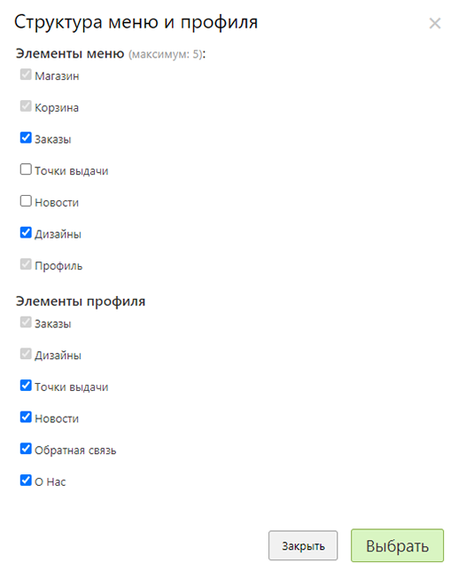

# Дизайн приложения

## Цветовое оформление
* В данном разделе задаются корпоративные цвета приложения:
    + Цвет верхней панели.
    + Цвет текста верхней панели.
    + Цвет нижней панели.
    + Цвет текста нижней панели.
    + Цвет выбранного текста нижней панели.
    + Цвет выбранной вкладки.
    + Цвет текста выбранной вкладки.
    + Цвет кнопки.
    + Цвет текста кнопки.    
* А так же логотип приложения, который выводится на экране выбора сайта.
* 

## Структура меню и профиля
* В данном разделе задаются элементы, которые выводятся в меню (нижняя панель) и личном кабинете пользователя.
* 