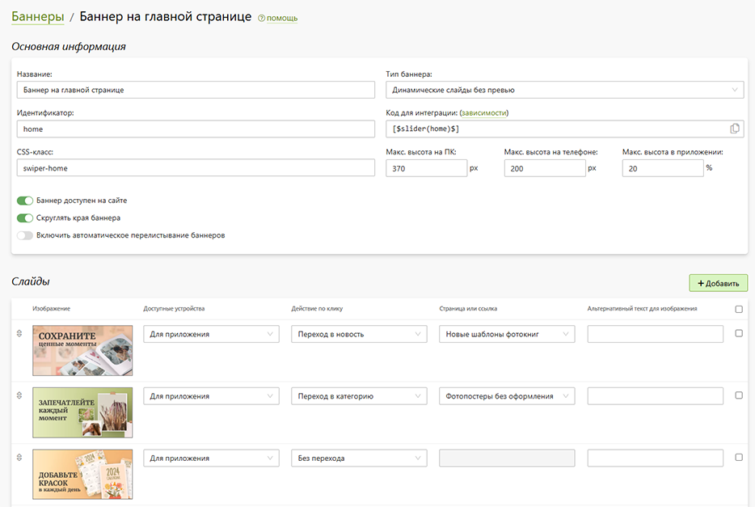

# Ответы на популярные вопросы

## Как настроить различное поведение калькулятора на сайте, и в мобильном приложении
* Наборы настроек для каждого варианта поведения калькулятора называются представлениями. Имеется три базовых представления калькулятора:
    + __default__ - стандартное представление использующееся в настольной и мобильной версии сайта (если не заданы `mobile`/`default-mobile`), а так же используется в мобильном приложении если не задано `mobile`.
    + __mobile__ - представление калькулятора, которое используется в мобильном приложении и в мобильной версии сайта (если не задано `default-mobile`).
    + __default-mobile__ - представление калькулятора, которое используется для мобильной версии сайта.
* 
> О настройке калькулятора можно узнать в [разделе](/print/products#калькулятор).

## Быстрый заказ в мобильном приложении
* В мобильном приложении для категорий с редактором товаров можно настроить быстрый заказ, который позволяет пропускать страницы корзины и доставки. 
* Для этого нужно в основной информации категории включить настройку "Включить быстрый заказ из редактора" и при необходимости "Использовать свои точки выдачи для доставки в быстром заказе".
* 

## Баннеры в мобильном приложении
* В мобильном приложении можно размещать баннеры:
    + На экране "__Магазин__" - задается в настройках приложения в разделе "__Сайты__";
    + На экране группы категорий - задается в настройках групп на уровне сайта;
    + На экране категории - задается в настройках категории на уровне приложения.
* Баннеры для приложения создаются точно так же как и для сайта, только с указанием для слайдов доступные устройства "Для приложения". Слайды доступные для приложения имеют варианты дейсствия по клику: переход в новость, переход в категорию, без перехода. Так же для баннера в приложении можно указать значение минимальной высоты в процентах относительно экрана устройства.
* 

## Ограничения в мобильном приложении
### Редакторы 
* Список редакторов, поддерживающих работу в приложении:
    + Редактор фотопечати
    + Редавтор товаров
    + Редактор дизайнов
    + Редактор макетов (работает как редатор товаров)

### Способы доставки
* В мобильном приложении __поддерживаются__ следующие типы доставок: 
    + собственные точки выдачи; 
    + собственные курьерские службы; 
    + транспортные компании до пункта выдачи.
* В мобильном приложении __не поддерживаются__ cледующие типы доставок: 
    + агрегаторы служб доставки (SafeRoute и др.);
    + транспортные компании по адресу клиента.

### Способы оплаты
* В мобильном приложении можно использользовать до 2 способов оплаты (не включая оплату бонусами). 
* Список поддерживаемых способов оплаты: 
    + Оплата бонусами
    + Оплата при получении
    + Assist
    + ЮKassa
    + Paykeeper
    + CloudPayments
    + Revolut
    + EveryPay
    + Stripe
    + Iyzico
    + CCAvenue
    + PayPal
    + Liqpay

## Настройка интеграции с ЮКассой
* Настройка интеграции с ЮКассой возможна только после публикации приложения. Поэтому после публикации приложения, необходимо будет написать менеджеру ЮКассы с запросом подключения мобильного SDK. Для этого они запросят описание платежей (за что и от кого вы будете принимать платежи), ссылки на опубликованные приложения и данные от тестового аккаунта (их мы вам высылаем после публикации приложения), а также скриншоты экранов с платными товарами/услугами и пользовательского соглашения. 
* Далее ЮКасса в вашем личном кабинете добавит мобильное SDK и уже от туда необходимо будет взять ключи: "Идентификатор магазина (приложение)", "Секретный ключ (приложение)", "Ключ для мобильного SDK".
* Так же необходимо указать "Идентификатор, полученный при регистрации приложения (Client ID)", для его получения необходимо зарегистрировать приложение на сайте https://yookassa.ru/oauth/v2/client . При регистрации приложения в "Названии" указываем название приложения, поля "Описание" и "Ссылка на сайт приложения" оставляем пустыми, "Код подтерждения" выбираем "Показывать на странице", в Доступах в API ЮКасса нажимаем на "Выбрать все" и нажимаем кнопку "Зарегистрировать".

## Способы оплаты ЮКассы
* Мобильное SDK ЮКассы поддерживает:
    + Банковская карта; 
    + ЮMoney;
    + SberPay;
    + СБП.
* Если какого-то из данных способов оплаты у вас нет, то по вопросу подключения недостающего способа оплаты, необходимо обратиться к менеджеру ЮКассы.

## Пуш-уведомления
* В приложении есть 2 типа уведомлений:
    + Индивидуальные шаблоны уведомлений (подробнее можно посмотреть в [разделе](/app/notifications#индивидуальные-шаблоны-уведомлений)).
    + Стандартные шаблоны уведомлений (подробнее можно посмотреть в [разделе](/app/notifications#стандартные-шаблоны-уведомлений)).
* По новостям пуш-уведомления не отправляются.

## Группы категорий
* В приложении есть возможность группировать категории, для этого необходимо в настройках категорий указать одинаковое значение в поле "Группа". В качестве изображения группы берется то же изображение, что у первой категории этой группы.

## Порядок категорий и групп
* Порядок категорий в приложении зависит от порядка категорий в настройках сайта в разделе “__Печать / Продукты__”.
* Порядок групп в приложении зависит от порядка групп в настройках сайта в разделе “__Печать / Продукты / Группы__”.

## Видеоуроки
### Настройка мобильного приложения
<iframe width="840" height="473" src="https://www.youtube.com/embed/mLJXB6rGB1E?si=T26fT4Ya25LYB4ET" title="YouTube video player" frameborder="0" allow="accelerometer; autoplay; clipboard-write; encrypted-media; gyroscope; picture-in-picture; web-share" allowfullscreen></iframe>