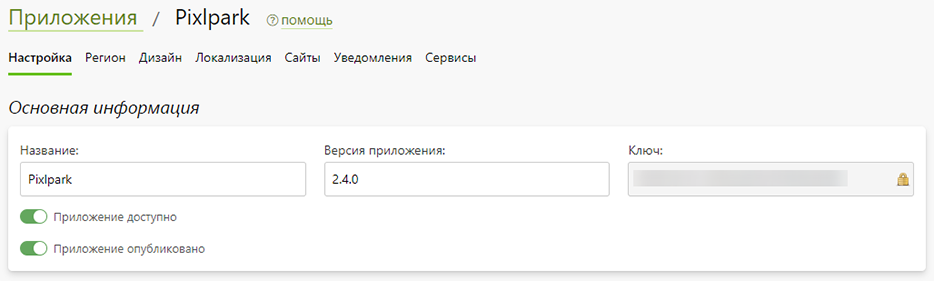
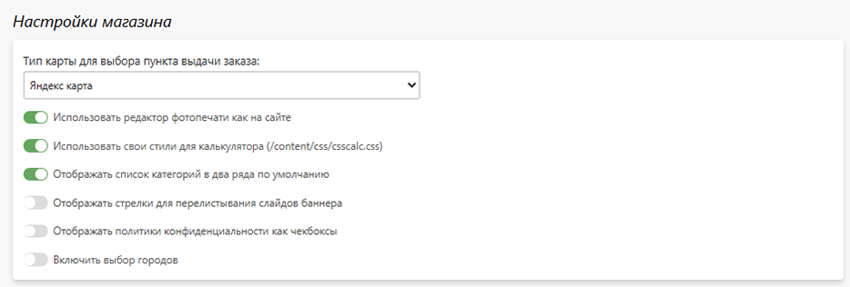

# Настройка
## Основная информация
* __Название__ - название приложения, которое будет отображаться в админ. панели.
* __Версия приложения__ - текущая используемая версия приложения. 
* __Ключ__ - системный идентификатор приложения, использующийся для его сборки.
* __Ссылка на приложение в Google Play__ - cсылка на приложение в Google Play.
* __Ссылка на приложение в App Store__ - cсылка на приложение в App Store.
* __Код для интеграции__ - константа кнопок мобильных изображений.
* 

## Настройки регистрации и авторизации
* __Предлагать авторизацию по номеру телефона__ - отображать авторизацию по номеру телефона.
* __Предлагать авторизацию по E-mail__ - отображать авторизацию по E-mail.
* __Предлагать авторизацию через Telegram__ - отображать авторизацию через Telegram.
> Для авторизации через Telegram нужно подключить и настроить бота на сайте.
* __Вход в приложение по умолчанию__ - настройки экрана входа по умолчанию:
    + По телефону.
    + По эл. почте.
    + Через Telegram.
* __Требоывать электроную почту при регистрации__ - обязательный ввод электронной почты на экране регистрации.
* __Требовать подтверждения электронной почты при заказе__ - обязательный ввод кода подтверждения электронной почты при оформлении заказа. 
* __Требовать телефон при регистрации__ - обязательный ввод телефона на экране регистрации.
* __Требовать подтверждения телефона при заказе__ - обязательный ввод кода подтверждения телефона при оформлении заказа. 
* __Требовать имя при регистрации__ - обязательный ввод имени на экране регистрации.
* __Требовать фамилию при регистрации__ - обязательный ввод фамилии на экране регистрации.
* __Отображать поле ввода кода партнёра__ - возможность ввода кода партнера на экране регистрации (при условии, что на выбранном сайте включена партнерская программа).
* 

## Настройки личного кабинета
* __Отображать заказы со всех сайтов__ - отображать в профиле клиента только заказы текущего выбранного сайта.
* __Отображать дополнительный номер заказа вместо основного__ - выводить на экране списка заказов дополнительный номер вместо основного.
* __Отображать у заказов кнопку обсуждения__ - отображать на экране списка заказов нопку обсуждения заказа.
* 

## Настройки магазина
* __Тип карты для выбора пунта выдачи заказа__ - настройка отображения пунктов выдачи:
    + Не использовать карту.
    + Яндекс карта.
    + Google карта.
* > Доступность выбора карт для отображения пунктов выдачи определяется включением соответствующих [сервисов](/app/serviсes).
* __Использовать редактор фотопечати как на сайте__ - использовать в редакторе фотопечати редактор идентичный редактору на сайте.
* __Использовать свои стили для калькулятора__ - использовать уникальные стили из файла `/content/css/csscalc.css`, в разделе "__CMS / Файлы__".
* __Отображать список категорий в два ряда по умолчанию__ - по умолчанию выводить список товаров в виде иллюстраций в два ряда.
* 