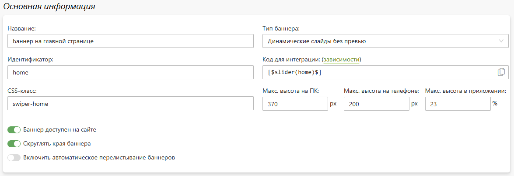
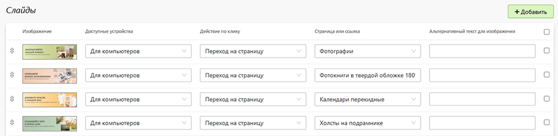

# Баннеры
* В данном разделе представлен список баннеров сайта, хаждый из котороых обладает следующим набором характеристик:
    + __Название__ - название баннера в панели управления.
    + __Тип баннера__ - тип отображения баннера на сайте.
    + __Идентификатор__ - уникальный код, по которому баннер встраивается на страницу сайта.
    + __Код для интеграции__ - константа для интеграции баннера на страницу сайта.
    + __CSS-класс__ - заданный CSS-класс баннера.
    + __Макс. высота на ПК__ - размеры баннера для ПК.
    + __Макс. высота на телефоне__ - размеры баннера для телефона.
    + __Баннер доступен на сайте__ - выводить баннер на страницах сайта. 
    + __Скруглять края баннера__ - отображать у баннера скругленные края.
* 
* __Слайды__ - иллюстрации, которые будут вписыватсья в размеры баннера и отображаться в качестве слайдов. Каждый слайд имеет следующие характеристики:
    + Доступные устройства - устройства (ПК или телефон), для которых доступен слайд;
    + Действие по клику - событие по клику на слайд: без перехода, переход по ссылке, переход на страницу, переход по внешней ссылке;
    + Страница или ссылка - ссылка, страница сайта или внешняя ссылка, на которую будет перенаправлен пользователь по клику слайда.
    + Альтернативный текст для изображения - отображать альтернативный текст для изображения.
* 