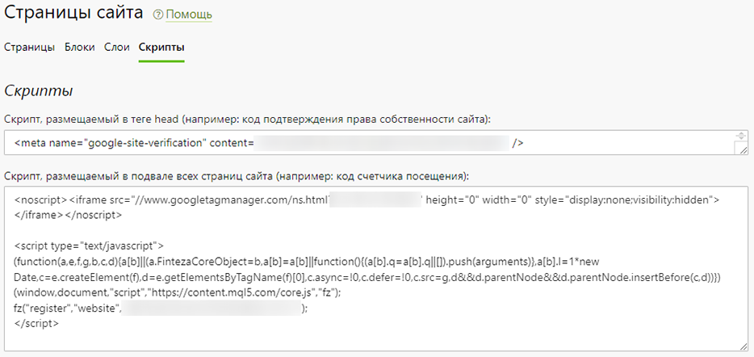
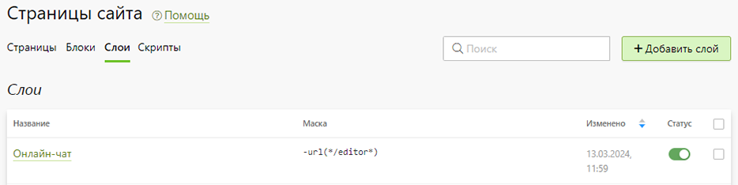
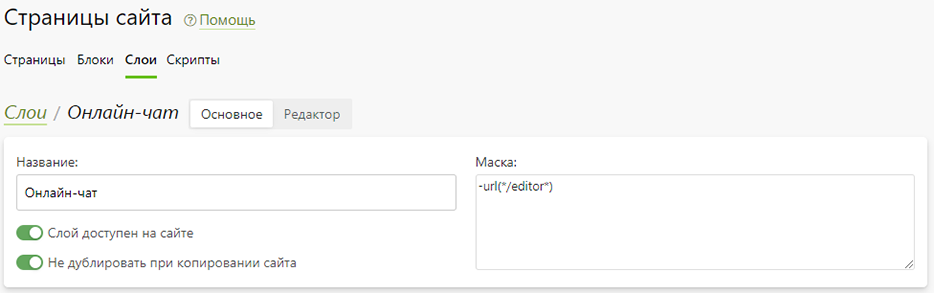

# Ответы на популярные вопросы
## Как использовать константы
### CMS
* `[$navigation(main)$]` - меню из раздела "__CMS / Навигация__", где __main__ - идентификатор навигации.
* `[$slider(main)$]` - баннер из раздела "__CMS / Баннеры__", где __main__ - идентификатор баннера.
* `[$slider(category:cUrl)$]` - баннер категории, где __cUrl__ - URL категории.
* `[$fullPath$]` - значение константы локализации из раздела "__CMS / Локализация__", где __fullPath__ - ее путь.
* `[$breadcrumbs$]` - хлебные крошки текущей страницы из раздела "__CMS / Страницы / Страницы__".
* `[$portfolio(category:cUrl) $]` - примеры работ из раздела "__Фотогалерея / Иллюстрации__", где __cUrl__ - URL категории фотогалереи или категории печати.
* `[$favoriteFeedbacks$]` - избранные отзывы клиентов из раздела "__Отзывы / Гостевая книга / Избранные__".
* `[$lastNews$]` - список последних опубликованных новостей из раздела "__Новости / Лента новостей__".
* `[$appLinks$]` - кнопки мобильных приложений из раздела  "__Приложения / Текущее_приложение / Настройка__".

### Доставка
* `[$delivery:external$]` - карта со всеми способами доставкиа из раздела “__Настройка / Доставка__”.
* `[$delivery:pickPointMap$]` - карта с собственными точками выдачи.
* `[$delivery:locationSelector$]` - выбор города в шапке сайта.

### Контакты
* `[$websiteTitle$]` - название бренда из раздела “__Настройка / Регион → Контакты__”.
* `[$websiteCity$]` - город из раздела “Настройка / Регион → Контакты”.
* `[$websiteAddress$]` - адрес из раздела “Настройка / Регион → Контакты”.
* `[$websiteIndex$]` - индекс из раздела “Настройка / Регион → Контакты”.
* `[$websiteEmail$]` - эл. почта из раздела “Настройка / Регион → Контакты”.
* `[$websitePhone$]` - телефон из раздела “Настройка / Регион → Контакты”.
* `[$websiteTelegram$]` - telegram из раздела “Настройка / Регион → Контакты”.
* `[$websiteWhatsapp$]` - whatsapp из раздела “Настройка / Регион → Контакты”.
* `[$websiteLogo$]` - абсолютная ссылка на логотип сайта из раздела “__CMS / Дизайн__”.
* `[$websiteDomain$]` - доменное имя сайта из раздела “__Настройка / Домены__”.

### Реквизиты
* `[$requisite:name$]` - название юридического лица из раздела "__Настройка / Оплата / Реквизиты__".
* `[$requisite:ceo$]` - директор.
* `[$requisite:kpp$]` - КПП.
* `[$requisite:inn$]` - ИНН.
* `[$requisite:ogrn$]` - ОГРН.
* `[$requisite:bank$]` - наименование банка.
* `[$requisite:bic$]` - БИК.
* `[$requisite:paymentAccount$]` - расчетный счет.
* `[$requisite:correspondentAccount$]` - корреспондентский счёт.
* `[$requisite:legalAddress$]` - юридический адрес.
* `[$requisite:postalAddress$]` - почтовый адрес.
* `[$requisite:stampUrl$]` - ссылка на иллюстрацию печати.
* `[$requisite:signatureUrl$]` - ссылка на иллюстрацию подписи.

### Магазин
* `[$shop$]` - список категорий из раздела "__Магазин / Продукты__".
* `[$shop(group:gName)$]` - список категорий, где __gName__ - название группы категорий.

### Сувениры
* `[$gifts$]` - список категорий и подкатегорий из раздела "__Сувениры / Продукты__" без функции поиска.
* `[$gifts(isSearchable:true)$]` - список категорий и подкатегорий с функцией поиска.

### Дизайны
* `[$templates(type:templates, category:cUrl, product:pUrl, title:"Дизайны", count:4)$]` - произвольные шаблоны из раздела "__Печать / Дизайны / Шаблоны__", где:
    + cUrl - URL категории;
    + pUrl  - URL продукта;
    + "Дизайны"  - опциональный заголовок блока, который по умолчанию использует значение из локализации;
    + 4 - количество шаблонов.
* `[$templates(type:cliparts, category:cUrl, product:pUrl, title:"Дизайны", count:4)$]` - произвольные клипарты.
* `[$templates(type:pictures, category:cUrl, product:pUrl, title:"Дизайны", count:4)$]` - произвольные картины.

### Печать
* `[$categories(group:gUrl)$]` - список категорий печати из раздела "__Печать / Продукты__", где __gUrl__ - URL группы категорий.
* `[$categories(groups)$]` - список категорий печати всех групп.
* `[$categories(isPopular:true, max:N)$]` - список популярных групп печати в количестве N штук, упорядоченных по порядку панели управления.
* `[$categoryCover(category:cUrl)$]` - обложка категории, где __cUrl__ - URL категории.
* `[$categoryDescription(category:cUrl)$]` - описание категории, где __cUrl__ - URL категории.
* `[$categoryDescriptionExtended(category:cUrl)$]` - расширенное описание категории с иллюстрацией, где __cUrl__ - URL категории.
* `[$categoryEditorUrl(category:cUrl)$]`- ссылка на редактор, где __cUrl__ - URL категории.
* `[$productName(category:cUrl, product:pUrl)$]` - название продукта, __cUrl__ - URL категории, а __pUrl__ - URL продукта.
* `[$price(category:cUrl, product:pUrl, quantity:qVal, page:pVal, surface: sVal, zone: zVal)$]` - стоимость продукта без учета опций, где:
    + cUrl и pUrl - описаны выше (обязательные параметры);
    + qVal - количество продуктов (опциональный параметр, по умолчанию = 1);
    + pVal - количество поверхностей печати (опциональный параметр, по умолчанию = 1);
    + sVal и zVal - порядковые номера поверхности и зоны печати, для которых нужно произвести расчет стоимости; используется вместе и без параметра “page”; например, если требуется рассчитать стоимость печати футболки на спине А4  (опциональные параметры).
* `[$priceWithCustomWorks(category:cUrl, product:pUrl, qantity:qVal, page:pVal, surface: sVal, zone: zVal)$]` - стоимость продукта с учетом обязательных опций.
* `[$pricePerItem(category:cUrl, product:pUrl, qantity:qVal, page:pVal, surface: sVal, zone: zVal)$]` - стоимость единицы продукта без учета опций.
* `[$priceString(...)$], [$ priceWithCustomWorksString(...)$], [$ pricePerItemString(...)$]` - стоимость вместе с валютой сайта.
* `[$calculator(category:cUrl, product:pUrl, config:view)$]` - калькулятор для категории печати, где:
    + cUrl - URL категории (обязательный параметр);
    + pUrl - URL продукта, который будет выбран по умолчанию (опциональный параметр);
    + view - название представления калькулятора (опциональный параметр).
* `[$axiomcalculator(category:cUrl, product:pUrl)$]` - калькулятор для категории печати с подключенной ERP Axiom.
* `[$poly1ccalculator(category:cUrl, product:pUrl)$]` - калькулятор для категории печати с подключенной ERP 1С:Полиграфия.
* `[$asystemcalculator(category:cUrl, product:pUrl)$]` - калькулятор для категории печати с подключенной ERP ASystem.
* `[$helloprintcalculator(category:cUrl, product:pUrl)$]` - калькулятор для категории печати с подключенной ERP HelloPrint.

## Как подключить онлайн-чат на сайт
* Для подключения онлайн-чата, виджета обратного звонка или другого подобного сервиса необходимо разместить код данного виджета во __втором поле__ раздела “__CMS / Страницы / Скрипты__”.
* 
* Если же требуется, чтобы виджет отрабатывал не на всех страницах сайта, то тогда необходимо:
    + Перейти в раздел “__CMS / Слои__”;
* 
    + Создать новый слой, указав в нем маску с исключенными страницами;
* 
    + Разместить код виджета в __секции “JavaScript”__.
* 
* Например, на демо-сайте виджет онлайн-чата отображается на всех страницах кроме редактора. В этом случае в слое указывается маска: “__-url(*/editor*)__".
* Подробнее о форматировании маски можно прочитать в соответствующем [разделе документации](/cms/pages#задание-маски-слоя).

## Видеоуроки
### Редактирование страниц сайта
<iframe width="720" height="405" src="https://rutube.ru/play/embed/70558fdd6b43fcdf07875bdd819af774/" frameBorder="0" allow="clipboard-write; autoplay" webkitAllowFullScreen mozallowfullscreen allowFullScreen></iframe>

### Как подключить онлайн-чат на сайт
<iframe width="720" height="405" src="https://rutube.ru/play/embed/9ade21aca92af66951a820d023ec42ac/" frameBorder="0" allow="clipboard-write; autoplay" webkitAllowFullScreen mozallowfullscreen allowFullScreen></iframe>
