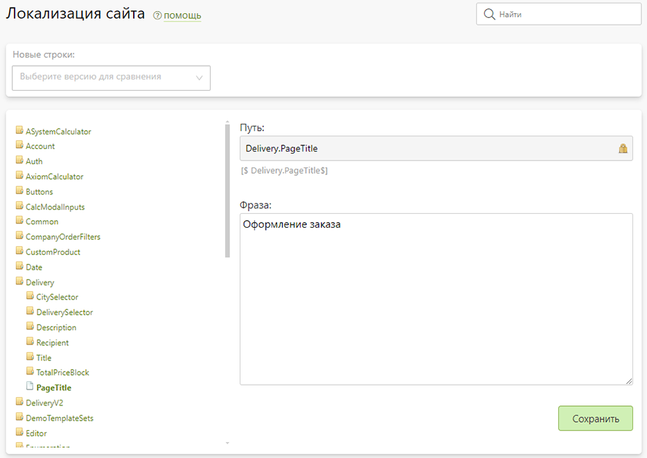

# Локализация сайта
* В данном разделе представлены текстовые константы, которые используют в своем интерфейсе все динамические страницы сайта из раздела “[Типы страниц](/cms/pages#типы-страниц)”. Это могут быть названия кнопок, информационные сообщения, заголовки и т.д.
* Для удобства работы все константы отображаются в виде иерархической структуры, где положение каждой определяется уникальный ключом - путем. По нему можно выводить ее значение на любую страницу сайта (пример: `[$fullPath$]`).
* С каждым обновлением в систему добавляются новые константы, появление которых можно отслеживать через специальный фильтр.
* 
* Для удобной локализации сайта техническая поддержка Pixlpark может предоставить единый xml-файл со всеми константами, который после перевода можно будет загрузить в систему обратно.