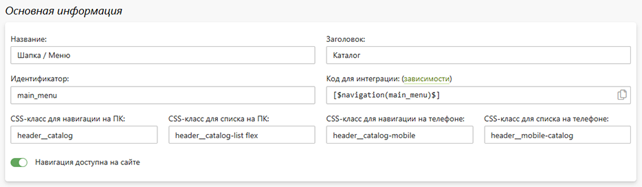

# Навигационные списки
* В данном разделе представлены навигационные списки сайта, каждый из которых обладает следующим набором характеристик:
    + __Название__ - название навигации в панели управления.
    + __Заголовок__ - название навигации на сайте
    + __Идентификатор__ - уникальный код, по которому навигационный список встраивается на страницу сайта. 
    + __Код для интеграции__ -  константа для интеграции навигации на страницу сайта.
    + __CSS-класс для навигации на ПК__ - заданный CSS-класс навигации на ПК.
    + __CSS-класс для списка на ПК__ - заданный CSS-класс списка навигации на ПК.
    + __CSS-класс для навигации на телефоне__ - заданный CSS-класс навигации на телефоне.
    + __CSS-класс для списка на телефоне__ - заданный CSS-класс списка навигации на телефоне.
    + __Навигация доступена на сайте__ - выводить навигацию на страницах сайта. 
* 
* __Список__ - набор элементов навигации. Каждый навигационный список имеет следующие характеристики:
    + Текст - название элемента списка;
    + Действие по клику - событие по клику на элемент списка: без перехода, переход по ссылке, переход на страницу, переход по внешней ссылке;
    + Страница или ссылка - ссылка, страница сайта или внешняя ссылка, на которую будет перенаправлен пользователь по клику элемента списка;
    + CSS-класс для текста - заданный CSS-класс для элемента списка;
    + Группа печати для подменю - отображение категорий выбранной группы печати;
* 