# Группы
## Описание
* __Группы__ - это наборы частных лиц или организаций. Они предназначаются для сегментации клиентов и последующей более удобной работы с ними.
* Через панель управления можно либо предоставить, либо ограничить доступ группе клиентов к следующим объектам системы:
    + Категории продуктов и опции;
    + Способы оплата и доставки;
    + Правила автоматизации;
    + Страницы и блоки CMS;
    + Персональные скидки;
    + Пуш-уведомления;
    + Перекрестные продажи.
* Данные ограничения задаются в самих объектах системы и отображаются в настройках группы.
* Клиентов в группу можно добавлять несколькими способами:
    + Выбирая необходимых клиентов из списка пользователей;
    + Импортируя набор адресов эл. почты (но в группу будут добавлены только найденные клиенты из списка пользователей);
    + Настроив стратегию автоматического добавления клиентов.
* На факт добавления и за 24 часа до исключения клиента из группы можно настроить отправку собственных уведомлений. 
* В сервисе предусмотрено несколько стратегий добавления клиентов в группу, что позволяет автоматизировать процесс сегментации клиентов.

## Характеристики группы
* __Название__ - название группы, которое выводится только в панели управления.
* __Описание__ - описание группы, которое выводится только в панели управления на странице списка групп.
* __Уведомление на добавление в группу__ - собственное уведомление, которое отправляется на доабвление клиента в группу. Уведомление такого типа можно добавить в разделе "Маркетинг / Уведомления / Шаблоны / Собственные".
* __Уведомление на исключение из группы__ - собственное уведомление, которое отправляется за 24 часа до исключения клиента из группу. 
* 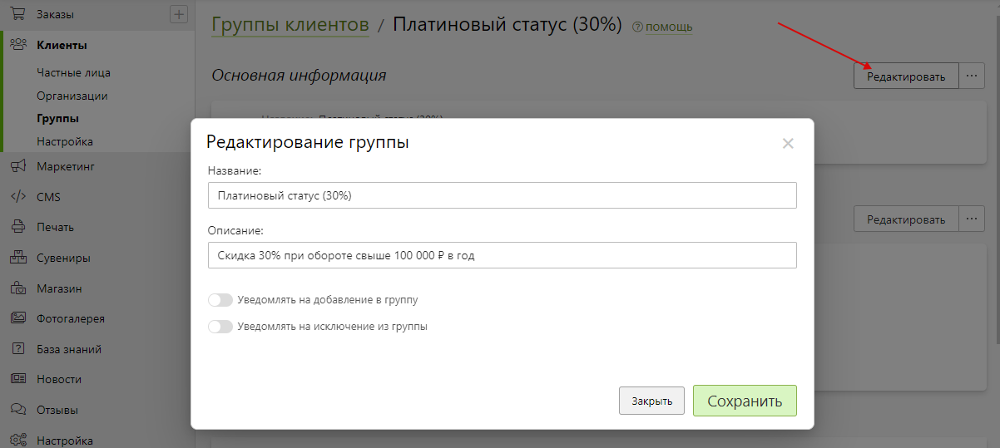
* __Cтратегии добавления в группу__ - правила, по которым можно либо вручную, либо автоматически добавлять клиентов в группу:
    + __Не добавлять автоматически__ - не добавлять клиентов автоматически;
    + __Добавлять сотрудников автоматически__ - автоматически добавлять сотрудников с ролями глобальных администраторов и любыми ролями для текущего сайта;
    + __Добавлять клиентов, заходивхших в период__ - добавлять клиентов, чье время с момента регистрации на сайте входит в заданный период времени; пример: если задать период = "день", то в группе будут находиться пользователи, зарегистрировавшиеся в последние 24 часа; 
    + __Добавлять клиентов, зарегистрированных в период__ - добавлять клиентов, чей объем продаж за заданный период времени находится в установленном диапазоне; при этом объем можно считать как по всем, так и по определенным продуктам; пример: данная стратегия подходит для организации накопительных скидок;
    + __Добавлять клиентов, оформивших заказы в период__ - добавлять клиентов, чье время с момента последнего посещения сайта входит в заданный период времени; пример: если задать период = "месяц", то в группе будут находиться пользователи, с момента последнего посещения сайта которых прошло не более 30 дней;
* 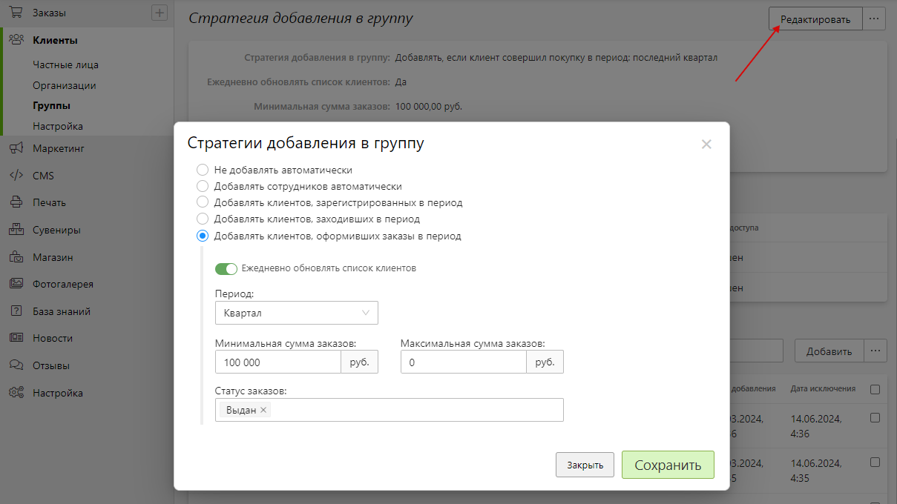
* __Зависимости__ - список объектов сайта, которые имеют ограничения по данной группе.
* 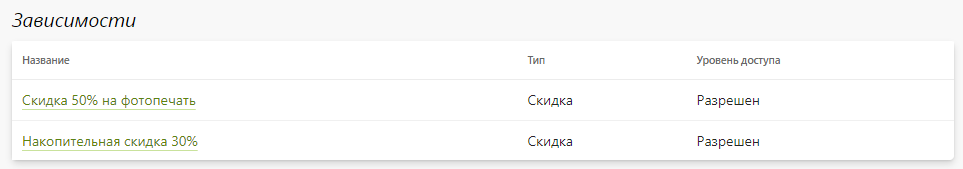
* __Клиенты группы__ - частные лица и организации, состоящие в группе.
* 

## Примеры использования
### Накопительные скидки
#### Задача
* Настроить накопительные скидки по сумме заказов за год:
    + Скидка 10% при обороте от 20 до 50 тыс. руб.;
    + Скидка 20% при обороте от 50 до 100 тыс. руб.;
    + Скидка 30% при обороте свыше 100 тыс. руб.
#### Решение
1. Создаем __три группы__ (Серебряный статус (10%), Золотой статус (20%), Платиновый статус (30%)) с автоматическим добавлением клиентов, оформивших заказы за последний год на сумму:
    + __от 20 000 до 50 000 ₽__;
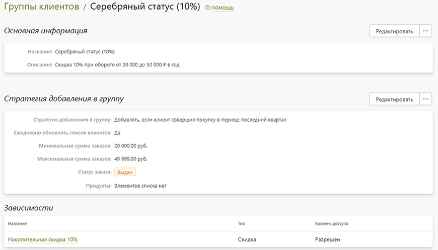
    + __от 50 000 до 100 000 ₽__;

    + __свыше 100 000 ₽__;

2. В разделе “__Маркетинг / Скидки__” создаем три скидки со следующими характеристиками:
    + Тип: персональная;
    + Не суммируется;
    + Величина скидки на продукты: 10%, 20%, 30%.
* 
3. В новых скидках во вкладке “Клиенты” добавляем соответствующие ранее созданные группы.

### Оптовая печать фотографий
#### Задача
Настроить скидку 50% на фотопечать для тех клиентов, кто за год заказывает их на сумму более 300 000 ₽.
#### Решение
1. Создаем группу “__Оптовики по фотопечати__” с автоматическим добавлением клиентов, оформивших заказы на печать фотографий за последний год более чем на 300 000 ₽.
* 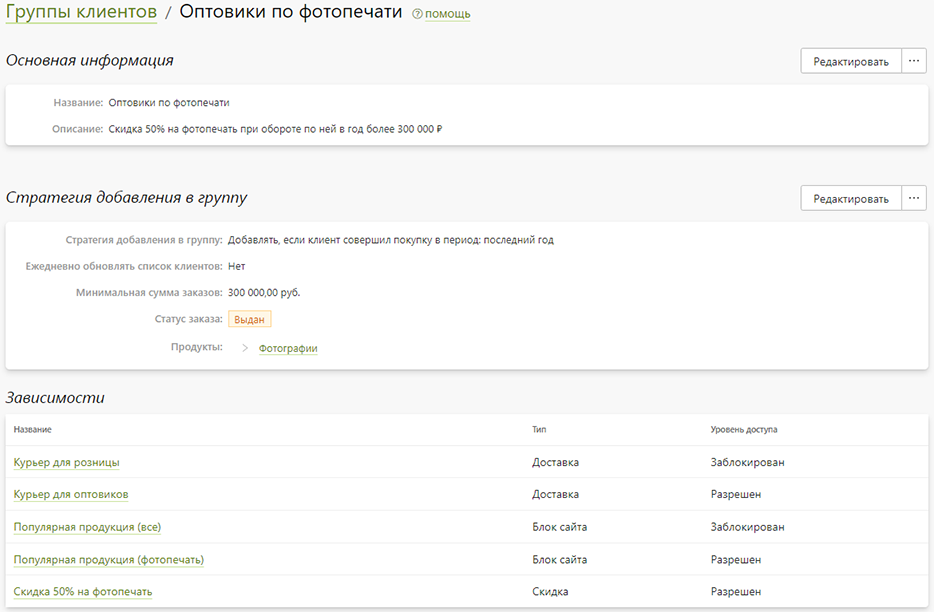
2. В разделе “__Маркетинг / Скидки__” создаем скидку со следующими характеристиками:
    + Тип: персональная;
    + Не суммируется;
    + Величина скидки на продукты: 50%;
    + Ограничение по категориям раздела “Печать”: Фотографии.
* 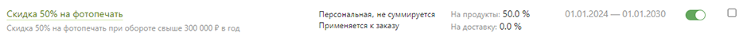
3. В новой скидке во вкладке “Клиенты” добавляем ранее созданную группу.
* 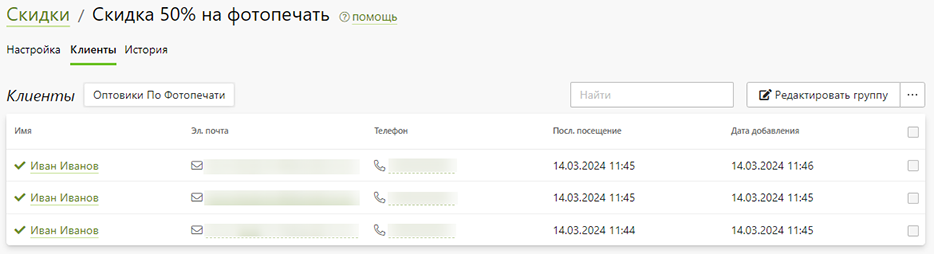

### Оптовая печать фотокниг
#### Задача
Настроить оптовые цены на печать фотокниг для тех клиентов, кто за год заказывает их на сумму более 400 000 ₽.
#### Решение
1. В разделе “__Печать / Продукты__” дублируем категорию фотокниг с шаблонами и опциями, а затем для новой задаем оптовые цены (которые, например, невозможно эмулировать применением скидки в процентах).
* 
2. Создаем группу “__Оптовики по фотокнигам__” с автоматическим добавлением клиентов, оформивших заказы на печать фотокниг по двум категориям за последний год более чем на 400 000 ₽.
* 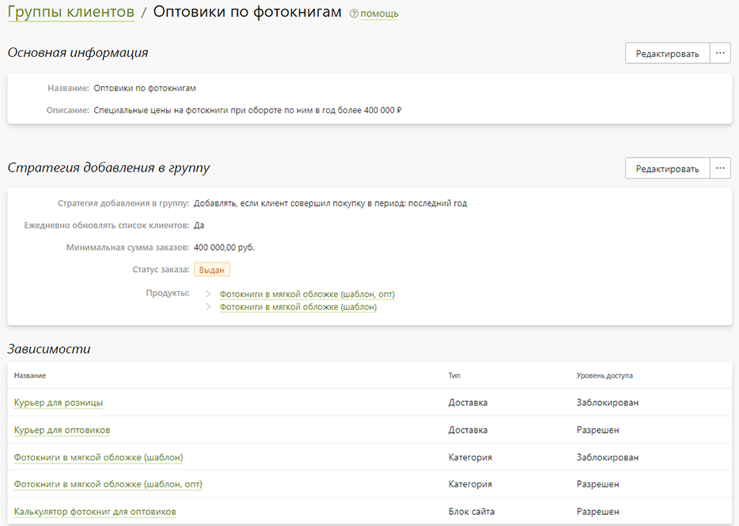
3. В исходной категории устанавливаем ограничение по группам, задавая блокировку для ранее созданной группы.
* 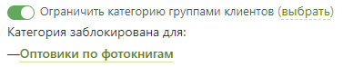
4. В новой категории устанавливаем ограничение по группам, задавая доступность для ранее созданной группы.
* 
5. В разделе “__CMS / Страницы / Блоки__” создаем блок:
    + Размещаем в нем калькулятор новой категории;
    + Добавляем дополнительную информацию;
    + Устанавливаем ограничение по группам, задавая доступность для ранее созданной группы.
* 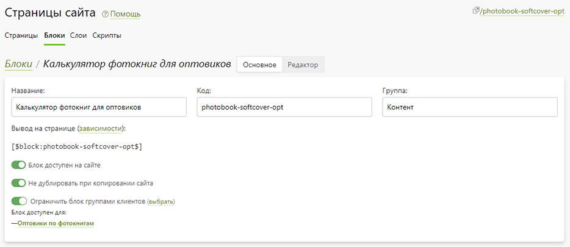
6. На продуктовой странице следом за калькулятором добавляем новый блок.
* 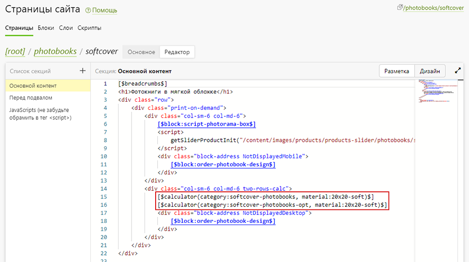

### Бесплатная доставка
#### Задача
Настроить бесплатную курьерскую доставку для оптовых клиентов.
#### Решение 1
1. В разделе “__Настройка / Доставка__” дублируем курьерскую доставку и задаем ей другое имя.
2. В исходной доставке устанавливаем ограничение по группам, задавая блокировку для групп оптовых клиентов.
* 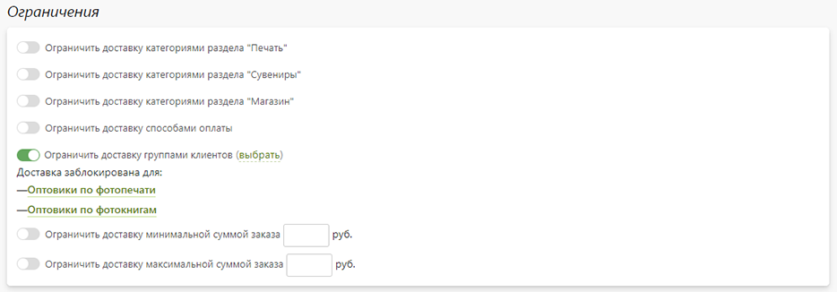
3. Во новой доставке устанавливаем ограничение по группам, задавая доступность для групп оптовых клиентов.
* 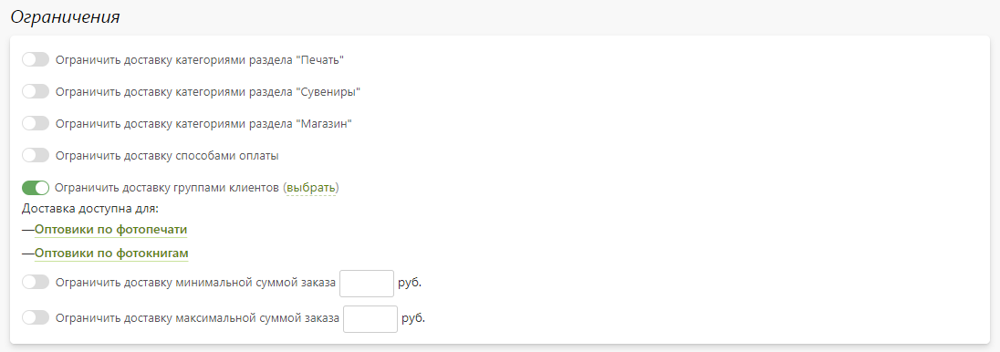
#### Решение 2
1. Создаем группу “__Оптовики__” с автоматическим добавлением клиентов, оформивших заказы за последний год более чем на 500 000 ₽.
* 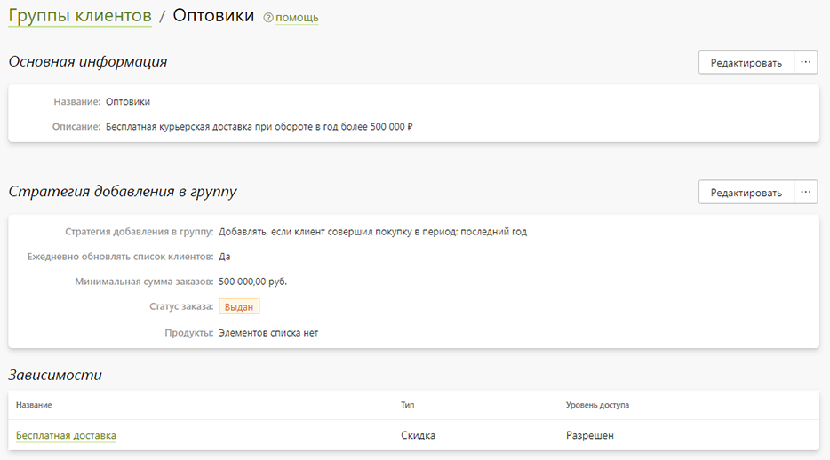
2. В разделе “__Маркетинг / Скидки__” создаем скидку со следующими характеристиками:
    + Тип: персональная;
    + Суммируется;
    + Величина скидки на доставку: 100%.
* 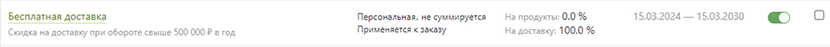
3. В новой скидке во вкладке “Клиенты” добавляем ранее созданную группу.
* 

### Оплата при получении
#### Задача
Настроить доступность оплаты при получении только тем клиентам, кто суммарно заказал на сумму более 3 000 ₽.
#### Решение
1. Создаем группу “__Проверенные клиенты__” с автоматическим добавлением клиентов, оформивших заказы за весь период более чем на 3 000 ₽.
* 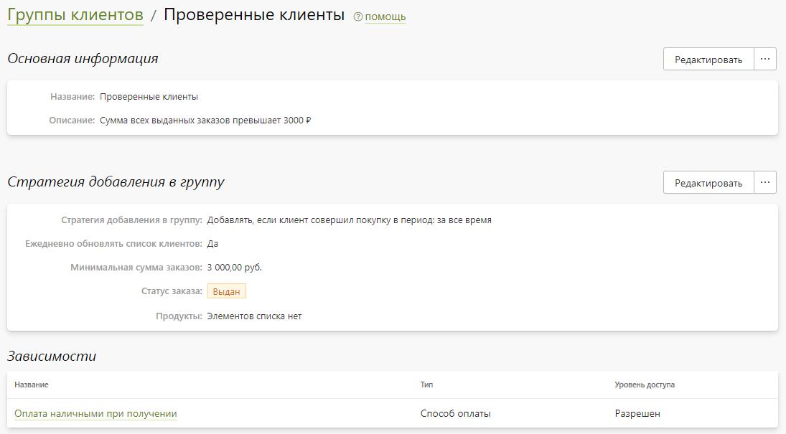
2. В разделе “__Настройка / Оплата__” выбираем оплату при получении и устанавливаем ограничение по группам, задавая доступность для ранее созданной группы.
* 

### Скидка для сотрудников
#### Задача
Настроить скидку 20% для сотрудников на весь ассортимент.
#### Решение
1. Создаем группу “__Сотрудники__” со стратегией “Добавлять сотрудников автоматически”. В нее попадут глобальные администраторы компании и сотрудники с любой ролью доступа к данному сайту.
* 
2. В разделе “__Маркетинг / Скидки__” создаем скидку со следующими характеристиками:
    + Тип: персональная;
    + Не суммируется;
    + Величина скидки на продукты: 20%.
* 
3. В новой скидке во вкладке “Клиенты” добавляем ранее созданную группу.
* 

### Скидка в день регистрации
#### Задача
Настроить скидку 20% на фотопечать в день регистрации.
#### Решение
1. Создаем группу “__Новички__” с автоматическим добавление клиентов, зарегистрировавшихся за последний день.
* 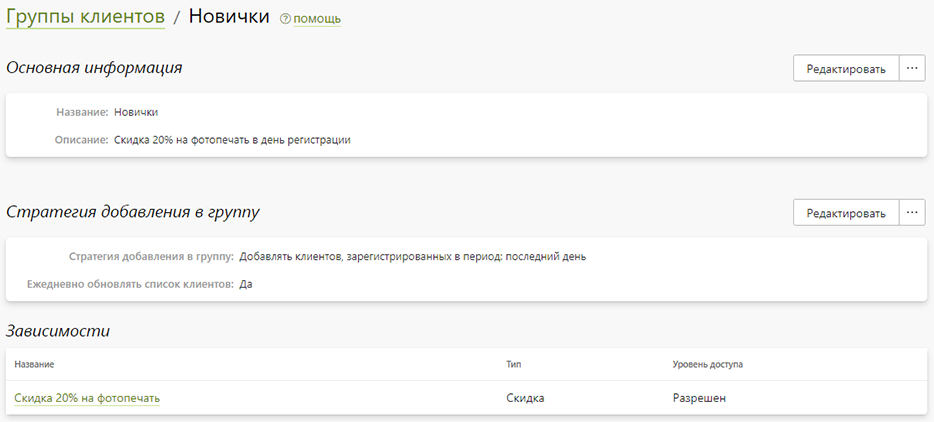
2. В разделе “__Маркетинг / Скидки__” создаем скидку со следующими характеристиками:
    + Тип: персональная;
    + Не суммируется;
    + Величина скидки на продукты: 20%;
    + Ограничение по категориям раздела “Печать”: Фотографии.
* 
3. В новой скидке во вкладке “Клиенты” добавляем ранее созданную группу.
* 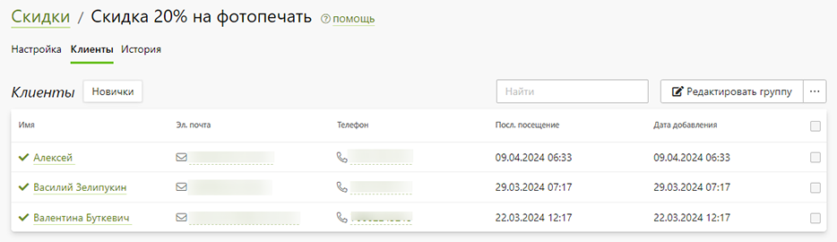
4. Информируем клиента о скидке:
    + Добавляем рекламный баннер на сайт;
    + Добавляем информацию в письмо-приветствие, которое отправляется в момент регистрации на сайте.

### Скидка для возврата клиента
#### Задача
Предложить клиенту скидку 20% на всю интерьерную печать через 3 месяца с момента последнего посещения сайта.
#### Решение
1. В разделе “__Маркетинг / Уведомления / Шаблоны__” создаем собственное уведомление с информацией о предоставляемой клиенту скидке, которое действует в течении 24 часов. 
* 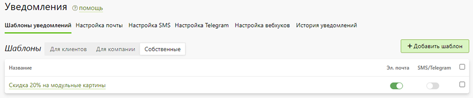
2. Создаем группу “__Замершие__” с автоматическим добавление клиентов, заходивших на сайт в последние 3 месяца, и выбираем созданное выше уведомление для отправки на факт исключения клиента из группы.
* 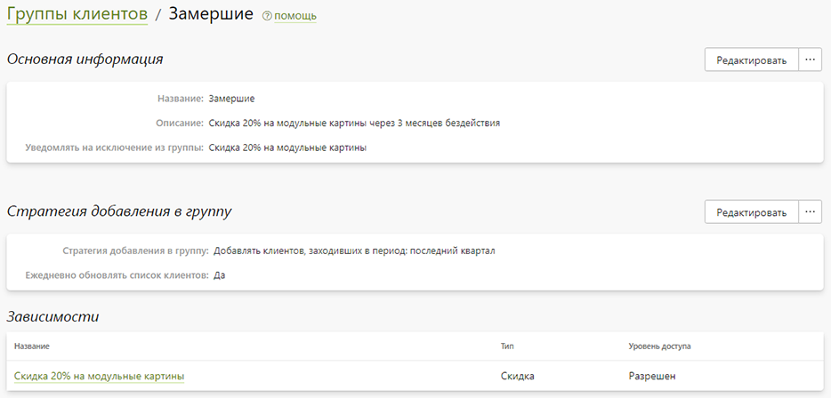
3. В разделе “__Маркетинг / Скидки__” создаем скидку со следующими характеристиками:
    + Тип: персональная;
    + Не суммируется;
    + Величина скидки на продукты: 20%;
    + Ограничение по категориям раздела “Печать”: группа “Интерьер”.
* 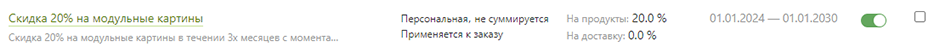
4. В новой скидке во вкладке “Клиенты” добавляем ранее созданную группу.
* 

### Автоматическая печать
#### Задача
Настроить автоматическую печать заказов до 10 000 ₽ от надежных клиентов.
#### Решение
1. Создаем группу “__Надежные клиенты__” без автоматического добавления клиентов. По мере надобности включаем в нее пользователей, которых считаем надежными.
* 
2. В разделе “__Заказы / Настройка / Правила автоматизации__” создаем правило со следующими характеристиками:
    + Статус оплаты: Ожидать оплату;
    + Время нахождения в статусе более: 30 мин. (чтобы у клиента было время для отмены заказа);
    + Стоимость заказа: до 10 000 ₽;
    + Действие: смена статуса заказа на “В печать”.
3. В новом правиле устанавливаем ограничение по группам, задавая доступность для ранее созданной группы. 
* 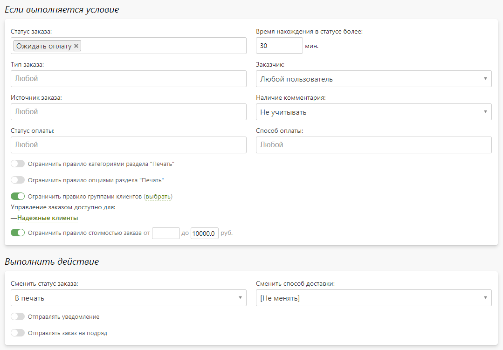

### Перекрестные продажи
#### Задача
Выключить работу модуля перекрестных продаж для оптовых клиентов.
#### Решение
1. В разделе “__Маркетинг / Корзины / Настройка__” устанавливаем ограничение по группам, задавая блокировку для групп оптовых клиентов.
* 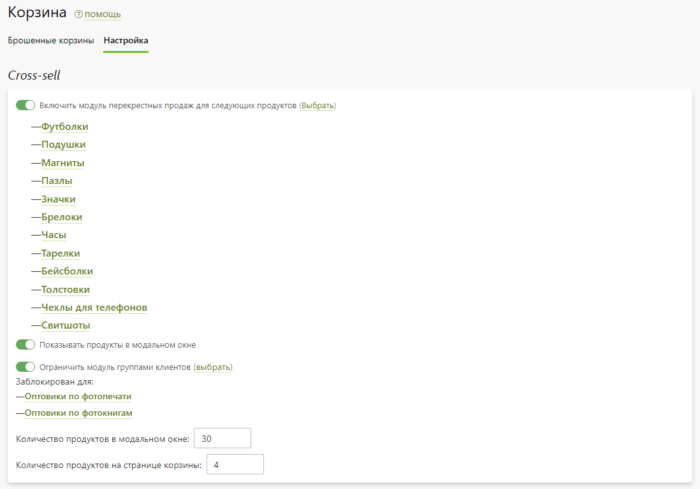

### Актуальная популярная продукция
#### Задача
Для оптовых клиентов по фотопечати в блоке популярной продукции на главной выводить лишь товары из вкладки “Фотопечать”.
#### Решение
1. В разделе “__CMS / Страницы / Блоки__” дублируем блок популярной продукции и задаем ему другое имя.
* 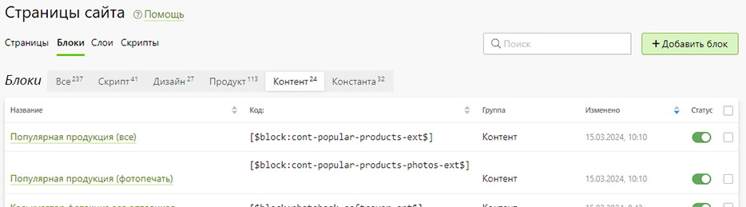
2. В новом блоке изменяем разметку, оставляя лишь продукты из вкладки “Фотопечать”.
3. Добавляем второй блок следом за первым в разметке главной страницы сайта.
* 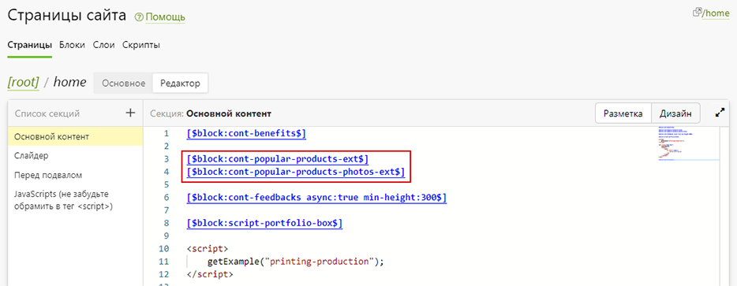
4. В исходном блоке устанавливаем ограничение по группам, задавая блокировку для группы оптовых клиентов.
* 
5. В новом блоке устанавливаем ограничение по группам, задавая доступность для группы оптовых клиентов.Скидка для сотрудников
* 

### Тестирование приложения
#### Задача
Настроить отправку пуш-уведомлений только тестировщикам компании.
#### Решение
1. Создаем группу “__Тестировщики__” без автоматического добавления клиентов, в которую включаем пользователей, отвечающих за тестирование мобильного приложения.
* 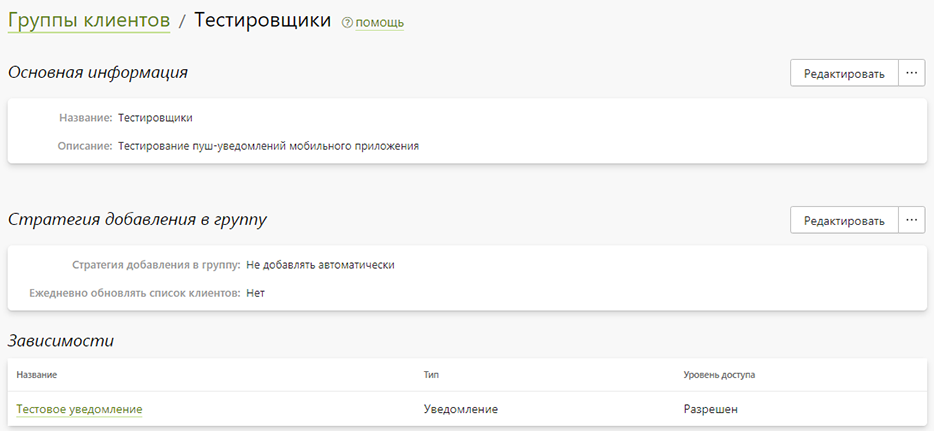
2. В настройках мобильного приложения в разделе “__Уведомления__” создаем персональное уведомление с необходимыми характеристиками.
3. В новом уведомлении устанавливаем ограничение по группам, задавая доступность для ранее созданной группы. 
* 
