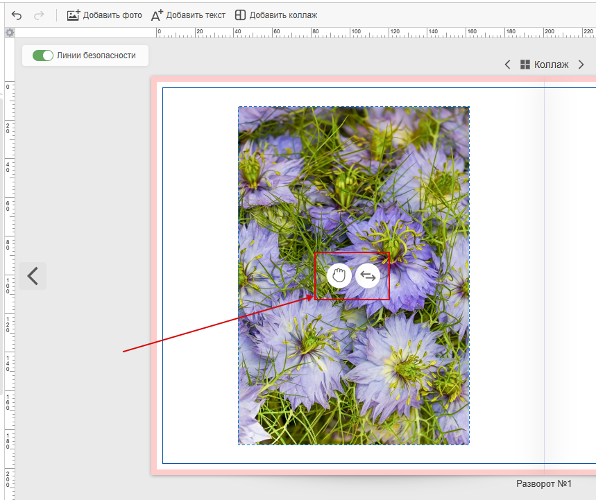

# События аналитики
* В данном разделе описаны события, которые передаёт редактор в сервисы аналитики.
* Для его работы необходимо в панели управления в разделе "__Маркетинг / Сервисы__", включить "__Яндекс Метрика__" в поле "__Идентификатор счетчика__" записать ID счётчика из Яндекс Метрики.

> На данный момент функционал работает только для Яндекс Метрики.
* Отчёт можно просмотреть на странице Яндекс Метрики. Для этого в Яндекс Метрике перейдите в раздел "__Отчеты / Популярные / Параметры событий__".

* В открывшемся окне нажмите кнопку "__Группировки__". В окне Группировка необходимо установить галочку на "__Цель "Java Script" Событие__", а так же первые шесть уровней __Параметров события__, как на скриншоте ниже. Яндекс Метрика ограничивает группировку максимум семью пунктами, возможно, из выбранных по умолчанию придётся удалить лишние. После этого нажмите кнопку "__Применить__".

* События сгруппированы по категориям для удобства восприятия. Каждое событие сопровождается кратким описанием, отражающим, что делает пользователь.

## __Общие действия с элементами__:
* 
    + __Element Copy (Копирование элемента)__: Пользователь копирует элемент на поверхности.
    + __Element Cut (Вырезание элемента)__: Пользователь вырезает элемент с поверхности.
    + __Element Duplicate (Дублирование элемента)__: Пользователь дублирует элемент на поверхности.
    + __Element Paste (Вставка элемента)__: Пользователь вставляет элемент на поверхность.
    + __Element Remove (Удаление элемента)__: Пользователь удаляет элемент с поверхности.
    + __Element Backward (Перемещение элемента назад)__: Пользователь перемещает элемент на задний план.
    + __Element Forward (Перемещение элемента вперед)__: Пользователь перемещает элемент на передний план.
    + __Element Position Change (Изменение позиции элемента)__: Пользователь изменяет позицию элемента.

## Группировка и разгруппировка
* 
    + __Group Elements (Группировка элементов)__: Пользователь группирует несколько элементов.
    + __UnGroup Elements (Разгруппировка элементов)__: Пользователь разгруппирует элементы.

## Действия с историей
* 
    + __History Back (Шаг назад)__: Пользователь отменяет последнее действие.
    + __History Forward (Шаг вперед)__: Пользователь повторяет отмененное действие.

## Взаимодействие с интерфейсом
* 
    + __Student Picker Shown (Показан выбор студентов)__: Пользователь открывает инструмент выбора студентов.
    + __Surface Rotated (Повернута поверхность)__: Пользователь поворачивает рабочую поверхность.
    + __Surface Size Change Shown (Показан инструмент изменения размера поверхности)__: Пользователь открывает настройки размера поверхности.
    + __Full Screen Toggle (Переключение полноэкранного режима)__: Пользователь включает или выключает полноэкранный режим.
    + __Full Window Toggle (Переключение полнооконного режима)__: Пользователь включает или выключает полнооконный режим.
    + __Eye Dropper Click (Клик пипеткой)__: Пользователь использует инструмент "пипетка".
    + __Alert Shown (Показан алерт)__: Пользователю отображается уведомление об ошибке на элементе.
    + __Helplines Toggle (Переключение вспомогательных линий)__: Пользователь включает или выключает вспомогательные линии.

## Управление проектом и поверхностями
* 
    + __Clear Project (Очистка проекта)__: Пользователь очищает весь проект.
    + __Clear Surface (Очистка поверхности)__: Пользователь очищает текущую поверхность.
    + __Clear Project Placeholders (Очистка заполнителей проекта)__: Пользователь очищает плейсхолдеры всего проекта.
    + __Clear Surface Placeholders (Очистка заполнителей поверхности)__: Пользователь очищает плейсхолдеры текущей поверхности.
    + __Surfaces Rearranged (Перестановка поверхностей)__: Пользователь изменяет порядок поверхностей.
    + __Surface Duplicate (Дублирование поверхности)__: Пользователь дублирует поверхность.
    + __Surface Remove (Удаление поверхности)__: Пользователь удаляет поверхность.
    + __Surface Add (Добавление поверхности)__: Пользователь добавляет новую поверхность.

## Действия с навигатором
* 
    + __Navigator Show Toggle (Переключение видимости навигатора)__: Пользователь показывает или скрывает навигатор.
    + __Navigator Duplicate Surface (Дублирование поверхности в навигаторе)__: Пользователь дублирует поверхность через навигатор.
    + __Navigator Clear Surface (Очистка поверхности в навигаторе)__: Пользователь очищает поверхность через навигатор.
    + __Navigator Delete Surface (Удаление поверхности в навигаторе)__: Пользователь удаляет поверхность через навигатор.

## Действия с масштабом
* 
    + __Zoom In (Увеличение масштаба)__: Пользователь увеличивает масштаб.
    + __Zoom Out (Уменьшение масштаба)__: Пользователь уменьшает масштаб.
    + __Zoom Fit (Сбрасывание масштаба)__: Пользователь сбрасывает масштаб под содержимое.
    + __Zoom To Zone (Масштаб к зоне)__: Пользователь приближает определенную зону.
    + __Zoom To Grid (Масштаб к сетке)__: Пользователь переключает масштаб на вид с календарной сеткой.
    + __Zoom To Not Grid (Масштаб без сетки)__: Пользователь переключает масштаб на вид без календарной сетки.

## Действия с изображениями
* 
    + __Add Image To Surface (Добавление изображения на поверхность)__: Пользователь добавляет изображение на поверхность.
    + __Set Image Content (Установка содержимого изображения)__: Пользователь задает содержимое изображения.
    + __Set Image Element As Background (Установка изображения как фона)__: Пользователь устанавливает изображение как фон.
    + __Image Content Remove (Удаление содержимого изображения)__: Пользователь удаляет содержимое изображения.
    + __Frame Setted (Установка рамки)__: Пользователь применяет рамку к изображению.
    + __Image Replace (Замена изображения)__: Пользователь заменяет изображение.
    + __Image Opacity (Прозрачность изображения)__: Пользователь изменяет прозрачность изображения.
    + __Image Mirror (Зеркальное отображение изображения)__: Пользователь зеркально отражает изображение.
    + __Image Filter Shown (Показан фильтр изображения)__: Пользователь открывает настройки фильтров изображения.
    + __Image Filter Change (Изменение фильтра изображения)__: Пользователь изменяет фильтр изображения.
    + __Image Moving Hand Used (Использование инструмента перемещения)__: Пользователь перемещает содержимое изображения с помощью "руки".

## Действия с текстом
* 
    + __Add Text To Surface (Добавление текста на поверхность)__: Пользователь добавляет текст на поверхность.
    + __Text Font Shown (Показан выбор шрифта)__: Пользователь открывает выбор шрифта.
    + __Text Font Change (Изменение шрифта)__: Пользователь изменяет шрифт текста.
    + __Text Style Change (Изменение стиля текста)__: Пользователь изменяет стиль текста (например, жирный, курсив).
    + __Text Font Size Change (Изменение размера шрифта)__: Пользователь изменяет размер шрифта.
    + __Text Color Change (Изменение цвета текста)__: Пользователь изменяет цвет текста.
    + __Text Settings Shown (Показаны настройки текста)__: Пользователь открывает настройки текста.
    + __Text Line Height Change (Изменение высоты строки)__: Пользователь изменяет высоту строки текста.
    + __Text Align Change (Изменение выравнивания текста)__: Пользователь изменяет выравнивание текста.
    + __Text Effect Shown (Показаны эффекты текста)__: Пользователь открывает настройки эффектов текста.
    + __Text Effect Reset (Сброс эффектов текста)__: Пользователь сбрасывает эффекты текста.
    + __Text Effect Shadow (Тень текста)__: Пользователь добавляет тень к тексту.
    + __Text Effect Hover (Эффект при наведении)__: Пользователь добавляет эффект парения к тексту.
    + __Text Effect Outline (Контур текста)__: Пользователь добавляет обводку к тексту.
    + __Text Effect Background (Фон текста)__: Пользователь добавляет фон к тексту.
    + __Text Effect Gradient (Градиент текста)__: Пользователь добавляет градиент к тексту.
    + __Text Mobile Settings Shown (Показаны мобильные настройки текста)__: Пользователь открывает настройки текста для мобильных устройств.

## Действия с шаблонами
* 
    + __Apply Template Set (Применение набора шаблонов)__: Пользователь применяет набор шаблонов.
    + __Apply Template Item (Применение элемента шаблона)__: Пользователь применяет отдельный элемент шаблона.
    + __Template Tag Used (Использование тега шаблона)__: Пользователь использует тег шаблона.
    + __Template Selection Modal Close (Закрытие модального окна выбора шаблона)__: Пользователь закрывает окно выбора шаблона.
    + __Template Selection Modal Empty Template (Выбор пустого шаблона)__: Пользователь выбирает пустой шаблон в модальном окне.
    + __Template Selection Modal Apply Template (Применение шаблона из модального окна)__: Пользователь применяет шаблон из модального окна.

## Действия с фоном
* 
    + __Add Background (Добавление фона)__: Пользователь добавляет фон.
    + __Accept Fill Backgrounds (Принятие заливки фона)__: Пользователь подтверждает заливку фоном всего проекта.
    + __Reject Fill Backgrounds (Отклонение заливки фона)__: Пользователь отклоняет заливку фоном всего проекта.
    + __Add Background Color (Добавление цвета фона)__: Пользователь добавляет цвет фона.
    + __Background Flip (Переворот фона)__: Пользователь отзеркаливает фон.
    + __Background Effects (Эффекты фона)__: Пользователь применяет эффекты к фону.
    + __Set User Background (Установка пользовательского фона)__: Пользователь устанавливает свой фон.
    + __Reset Background (Сброс фона)__: Пользователь сбрасывает настройки фона.
    + __Duplicate Background (Дублирование фона)__: Пользователь дублирует фон.
    + __Background Opacity (Прозрачность фона)__: Пользователь изменяет прозрачность фона.

## Действия с коллажами
* 
    + __Add Collage To Surface (Добавление коллажа на поверхность)__: Пользователь добавляет коллаж на поверхность.
    + __Collage Image Add (Добавление изображения в коллаж)__: Пользователь добавляет изображение в коллаж.
    + __Create Collage Out Of Images (Создание коллажа из изображений)__: Пользователь создает коллаж из изображений.

    + __Collage Image Carousel (Карусель изображений коллажа)__: Пользователь использует карусель изображений в коллаже.
    + __Collage Spacer Change (Изменение отступов в коллаже)__: Пользователь изменяет отступы в коллаже.
    + __Collage Row Column Size Change (Изменение размера строк/столбцов коллажа)__: Пользователь изменяет размер строк или столбцов коллажа.
    + __Collage Add Image Row Column (Добавление изображения в строку/столбец коллажа)__: Пользователь добавляет изображения в строку или столбец коллажа.
    + __Collage Ungroup (Разгруппировка коллажа)__: Пользователь разгруппирует коллаж.
    + __Collage Layout Change (Изменение макета коллажа)__: Пользователь изменяет макет коллажа.
    + __Collage Settings Shown (Показаны настройки коллажа)__: Пользователь открывает настройки коллажа.

## Действия с календарями
* 
    + __Calendar Add Grid (Добавление сетки календаря)__: Пользователь добавляет сетку календаря.
    + __Calendar Settings Changed (Изменение настроек календаря)__: Пользователь изменяет настройки календаря.
    + __Calendar Add Image (Добавление изображения в календарь)__: Пользователь добавляет изображение в день календарной сетки.
    + __Calendar Event Modal Shown (Показан модальный диалог событий календаря)__: Пользователь открывает окно событий календаря.
    + __Calendar Day Clear Image (Очистка изображения дня)__: Пользователь удаляет изображение из дня календаря.
    + __Calendar Period Change Shown (Показан выбор периода календаря)__: Пользователь открывает выбор периода календаря.

## Действия с другими элементами
* 
    + __Add Sticker To Surface (Добавление стикера на поверхность)__: Пользователь добавляет стикер на поверхность.
    + __Add Clipart To Surface (Добавление клипарта на поверхность)__: Пользователь добавляет клипарт на поверхность.
    + __Add Picture To Surface (Добавление картинки на поверхность)__: Пользователь добавляет картинку на поверхность.
    + __Add User Picture To Surface (Добавление пользовательской картинки на поверхность)__: Пользователь добавляет свою картинку на поверхность.

## Прочее
* 
    + __Issues (Проблемы)__: Пользователь открывает панель с ошибками.
    + __Context Menu Shown (Показан контекстное меню)__: Пользователь открывает контекстное меню.

# Контексты событий (AnaliticEventsContext)
* Контексты указывают, как или откуда было инициировано событие. Они помогают понять, каким способом пользователь взаимодействует с приложением.
    + __Short Cut (Горячая клавиша)__: Действие выполнено с помощью клавиатурной комбинации.
    + __Context Menu (Контекстное меню)__: Действие выбрано из контекстного меню (например, правый клик).
    + __Context Panel (Контекстная панель)__: Действие инициировано из панели, появляющейся над элементом.
    + __Top Panel (Верхняя панель)__: Действие выполнено из верхней панели интерфейса.
    + __Side Panel (Боковая панель)__: Действие выполнено из боковой панели интерфейса.
    + __DragNDrop (Перетаскивание)__: Действие инициировано перетаскиванием элемента.
    + __Double Click (Двойной клик)__: Действие вызвано двойным кликом мыши.
    + __Button (Кнопка)__: Действие инициировано нажатием на кнопку.
    + __Swiper (Свайпер)__: Действие вызвано использованием слайдера.

    + __Collage Control (Управление коллажем)__: Действие инициировано из элементов управления коллажем.

    + __None (Нет контекста)__: Контекст не применим или не указан.
    + __Placeholder Swap (Обмен местами плейсхолдеров)__: Действие связано с обменом местами плейсхолдеров.
    + __Layer Position (Позиция слоя)__: Действие связано с изменением порядка слоев.

    + __DropDown (Выпадающее меню)__: Действие выбрано из выпадающего меню.
    + __Element Control (Управление элементом)__: Действие инициировано из элементов управления конкретным элементом, например:

    + __Navigator (Навигатор)__: Действие инициировано из навигатора.
    + __Navigator DropDown (Выпадающее меню навигатора)__: Действие выбрано из выпадающего меню в навигаторе.
    + __Navigator DragNDrop (Перетаскивание в навигаторе)__: Действие инициировано перетаскиванием в навигаторе.
    + __SurfaceControl (Управление поверхностью)__: Действие инициировано из элементов управления поверхностью.

    + __PreviewModal (Модальное окно предпросмотра)__: Действие инициировано из модального окна предпросмотра.
    + __Wheel (Колесико мыши)__: Действие вызвано прокруткой колесика мыши (например, для масштабирования).
    + __Font List Model (Модель списка шрифтов)__: Действие связано с выбором шрифта из списка.
    + __Mobile Text Settings (Настройки текста для мобильных устройств)__: Действие инициировано из настроек текста для мобильных устройств.

    + __Style DropDown (Выпадающее меню стилей)__: Действие выбрано из выпадающего меню стилей.
