# Как настроить бизнес-сувениры
## Настройка сайта
### 1. Подключение домена 
* В панели управления __регистратора доменого имени__ задать для домена IP-адрес __81.163.20.133__.
* 
* В разделе "__Настройка / Домены__" добавить домен. А затем, как только сайт начнет открываться по новому домену, сделать его основным. 
* 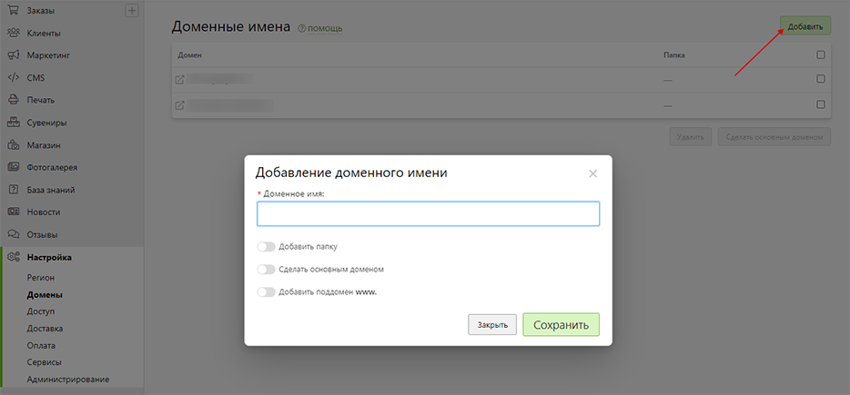

### 2. Задание контактной информации 
* В разделе "__Настройка / Регион__" в блоке "__Контакты__" задать бренд, адрес, телефон и эл. почту.
```js
 Для избежания ошибок рекомендуем использовать точный адрес из сервиса "2ГИС". 
 Например, для Томска вместо "Ленина, 108" правильнее "Проспект Ленина, 108", т.к. в Томсе нет "улицы Ленина".
```
### 3. Стилизация дизайна
* В разделе "__CMS / Дизайн__" загрузить логотип в формате `.svg`, загрузить иконку в формате `.ico` и указать цвета для брендирования сайта.
* 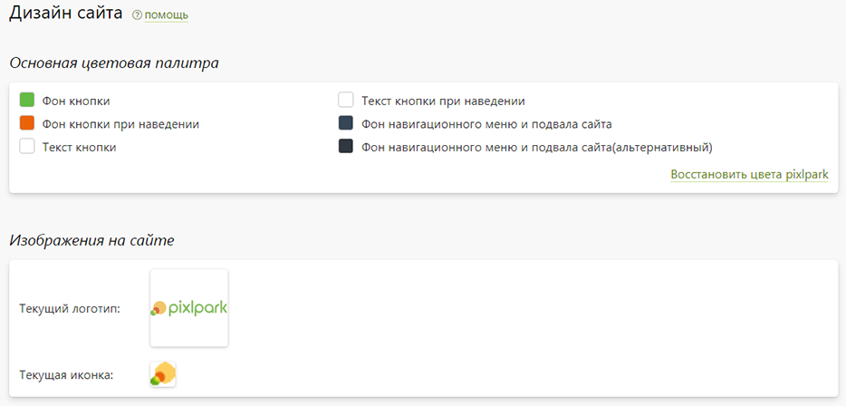

### 4. Размещение реквизитов
* В разделе "__CMS / Страницы__" на странице __Реквизиты компании__ задать актуальные реквизиты.
* 

## Настройка магазина
### 1. Подключение каталогов
* В разделе "__Сувениры / Настройка / Каталоги__" отключить неиспользуемые каталоги. Отметим, что каталог "Продукты 1С" позволяет массово загрузить ваши продукты из внешнего файла.
* 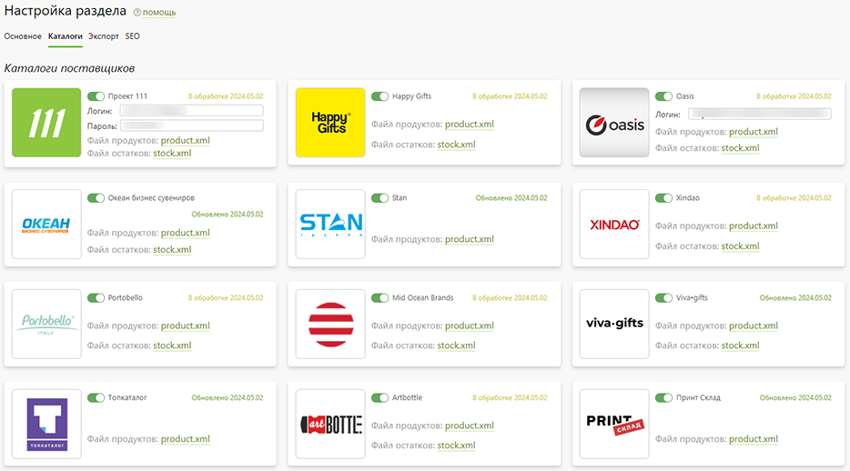

### 2. Корректировка цен
* В разделе "__Сувениры / Настройка / Основное__" в блоке "__Правила тиражности__" переопределить стоимость продукции, которая по умолчанию совпадает с рекомендуемой розничной. Для этого необходимо нажать на "__Любой__" вид нанесения, а затем в открывшемся модальном окне в поле "__Множитель__" указать значение `1,3`, если, например, стоимость продукции надо увеличить на 30%.
* 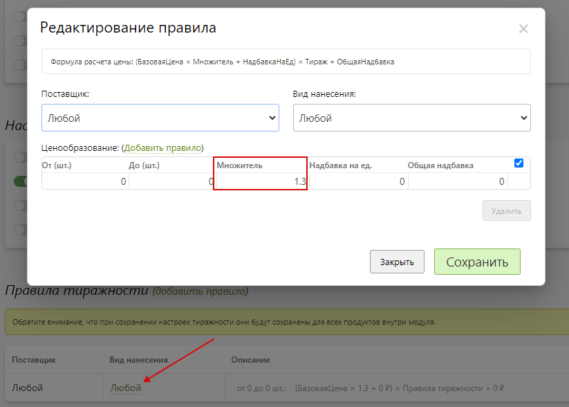
* В разделе "__Сувениры / Настройка / Основное__" в блоке "__Основная информация__" задать минимальную стоимость для заказа.

### 3. Определение приватности
* В разделе "__Сувениры / Настройка / Основное__" в блоке "__Основная информация__" выключить настройку "Отображать информацию о поставщике", если требуется скрыть на сайте информацию о принадлежности продукта к каталогу.
* 

### 4. Редактирование продуктов
* В разделе "__Сувениры / Продукты__" изменить наборы категорий, подкатегорий и продуктов. А также при желании изменить описание продуктов и другие их характеристики.
* 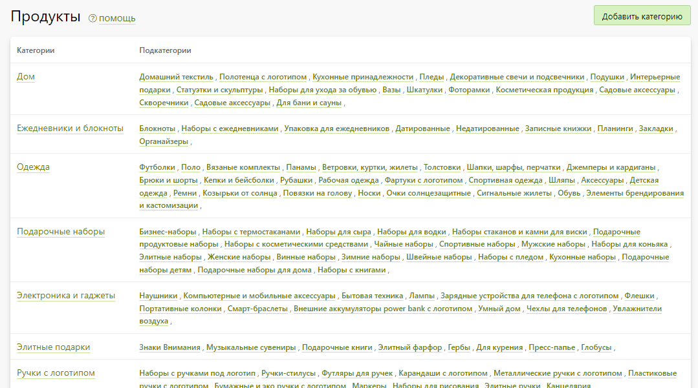

### 5. Задание видов нанесения
* В разделе "__Сувениры / Виды нанесения__" изменить список видов нанесения, которые отображаются на сайте в карточке товара.
* 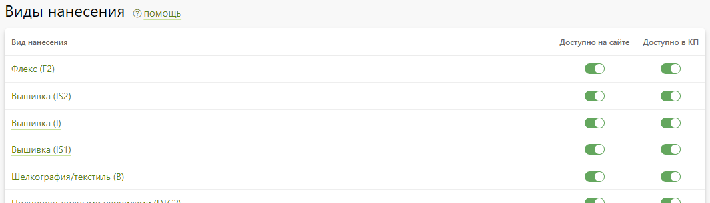

## Настройка главной страницы
### 1. Формирование структуры
* В разделе "__CMS / Страницы / Блоки__" во вкладке "__Главная__" отключить неиспользуемые информационные блоки для страницы.
* 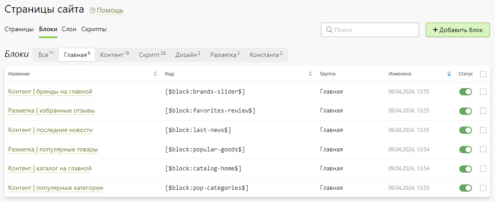

### 2. Загрузка баннеров
* В разделе "__CMS / Файлы__" в папку "__sliders__" загрузить баннеры:
    + Размер: `1920 х 500 px`, где основная композиция должна быть размещана в прямоугольнике `[593, 0] - [1583 500]`;
    + Формат: `.jpg` или `.png`, а сами файлы оптимизированы специальными сервисами типа [imagecompressor.com](https://imagecompressor.com/);
    + Название: наименование иллюстраций может быть любым, однако мы не рекомендуем использовать в названии слова типа "banner".
* 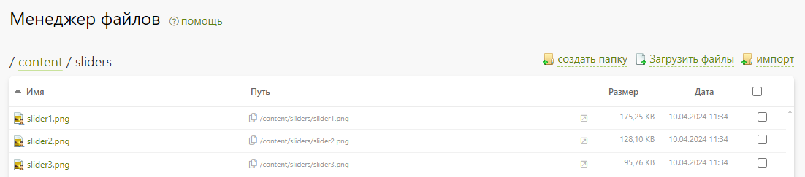

### 3. Задание популярных категорий
* В разделе "__Сувениры / Продукты__" в настройках каждой категории можно указать, что она является популярной, а также загрузить для нее обложку размером `630 х 630 px`. Пять последних из них по дате обновления будут отображаться в блоке популярных категорий.
* 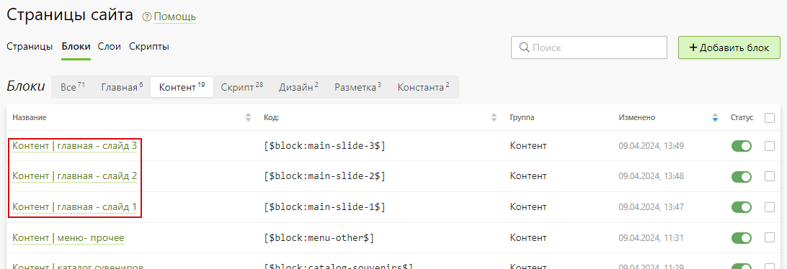

### 4. Задание популярных товаров
* В разделе "__Сувениры / Продукты__" в настройках каждого продукта можно указать, что он является новинкой или рекомендуемой позицией. Эти продукты будут отображаться в блоке популярных товаров.
* 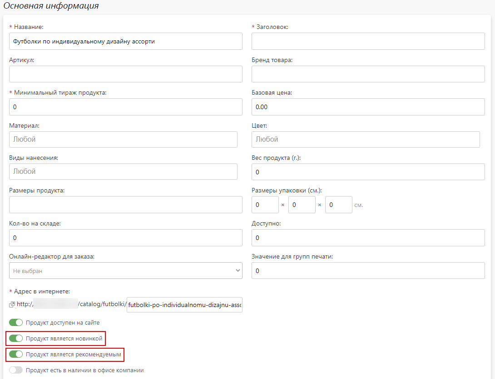

### 5. Размещение отзывов
* В разделе "__Отзывы / Гостевая книга__" отметить понравившиеся отзывы избраными, опубилковать их и очистить кэш сайта. Новые отзывы можно разместить через страницу гостевой книги на сайте ([пример](https://gifts.pixlpark.ru/guestbook)). 
* Количество выводимых отзывов регулируется в разделе "____Отзывы / Настройка____".
* 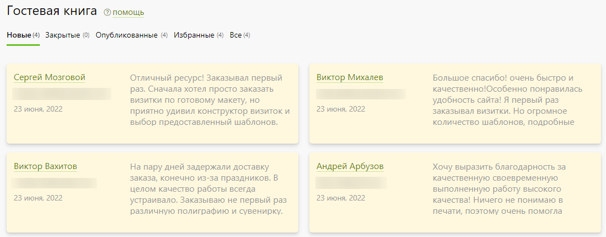

### 6. Публикация новостей
* В разделе "__Новости / Лента новостей__" задать новости, некоторые из которых будут отображаться в блоке последних новостей и в разделе "Новости" ([пример](https://gifts.pixlpark.ru/news)).
* 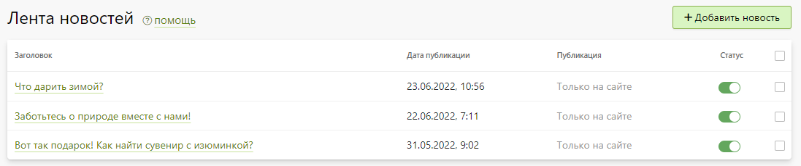

## Настройка прочих разделов
### 1. Загрузка портфолио
* В разделе "__Фотогалерея / Иллюстрации__" примеры работ, которые будут отображаться на сайте в разделе "[Портфолио](https://gifts.pixlpark.ru/portfolio)".
* 

### 2. Редактирование видов нанесения
* В разделе "__CMS / Страницы" → application-types__" отредактировать информацию о видах нанесения, которая будет отображаться на сайте в разделея "[Виды нанесения](https://gifts.pixlpark.ru/application-types)".
* 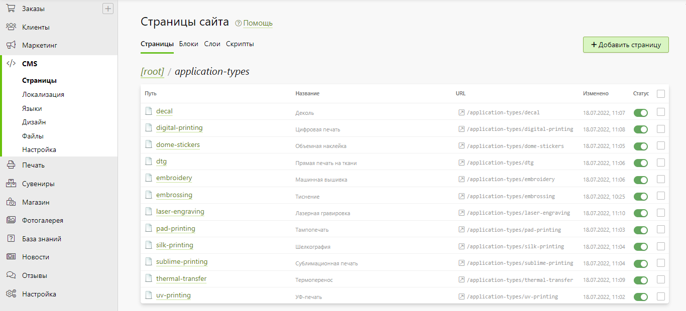

### 3. Оформление подборок
* В разделе "__CMS / Страницы" → collections__" настроить тематические подарки, которые будут отображаться на сайте в разделе "[Подборки](https://gifts.pixlpark.ru/collections)".
* 
```js
 Сами подборки в PDF-формате можно подготовить следующим образом:
 1. Авторизоваться на сайте под учетной записью администратора;
 2. Добавить в корзину продукты интересующей тематики;
 3. Сачать из корзины презентацию, при необходимости отредактировав ее;
 4. Загрузить презентацию в раздел "CMS / Файлы" в папку "collections";
 5. Разместить ссылку на PDF-файл в разметке страницы "CMS / Страницы" → "collections".
```

## Видеоуроки
### Как установить цены на сувениры
<iframe width="720" height="405" src="https://rutube.ru/play/embed/1b7dd83f27bce3a65f6a9064955e134d/" frameBorder="0" allow="clipboard-write; autoplay" webkitAllowFullScreen mozallowfullscreen allowFullScreen></iframe>