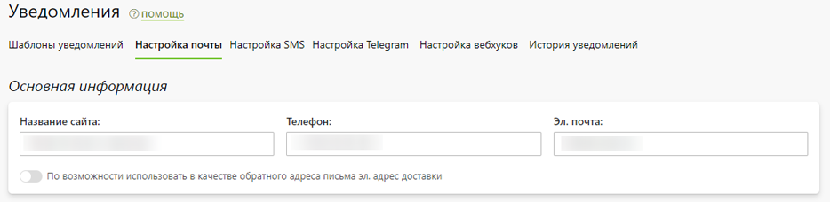
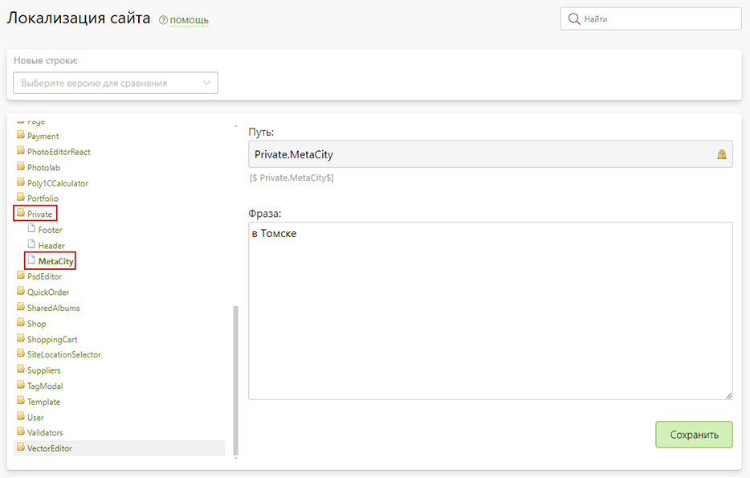
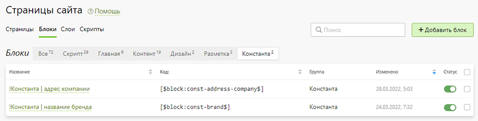

# Ответы на популярные вопросы

## Как настроить сайт с каталогами сувениров
### Настройка сайта
#### Настройка домена 
* В панели управления __регистратора доменого имени__ задать для домена IP-адрес __81.163.20.133__.
* В разделе "__Настройка / Домены__" добавить домен. А затем, как только сайт начнет открываться по основному домену, сделать его основным. 
* 

#### Настройка контактной информации 
* В разделе "__Маркетинг / Уведомления / Настройка почты__" в блоке "__Основная информация__" задать название сайта, телефон и эл. почту.
* 
* В разделе "__CMS / Локализация__" в переменной `Private.MetaCity` задать город.
* 
* В разделе "__CMS / Страницы / Блоки__" во вкладке "__Константа__" в двух блоках задать адрес компании и название бренда.
* 
#### Настройка дизайна
* В разделе "__CMS / Дизайн__" загрузить логотип в формате `.svg`, загрузить иконку в формате `.ico` и указать "Фон кнопки", который будет являться основным цветом для сайта.
* 
#### Настройка реквизитов
* В разделе "__CMS / Страницы__" на странице __Реквизиты компании__ задать актуальные реквизиты.
* 

### Настройка каталогов
#### 1. Подключение каталогов поставщиков 
* В разделе "__Сувениры / Настройка / Каталоги__" отключить неиспользуемые каталоги. Для оставшихся по возможности указать персональные логин и пароль для получения выгрузок. Но, если этого не сделать, синхронизация с каталогами будет работать и со стандартными. Отметим, что каталог "Продукты 1С" позволяет массово загрузить ваши продукты из внешнего файла, а каталог "Свои продукты" - добавлять продукты вручную через панель управления.
* 
#### 2. Правила тиражности
* В разделе "__Сувениры / Настройка / Основное__" в блоке "__Правила тиражности__" переопределить стоимость продукции, которая по умолчанию совпадает с рекомендуемой розничной. Для этого необходимо нажать на "__Любой__" вид нанесения, а затем в открывшемся модальном окне в поле "__Множитель__" указать значение `1,3`, если, например, стоимость продукции надо увеличить на 30%.
* 
#### 3. Категории, подкатегории и продукты
* В разделе "__Сувениры / Продукты__" изменить наборы категорий, подкатегорий и продуктов. А также при желании изменить описание продуктов и другие их характеристики.
* 
#### 4. Виды нанесения
* В разделе "__Сувениры / Виды нанесения__" изменить список видов нанесения, которые отображаются на сайте в карточке товара.
* 

### Настройка главной страницы
#### 1. Блоки главной страницы
* В разделе "__CMS / Страницы / Блоки__" во вкладке "__Главная__" отключить неиспользуемые блоки.
* 
#### 2. Баннеры 
* В разделе "__CMS / Файлы__" в папку "__sliders__" загрузить баннеры:
    + Размер: `1920 х 500 px`, где основная композиция должна быть размещана в прямоугольнике `[585, 0] - [1585, 500]`;
    + Формат: `.jpg` или `.png`, а сами файлы оптимизированы специальными сервисами типа [imagecompressor.com](https://imagecompressor.com/);
    + Название: наименование иллюстраций может быть любым, однако мы не рекомендуем использовать в названии слова типа "banner".
* 
#### 3. Популярные категории 
* В разделе "__Сувениры / Продукты__" в настройках каждой категории можно указать, что она является популярной, а также загрузить для нее обложку размером `630 х 630 px`. Пять последних из них по дате обновления будут отображаться в блоке популярных категорий.
* 
#### 4. Новинки и рекомендуемые товары
* В разделе "__Сувениры / Продукты__" в настройках каждого продукта можно указать, что он является новинкой или рекомендуемой позицией. Эти продукты будут отображаться в блоке популярных товаров.
* 
#### 5. Отзывы
* В разделе "__Отзывы / Гостевая книга__" отметить понравившиеся отзывы избраными. Они будут отображаться в блоке отзывов. Новые отзывы можно разместить через страницу отзывов на сайте ([пример](https://gifts.pixlpark.ru/guestbook)).
* 
#### 6. Новости
* В разделе "__Новости / Лента новостей__" задать новости, некоторые из которых будут отображаться в блоке последних новостей и в разделе "Новости" ([пример](https://gifts.pixlpark.ru/news)).
* 

### Настройка прочих разделов
Настройка иного содержимого сайта описана ниже:
1. В разделе "__Фотогалерея / Иллюстрации__" редактируется "Портфолио" ([пример](https://gifts.pixlpark.ru/portfolio)).
* 
2. В разделе "__CMS / Страницы" → application-types__" редактируются "Виды нанесения" ([пример](https://gifts.pixlpark.ru/application-types)).
* 
3. В разделе "__CMS / Страницы" → selections__" редактируются "Подборки" ([пример](https://gifts.pixlpark.ru/selections)).
* 

## Видеоуроки
### Как установить цены на сувениры
<iframe width="840" height="473" src="https://www.youtube.com/embed/go2B5--GI9s?si=EAxKkei4T1AKRYqb" title="YouTube video player" frameborder="0" allow="accelerometer; autoplay; clipboard-write; encrypted-media; gyroscope; picture-in-picture; web-share" allowfullscreen></iframe>