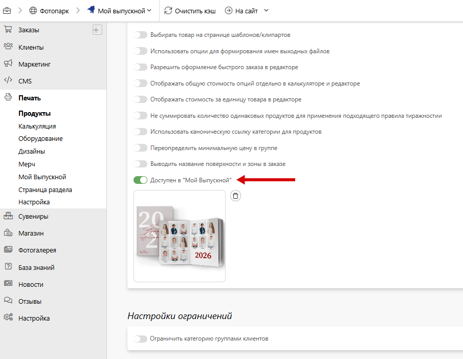
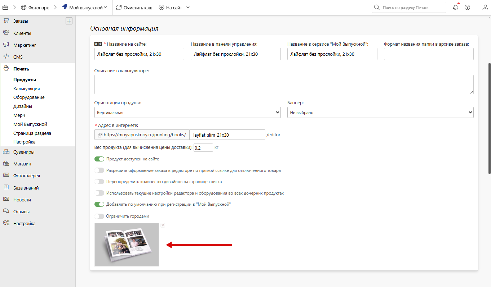
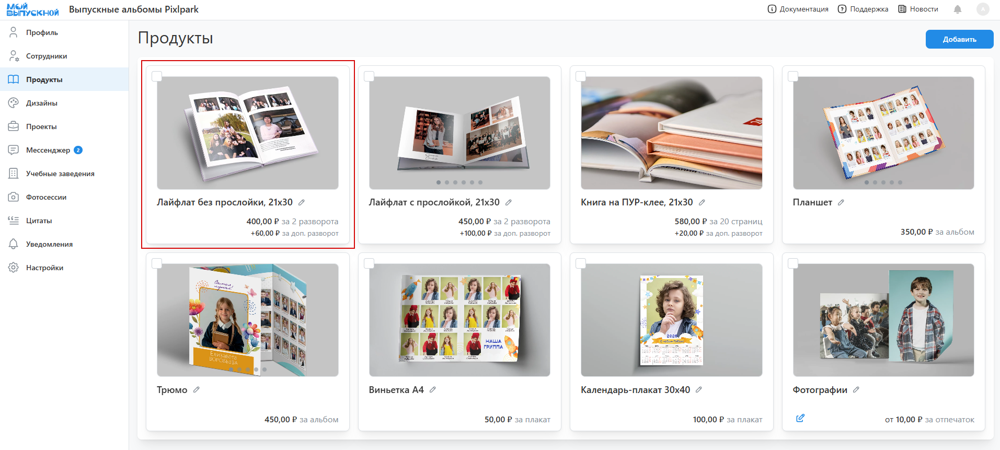

# Подключение к сервису “Мой Выпускной”

## Выбор типографии фотографом 
* [Мой выпускной](https://moyvipusknoy.ru/) - CRM система для подготовки и печати выпускных альбомов. Сервис позволяет как скачивать готовые к печати макеты, так и автоматически размещать заказы в типографиях, работающих на платформе Pixlpark.
* Зарегистрироваться в сервисе фотограф может как [самостоятельно](https://admin.moyvipusknoy.ru/register), так по реферальной ссылке типографии.
* При самостоятельной регистрации ему на выбор будут доступны только типографии, работающие на тарифе “Премиум”.
* При регистрации по реферальной ссылке возможны следующие варианты:
    1. Если типография работает на тарифе “Стандарт”, то она будет подключена автоматически. А среди доступных будут лишь те, которые работают на тарифе “Премиум”.
    2. Если типография работает на тарифе “Комфорт” или “Премиум”, то она будет подключена автоматически. А другие типографии доступны не будут.
* После самостоятельной регистрации фотограф также может перейти по реферальной ссылке - в этом случае партнерская типография будет подключена автоматически, а список ранее доступных типографий изменен не будет.

## Подключение типографии к сервису
* Для подключения типографии к сервису необходимо выполнить несколько шагов:
    1. Оставить заявку в тех. поддержку Pixlpark на подключение к сервису.
    2. В разделе “Настройка / Доступ” в блоке “Мой Выпускной” задать название типографии в сервисе и способы приема заказов:
        - Цифровой заказ - возможность скачивания готовых макетов с именованием для пакетной загрузки.
        - Физический заказ - возможность автоматического размещения заказа из сервиса на сайте типографии.
* В этом же блоке представлена реферальная ссылка типографии, которую она может распространять среди своих клиентов. 

## Настройка продукции типографии
* Для отображения в сервисе продукции типографии необходимо:
    1. В настройках категории печати включить “Доступен в Мой Выпускной” и при необходимости переопределить наименование в поле “Название в сервисе “Мой Выпускной”. Отметим, что сервис поддерживает работу только с редакторами дизайнов и фотопечати.
    
    2. В продуктах также указать наименование и при необходимости выставить настройку “Добавлять по умолчанию при регистрации в “Мой Выпускной” - в этом случае товар будет добавлять в коллекцию фотографа автоматически. Мы рекомендуем отмечать самые популярные товары, но чтобы суммарно их было не более 8 или 12 штук. Для визуализации товара в сервисе потребуется загрузить обложку или указать баннер с набором иллюстраций.
    
    
