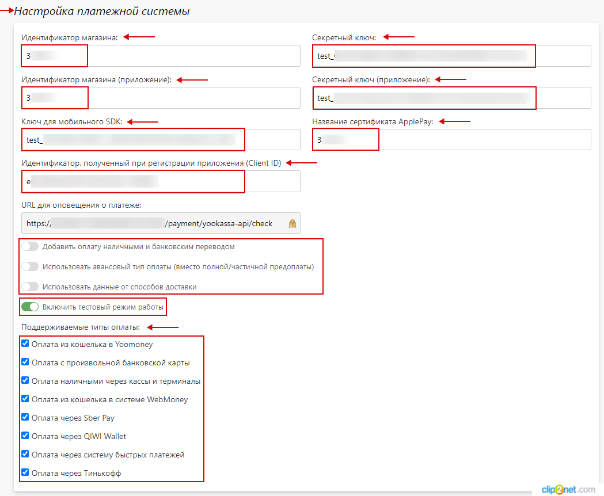

# Интеграции с платежными системами

## ЮKassa
* Настройка платежной системы "__ЮKassa__" позволяет оплачивать заказы на сайте при помощи сервиса для приема платежей в интернете [ЮKassa](https://yookassa.ru).
* Для настройки платежной системы необходимо выполнить следующие действия.

### Получение доступа
* Для получения доступа необходимо перейти на [страницу](https://yookassa.ru) и оставить заявку на подключение нажав на кнопку "__Подключить ЮKassa__".

### Требования к оформлению сайта
* Для подключения сервиса необходимо привести сайт в соответствии с [требованиями](https://yookassa.ru/docs/support/payments/onboarding/arrangement).

### Настройка тестового режима оплаты
> После настройки основного магазина необходимо проверить корректность настроек в тестовом режиме оплаты при помощи [тестового магазина](https://yookassa.ru/docs/support/merchant/payments/implement/test-store). В разделе "__Интеграция /  HTTP - уведомления__" тестового магазина в личном кабинете ЮKassa необходимо указать URL для уведомления из панели управления Pixlpark в формате: `https://frontend-XXXX.pixlpark.com/api/payment/yookassa-api/check` , а так же включить: __payment.succeeded__, __payment.waiting_for_capture__ и __payment.canceled__. В тестовом магазине возможно протестировать два вида оплаты: банковские карты и ЮMoney. 
* Для настройки тестового режима оплаты заказов в панели управления Pixlpark необходимо  перейти в раздел "__Настройка / Оплата__" и в подразделе "__Способы оплаты__" перейти в [карточку оплаты](../site/payments#карточка-оплаты) "__ЮKassa__".
> В случае, если при переходе в подраздел "__Способы оплаты__"  в списке отсутствует "__ЮKassa__", необходимо выбрать значение "__Не учитывать__" в подразделе "__Доступность__".
* 
* В подразделе "__Основная информация__" заполнить поля, указав:
    + __Название на сайте__.
    + __Название в панели управления__.
    + __Признак способа расчета в электронном чеке__ - выбрать необходимый способ из списка.
    + __Платежная система доступна на сайте__ - необходимо включить.
    + __Платежная система доступна в мобильном приложении__ - включить при необходимости.
    + __Платежная система используется по умолчанию__ - включить при необходимости.
* 
> Подразделы "__Ограничения__" и "__Комиссия платежной системы__" при необходимости настраиваются опционально.
* 
* В подразделе "__Настройки платежной системы__" заполнить поля, указав:
    + "__Идентификатор магазина__" - Shop ID тестового магазина в ЮKassa.
    + "__Секретный ключ__" - секретный ключ тестового магазина в ЮKassa.
    + "__Идентификатор магазина (мобильное приложение)__" - Shop ID тестового магазина в ЮKassa.
    + "__Секретный ключ (мобильное приложение)__" - секретный ключ тестового магазина в ЮKassa.
    + "__Ключ для мобильного SDK__" - ключ для тестового мобильного SDK в ЮKassa (создается при необходимости приема платежей в мобильном приложении).
    + "__Название сертификата ApplePay__" - сертификат ApplePay для ЮKassa.
    + "__Идентификатор, полученный при регистрации приложения (Client ID)__" - Client ID, полученный при регистрации приложения на сайте [https://yookassa.ru](https://yookassa.ru/oauth/v2/client)

    + "__Поддерживаемые типы оплаты__" - выбрать необходимые пункты.
    + "__Добавить оплату наличными или банковским переводом__" - включить при необходимости.
    + "__Использовать авансовый тип оплаты (вместо полной / частичной оплаты)__" - включить при необходимости.
    + "__Использовать данные от способов доставки__" - включить при необходимости.
    + "__Включить тестовый режим работы__" - необходимо включить.
* 
> "__Идентификатор магазина__" и "__Секретный ключ__" необходимы для приема платежей на сайте. "__Идентификатор магазина (мобильное приложение)__", "__Секретный ключ (мобильное приложение)__", "__Ключ для мобильного SDK__", "__Идентификатор, полученный при регистрации приложения (Client ID)__"  и "__Название сертификата ApplePay__" необходимы для приема платежей в мобильном приложении.
> Для получения "__Идентификатора, полученного при регистрации приложения (Client ID)__" необходимо перейти в личный кабинет ЮКассы по ссылке [https://yookassa.ru/oauth/v2/client](https://yookassa.ru/oauth/v2/client) и зарегистрировать приложение. При регистрации приложения нужно ввести название приложения, оно будет отображаться только в личном кабинете ЮКассы, в качестве кода подтверждения выбрать "Показывать на странице", в разделах "Кошелек ЮMoney" и "Профиль ЮMoney" включить просмотр.
> * 
* Далее, нажать кнопку "__Сохранить__" и сбросить кэш сайта.
* После, осуществить платеж на сайте выбрав "__ЮKassa__" в качестве способа оплаты заказа. Для осуществления платежа использовать [тестовые карты](https://yookassa.ru/developers/payment-acceptance/testing-and-going-live/testing#test-bank-card-data).
* При успешном завершении платежа информация дополнительно будет отражена в подразделе "__Оплата заказа__" [карточки заказа](../orders/list#информация-об-оплате-1) в панели управления Pixlpark.

### Настройка рабочего режима оплаты
* Для настройки продукционного (боевого) режима оплаты заказов необходимо перейти в раздел "__Настройка / Оплата__" и в подразделе "__Способы оплаты__" перейти в  "__ЮKassa__".
* В подразделе "__Настройки платежной системы__" заполнить поля, указав:
    + "__Идентификатор магазина__" - Shop ID магазина в ЮKassa.
    + "__Секретный ключ__" - секретный ключ магазина в ЮKassa.
    + "__Идентификатор магазина (мобильное приложение)__" - Shop ID магазина для мобильного приложения в ЮKassa.
    + "__Секретный ключ (мобильное приложение)__" - секретный ключ магазина для мобильного приложения в ЮKassa.
    + "__Ключ для мобильного SDK__" - ключ для мобильного SDK в ЮKassa (создается при необходимости приема платежей в мобильном приложении).
    + "__Название сертификата ApplePay__" - сертификат ApplePay для ЮKassa.
    + "__Идентификатор, полученный при регистрации приложения (Client ID)__" - Client ID, полученный при регистрации приложения на сайте [https://yookassa.ru](https://yookassa.ru/oauth/v2/client)

    + "__Включить тестовый режим работы__" - необходимо выключить.

* Далее, нажать кнопку "__Сохранить__" и сбросить кэш сайта.

### Настройка возврата платежа
* Для включения механизма возврата платежей в подразделе "__Основная информация__" раздела "__Настройка / Оплата / Настройка__" необходимо включить "__Разрешить возврат платежей в панели управления__".

* Возврат платежей из панели управления осуществляется несколькими способами.
    + __На странице списка заказов__
        - При отмене заказа будет отображено всплывающее окно с информацией о возврате средств.
* 
    + __В карточке заказа__
        - При отмене заказа будет отображено всплывающее окно с информацией о возврате средств. 
* 
    + __В разделе редактирования оплаты карточки заказа__
        - При выделении необходимого счета на оплату становится доступна кнопка "__Оформить возврат__".
* 

## Тинькофф
* Настройка платежной системы "__Тинькофф__" позволяет оплачивать заказы на сайте при помощи [эквайринга Тинькофф](https://www.tinkoff.ru/business/payments/internet-acquiring).
> Для корректной работы платежной системы в профиле пользователя обязательно указать email.
* Для настройки платежной системы необходимо выполнить следующие действия.

### Получение доступа
* Для получения доступа необходимо перейти на [страницу](https://www.tinkoff.ru/business/payments/internet-acquiring/) и оставить заявку на эквайринг нажав на кнопку "__Подключить__".

### Требования к оформлению сайта
* Для подключения платежной системы необходимо привести сайт в соответствии с [требованиями](https://www.tinkoff.ru/kassa/solution/classic/help/how-work/connection-conditions/#q3).

### Настройка тестового режима оплаты
> Предварительно необходимо [настроить](https://www.tinkoff.ru/kassa/solution/classic/help/how-involve/payment/#q8) тестовый терминал в личном кабинете интернет-эквайринга Тинькофф.
* Для настройки тестового режима оплаты заказов в панели управления Pixlpark необходимо  перейти в раздел "__Настройка / Оплата__" и в подразделе "__Способы оплаты__" перейти в [карточку оплаты](../site/payments#карточка-оплаты) "__Тинькофф__".
> В случае, если при переходе в подраздел "__Способы оплаты__"  в списке отсутствует "__Тинькофф__", необходимо выбрать значение "__Не учитывать__" в подразделе "__Доступность__".
* 
* В подразделе "__Основная информация__" заполнить поля, указав:
    + __Название на сайте__.
    + __Название в панели управления__.
    + __Признак способа расчета в электронном чеке__ - выбрать необходимый способ из списка.
    + __Платежная система доступна на сайте__ - необходимо включить.
    + __Платежная система доступна в мобильном приложении__ - включить при необходимости.
    + __Платежная система используется по умолчанию__ - включить при необходимости.
* 
> Подраздел "__Ограничения__" при необходимости настраивается опционально.
* 
* В подразделе "__Настройки платежной системы__" заполнить поля, указав:
    + "__Terminal ID__" - номер тестового терминала.
    + "__Пароль__" - пароль тестового терминала.
* 
* Далее, нажать кнопку "__Сохранить__" и сбросить кэш сайта.
* После, осуществить платеж на сайте выбрав "__Тинькофф__" в качестве способа оплаты заказа. Для осуществления платежей использовать данные тестовых карт, указанных на странице "__Тестирование платежей__" в личном кабинете Тинькофф.
> Подробную информацию о тестировании можно узнать на [странице](https://www.tinkoff.ru/kassa/solution/classic/help/how-involve/payment/#q10).
* При успешном завершении платежа информация дополнительно будет отражена в подразделе "__Оплата заказа__" [карточки заказа](../orders/list#информация-об-оплате-1) в панели управления Pixlpark.

### Настройка рабочего режима оплаты
> Для осуществления настроек предварительно необходимо настроить рабочий терминал в личном кабинете Тинькофф, а также убедится в его активации сотрудниками банка.
* Для настройки рабочего режима оплаты заказов необходимо перейти в раздел "__Настройка / Оплата__" и в подразделе "__Способы оплаты__" перейти в "__Тинькофф__".
* В подразделе "__Настройки платежной системы__" заполнить поля, указав:
    + "__Terminal ID__" - номер рабочего терминала.
    + "__Пароль__" - пароль рабочего терминала.
* 
* Далее, нажать кнопку "__Сохранить__" и сбросить кэш сайта.

### Настройка возврата платежа
* Для включения механизма возврата платежей в подразделе "__Основная информация__" раздела "__Настройка / Оплата / Настройка__" необходимо включить "__Разрешить возврат платежей в панели управления__".

* Возврат платежей из панели управления осуществляется несколькими способами.
    + __На странице списка заказов__
        - При отмене заказа будет отображено всплывающее окно с информацией о возврате средств.
* 
    + __В карточке заказа__
        - При отмене заказа будет отображено всплывающее окно с информацией о возврате средств. 
* 
    + __В разделе редактирования оплаты карточки заказа__
        - При выделении необходимого счета на оплату становится доступна кнопка "__Оформить возврат__".
* 

## Robokassa
* Настройка платежной системы "__Robokassa__" позволяет оплачивать заказы на сайте при помощи платежной системы Robokassa.
* Для настройки платежной системы необходимо выполнить следующие действия.

### Получение доступа
* Для получения доступа необходимо перейти на [страницу](https://robokassa.com) и оставить заявку на подключение нажав на кнопку "__Подключиться к Robokassa__".

### Требования к оформлению сайта
* Для подключения платежной системы необходимо привести сайт в соответствии с [требованиями](https://robokassa.com/content/trebovaniya.html).

### Настройка тестового режима оплаты
> Предварительно необходимо [создать и настроить магазин](https://robokassa.com/content/podklyuchenie-k-cms-ili-crm.html)  в личном кабинете Robokassa. При осуществлении настроек задать параметры:
> - "__Result URL__" - указать адрес в формате `https://ваш-сайт/payment/robokassa/result`.
> - "__Метод отсылки данных по Result Url__" - выбрать метод __POST__.
> - "__Success URL__"- указать адрес в формате `https://ваш-сайт/payment/robokassa/success`.
> - "__Метод отсылки данных по Success Url__" - выбрать метод __POST__.
> - "__Fail URL__" - указать адрес в формате `https://ваш-сайт/payment/robokassa/fail`.
> - "__Метод отсылки данных по Fail Url__" - выбрать метод __GET__.
> - пароли для проведения тестовых платежей в [тестовом режиме](https://docs.robokassa.ru/testing-mode).
* Для настройки тестового режима оплаты заказов в панели управления Pixlpark необходимо  перейти в раздел "__Настройка / Оплата__" и в подразделе "__Способы оплаты__" перейти в [карточку оплаты](../site/payments#карточка-оплаты) "__Robokassa__".
> В случае, если при переходе в подраздел "__Способы оплаты__"  в списке отсутствует "__Robokassa__", необходимо выбрать значение "__Не учитывать__" в подразделе "__Доступность__".
* 
* В подразделе "__Основная информация__" заполнить поля, указав:
    + __Название на сайте__.
    + __Название в панели управления__.
    + __Признак способа расчета в электронном чеке__ - выбрать необходимый способ из списка.
    + __Платежная система доступна на сайте__ - необходимо включить.
    + __Платежная система доступна в мобильном приложении__ - включить при необходимости.
    + __Платежная система используется по умолчанию__ - включить при необходимости.
* 
> Подраздел "__Ограничения__" при необходимости настраивается опционально.
* 
* В подразделе "__Настройки платежной системы__" заполнить поля, указав:
    + "__Идентификатор магазина__" - идентификатор магазина в Robokassa.
    + "__Пароль #1__" - пароль #1 для тестовой среды в Robokassa.
    + "__Пароль #2__" - пароль #2 для тестовой среды в Robokassa.
    + "__Включить тестовый режим работы__" - необходимо включить.
* 
* Далее, нажать кнопку "__Сохранить__" и сбросить кэш сайта.
* После, осуществить платеж на сайте выбрав "__Robokassa__" в качестве способа оплаты заказа.
* При успешном завершении платежа информация дополнительно будет отражена в подразделе "__Оплата заказа__" [карточки заказа](../orders/list#информация-об-оплате-1) в панели управления Pixlpark.

### Настройка рабочего режима оплаты
* Для настройки рабочего режима оплаты заказов необходимо перейти в раздел "__Настройка / Оплата__" и в подразделе "__Способы оплаты__" перейти в "__Robokassa__".
* В подразделе "__Настройки платежной системы__" заполнить поля, указав:
    + "__Пароль #1__" - пароль #1 в Robokassa.
    + "__Пароль #2__" - пароль #2 в Robokassa.
    + "__Включить тестовый режим работы__" - необходимо выключить.
* 
* Далее, нажать кнопку "__Сохранить__" и сбросить кэш сайта.
> Для запуска платежной системы необходимо пройти двухэтапную активацию магазина в Robokassa.

## Банковский перевод

* Настройка платежа "__Банковский перевод__" позволяет оплачивать заказы на сайте при помощи банковского перевода по сформированному платежному документу.

* Для настройки платежной системы необходимо выполнить следующие действия.
* В панели управления Pixlpark необходимо  перейти в раздел "__Настройка / Оплата__" и в подразделе "__Способы оплаты__" перейти в [карточку оплаты](../site/payments#карточка-оплаты) "__Банковский перевод__".
> В случае, если при переходе в подраздел "__Способы оплаты__"  в списке отсутствует "__Банковский перевод__", необходимо выбрать значение "__Не учитывать__" в подразделе "__Доступность__".
* 
* В подразделе "__Основная информация__" заполнить поля, указав:
    + __Название на сайте__.
    + __Название в панели управления__.
    + __Платежная система доступна на сайте__ - необходимо включить.
    + __Платежная система доступна в мобильном приложении__ - включить при необходимости.
    + __Платежная система используется по умолчанию__ - включить при необходимости.
* 
> Подраздел "__Ограничения__" при необходимости настраивается опционально.
* 
* Подраздел "__Настройка платежной системы__" содержит реквизиты получателя по умолчанию, задаваемые в подразделе "__Оплата / Реквизиты__".

> Для использования данной системы оплаты при пополнении личного счета включить "__Показывать данную систему оплаты при пополнении личного счета__".
* 
* После, подготовить шаблон платежного документа с указанием реквизитов организации в подразделе "__Платежные документы__".
* 
> Добавить новый платежный документ можно при помощи кнопки "__Добавить__".
* 
* На странице платежного документа заполнить форму, указав:
    + __"Название"__ - название платежного документа на сайте.
    + "__Документ доступен на сайте__" - необходимо включить.
    + "__Сохранять документ в формате PDF (по умолчанию HTML)__" - включить при необходимости выгрузки документа в формате PDF.
* 
* Далее, при необходимости, включить ограничения в подразделе "__Ограничения__" платежного документа.
* 
* Затем, в подразделе "__Документ__" добавить текстовое содержимое платежного документа.
* 
* Далее, нажать кнопку "__Сохранить__" и сбросить кэш сайта.
* После, осуществить платеж на сайте выбрав "__Банковский перевод__" в качестве способа оплаты заказа. При переходе на страницу оплаты выбрать необходимый бланк счета и нажать кнопку "__Распечатать__".
* 
* Информация о платеже дополнительно будет отражена в подразделе "__Оплата заказа__" [карточки заказа](../orders/list#информация-об-оплате-1) в панели управления Pixlpark.

> После подтверждения платежа статус оплаты заказа в панели управления Pixlpark можно изменить вручную нажав на кнопку "__Изменить__". Для этого в карточке "__Информация об оплате__"  необходимо ввести сумму платежа и нажать на кнопку "__Сохранить__".
* 
> Изменение статуса оплаты будет отражено в подразделе "__Оплата заказа__" карточки заказа в панели управления Pixlpark.
* 