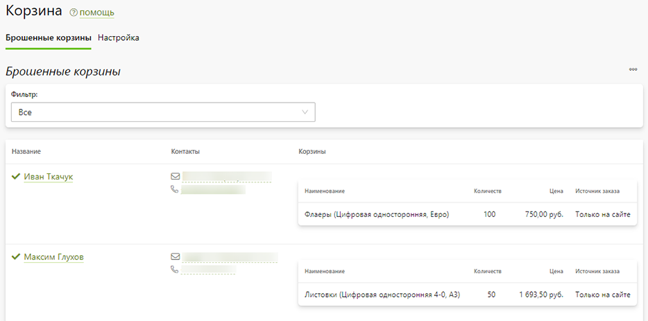
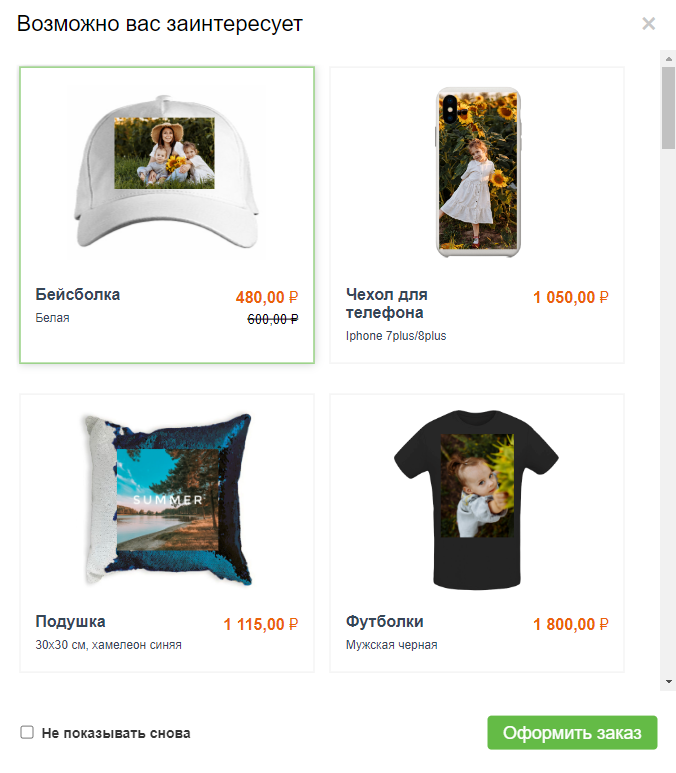
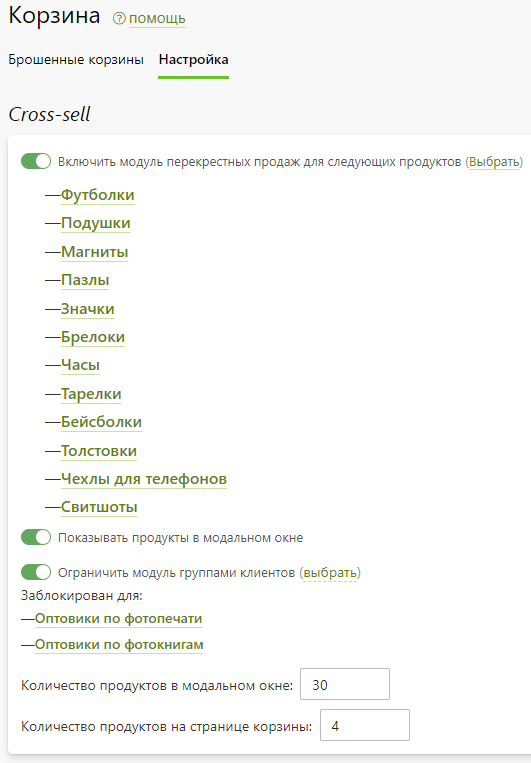

# Корзины
## Брошенные корзины
* В разделе “__Маркетинг / Корзины / Брошенные корзины__” отображаются не оформленные заказы клиентов, т.е. содержимое их корзин. Каждая позиция корзины храниться 14 дней с момента добавления, после чего удаляется безвозвратно.
* 
* В сервисе предусмотрено уведомление клиента за 24 часа до удаления продукта из корзины. Настроить уведомление можно в разделе “__Маркетинг / Уведомления__”.
* Используя информацию данного раздела вы можете связаться с клиентами и предложить помощь по оформлению заказов.

## Перекрестные продажи
* В разделе “__Маркетинг / Корзины / Настройка__” активируется модуль перекрестных продаж - это предложение к покупке дополнительных продуктов на странице корзины с размещенными на них фотографиями пользователя.
* Продукты могут отображаться в виде блока под таблицей страницы корзины и в виде модального окна, появляющегося после нажатия кнопки “Заказать”.
* 
* 
* Для запуска перекрестных продаж необходимо включить модуль и выбрать продукты, с которыми он будет работать.
* 
* Отметим, что персонализированный продукт формируются путем размещения фотографии клиента на первой зоне первой поверхности печати. Если фотография содержит лица людей, то система их старается позиционировать строго по центру печатной области.
