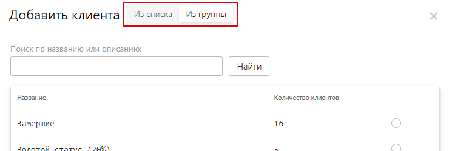
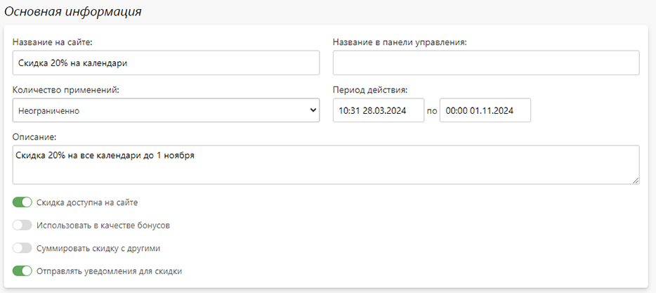
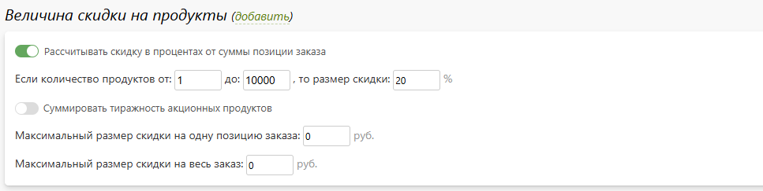
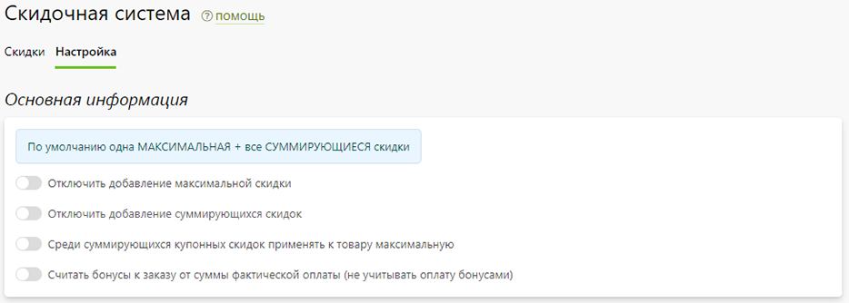

# Скидочная система
## Типы скидок
* __Скидка__ - это один из самых эффективных инструментов маркетинга, который выражается в понижении стоимости текущего или будущего заказа клиента.
* Основными характеристиками скидки, определяющими ее поведение являются:
    + __Тип скидки__:
        + __Персональная__ - скидка доступна либо определенному набору клиентов, либо указанной группе клиентов;
        + __Купонная__ - скидка становится доступна только после активации ее купонов;
        + __Общая__ - скидка по умолчанию доступна всем клиентам.
    + __Применимость__:
        + Скидка применяется к текущему заказу;
        + Скидка зачисляется в виде баллов на бонусный счет;
        + Скидка зачисляется в виде кэшбека на личный счет счет;
    + __Суммируемость__:
        + __Скидка суммирует свое значение__ к продукту с другими скидками, допускающими суммирование (например: если одна скидка дает 10% на продукт, а другая на этот же продукт - 20%, то при включении настройки итоговая скидка на продукт будет составлять 30%);
        + __Скидка не суммируется свое значение__ с другими (из предыдущего примера к продукту применится лишь скидка в 20%).
* Еще раз подчеркнем, что суммируемость отвечает лишь за применение разных скидок к одному продукту. Но, если в корзине находятся несколько продуктов и для них доступны разные скидки, то все они будут применяться вне зависиммости от настроек суммируемости.
* Именно комбинация этих параметров определяет всю вариативность применения скидок, которые мы рассмотрим ниже в разделе “Примеры использования”.
* Все скидки имеют как общие, так и специфичные характеристики:
    + Для персональных скидок это либо ручное добавление клиента, либо связывание с группой клиентов;
* 
    + Для купонных скидок это возможность ручного ввода купонов, либо их автоматическая генерация.
* 

## Характеристики скидки
* __Название на сайте__ - название скидки, отображаемое на сайте в личном кабинете пользователя и на странице корзины.
* __Название в панели управления__ - название скидки, отображаемое в панели управления на странице заказа, списка скидок, профиля клиента и выгрузках.
* __Применимость__ - применимость скидки к текущему или последующим заказам. 
* __Период действия__ - диапазон времени, в течении которого скидка доступна для использования. 
* __Скидка доступна на сайте__ - доступность скидки для использования.
* __Суммировать скидку с другими__ - суммировать скидку с другими суммирующимися (у которых включена аналогичная настройка).
* __Отправлять уведомления для скидки__ - оставлять логику работы уведомлений (о добавлении клиента в персональную скижку или активации купона) без изменений. Выключая данную настройку соответствующие уведомления для данной скидки отправляться не будут, даже если они включены.
* 
* __Величина скидки на продукты__ - фиксированное или процентное значение в рамках определенных диапазонов тиражности с максимальным значением как на один продукт, так и на заказ в целом;
* 
* __Величина скидки на доставку__ - фиксированное или процентное значение в рамках определенных диапазонов тиражности;
* 
* __Ограничения__ - ограничение применимости скидки по различным характеристиками:
    + Категориями раздела "Печать";
    + Опциям раздела "Печать";
    + Категориями раздела "Сувениры";
    + Категориями раздела "Магазин";
    + Способами доставки;
    + Способами оплаты;
    + Источником заказа (все, сайт, приложение);
    + Суммой скидочных товаров или всего заказа;
    + Количеством применений;
    + Количеством продуктов;
    + Количеством страниц продукта;
    + Днями недели, датами или часами в течении дня.
* 

## Множественное применение
* Очень часто случается так, что пользователю в определенный момент времени для продуктов корзины доступно сразу несколько скидок. В этом случае система применяет лишь те, которые суммарно дают максимальную выгоду.
* Логика одновременного применения скидок настраивается в панели управления в разделе "__Маркетинг / Скидки / Настройка__". По умолчанию применяются все суммирующиеся скидки и одна из оставшихся, дающая максимальную выгоду. 
* Далее, через соответствующие настройки этот алгоритм можно видоизменять:
    + Отключить добавление максимальной скидки, чтобы учитывались только суммирующиеся;
    + Отключить добавление суммирующихся скидок - в этом случае будет применена одна скидка, дающая максимальную выгоду среди всех возможных (включая суммирующихся);
    + Среди суммирующихся купонных скидок применять к продукту лишь одну, дающую максимальную выгоду;
* 
* В случае, если применяется скидка в виде начисления бонусов, то пересчитывать их величину после оформления заказа от суммы фактической оплаты, т.е. за вычетом оплата бонусными баллами.

## Примеры использования
### Скидка для сотрудников
:::info
[Описано в разделе "Группы"](/customers/groups#скидка-для-сотрудников)
:::
### Скидка для оптовиков
:::info
[Описано в разделе "Группы"](/customers/groups#оптовая-печать-фотографий)
:::
### Скидка в день регистрации
:::info
[Описано в разделе "Группы"](/customers/groups#скидка-в-день-регистрации)
:::
### Скидка для возврата клиента
:::info
[Описано в разделе "Группы"](/customers/groups#скидка-для-возврата-клиента)
:::
### Накопительные скидки
:::info
[Описано в разделе "Группы"](/customers/groups#накопительные-скидки)
:::
### Бесплатная доставка
:::info
[Описано в разделе "Группы"](/customers/groups#бесплатная-доставка)
:::