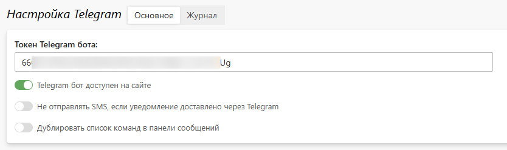

# Уведомления
## Шаблоны уведомлений
### Описание
* В сервисе Pixlpark существует множество стандартных событий, на совершение которых предусмотрена отправка уведомлений клиентам и сотрудникам компании. Например, это регистрация на сайте, совершение заказа или активация купона.
* Однако, поимо стандартных событий можно создавать свои собственные, на совершение которых можно настроить отправку собственных уведомлений. К таким событиям относятся:
    + Выполнение правила обработки заказов;
    + Добавление или исключения клиента из группы. 
* Вне зависимости от предназначения все уведомления могут отправляться по электронно почте, смс или telegram. Каждое уведомление имеет ряд настроек, которые вкупе называются шаблоном. 

### Характеристики шаблона
* __Отправлять уведомление по эл.почте/SMS/Telegram__ - отправлять уведомление по электронной почте, смс или telegram. Если уведомление предназначено сотрудникам компании, то оно по умолчанию отправляется стандартному списку получателей. Однако вы можете переодпределить получателей, выбрав любых сотрудников (в этом случае уведомление будет отправлено только им).
* __Отправлять копию письма__ - добавить к получателям уведомления следующий список адресов.
* __Не отправлять копию письма__ - исключить из получателей уведомления почте следующий список адресов.
* 
* __Ограничения__ - ограничить отправку уведомления:
    + __по типу заказчика__: частному лицу, организации, сотруднику;
    + __по статусу оплаты__, если уведомление свявзано с изменением состояния заказа. 
* 
* __Шаблон письма__ - сообщение, отправляемое по эл. почте.
* 
* __Шаблон SMS-сообщения__ - сообщение, отправляемое по смс.
* 
* __Шаблон сообщения в Telegram__ - сообщение, отправляемое в Telegram.
* 

## Настройка почты
* __По возможности использовать в качестве обратного адреса письма эл. адрес доставки__ - подставлять в качестве обратного адреса эл. почту пункта выдачи заказа, выбранного клиентом.
* __Почтовый сервер__ - сервер для отправки уведомлений по эл. почте:
    + __Системный__ - почтовый сервер сервиса Pixlpark;
    + __SendSay__ - почтовый сервер сервиса [SendSay](https://sendsay.ru/);
    + __SMTP__ - собственный почтовый сервер.
* __Настройка почтового сервера__ - настройки почтового сервера, выбраного выше.
* 

## Настройка SMS
* __Сервис отправки сообщений__ - сервис для отправки уведомлений по смс.
* 
* __Настройка сервиса__ - настройки сервиса, выбранного выше.
* 

## Настройка Telegram
* __Токен Telegram бота__ - токен , который формируется в процессе создания Telegram бота по следующему алгоритму:
    + Открыть Telegram-чат с [BotFather](https://t.me/BotFather) и отправить команду __/newbot__;
    + Указать название (например: `PixlparkDemo`) и псевдоним бота, который должен оканчиваться на "Bot" (например: `PixlparkDemoBot`);
    + Задать адрес сайта через команду __/setdomain__ (например: `https://demo.pixlpark.ru/`).
    + Определить доступные команды, которым соответствут представленные в панели управления функции.
* __Telegram бот доступен на сайте__ включить авторизацию и отправку уведомлений в Telegram.
* __Не отправлять SMS, если уведомление доставлено через Telegram__ - не отправлять клиенту смс-сообщение, если оно уже было доставлено через Telegram.
* 

## Настройка вебхуков
* В данном разделе представлен список настроенных вебхуков, каждый из которых характеризуется:
    + Статусом активности.
    + Событием сервиса, при котором он срабатывает.
    + URL-адресом, куда отправляется запрос с данными измененного объекта в формате JSON.
* 
* Каждый вебхук можно удалить, включить или выключить, изменить событие или URL-адрес, а также протестировать, отправив данные по номеру заказа.
* Также можно настроить отправку уведомление по эл. почте при ошибках работы вебхука.

## История
* В данном разделе представлен список отправленных уведомлений с возможностью их фильтрации по статусу отправки и каналу:
    + По эл. почте;
    + По смс;
    + Через Telegram;
    + Через приложение.
* 