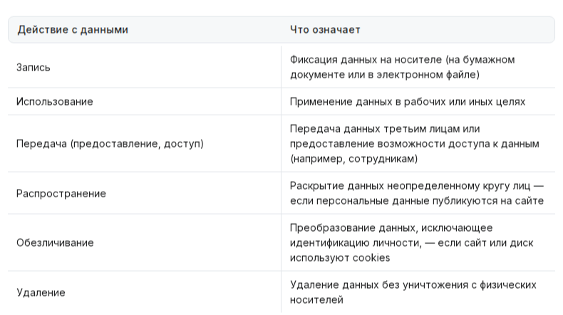
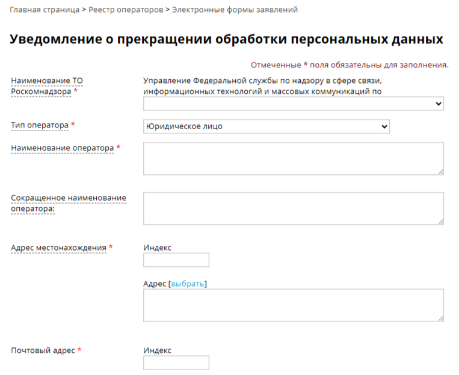

 
# Подача уведомления в Роскомнадзор
## Кому и для чего нужно подавать уведомление в Роскомнадзор
* Уведомление нужно подавать, если вы получаете данные о клиентах с использованием средств автоматизации и/или распространяете их. Например: собираете email-адреса или другую информацию через контактные формы, анализируете статистику сайта через внешние сервисы (с помощью cookies) или публикуете отзывы клиентов на сайте.
* Уведомление подается один раз. Это бесплатно. В течение 30-ти дней Роскомнадзор рассмотрит его и внесет информацию в реестр операторов.

## Подготовка к подаче уведомления
* До начала подачи уведомления необходимо проверить - подавалось ли уведомление в Роскомнадзор ранее. Это можно сделать на сайте Роскомнадзора в [Реестре операторов персональных данных](https://pd.rkn.gov.ru/operators-registry/operators-list/).
* Если уведомление уже направлялось, рекомендуем проверить насколько корректно в нем указана информация. Например, стоит проверить все ли цели обработки и категории персональных данных указаны, информацию об ответственном за организацию обработки персональных данных. 
* **В Приказе Роскомнадзора от 28.10.2022 г. № 180 утверждены новые формы уведомлений. Если уведомление было направлено до 26 декабря 2022 года, его обязательно нужно обновить.**

* Если уведомление подается впервые, то выберите «[Перейти к заполнению формы электронного уведомления](https://pd.rkn.gov.ru/operators-registry/notification/form/)».
* Если необходимо внести изменения, то выберите «[Перейти к заполнению уведомления об изменении сведений, содержащихся в уведомлении о намерении осуществлять обработку персональных данных](https://pd.rkn.gov.ru/operators-registry/notification/updateform/)».
* Уведомление можно подать одним из следующих способов:
    + В электронном виде, если у вас есть усиленная квалифицированная электронная подпись 
    + С использованием средств аутентификации ЕСИА, если у вас есть подтвержденная учетная запись на портале Госуслуг.
    + В бумажном виде - для этого заполненную форму необходимо распечатать и отправить в территориальных орган Роскомнадзора.
* На портале *Роскомнадзора* вы сможете выбрать удобный способ отправки уведомления. 
* Рассмотрим подробное заполнение формы

## Сведения об операторе
* **Регион регистрации**: регион, где зарегистрированы вы или ваша компания.
* **Адрес оператора**: укажите регион фактического местонахождения (для физических лиц) или адрес регистрации юридического лица.
* **Регион обработки**: территория, на которой вы обрабатываете персональные данные. Можно указать «Все субъекты Российской Федерации».

## Цели обработки персональных данных
* Укажите цели, которые соответствуют деятельности вашего интернет-магазина. Если целей несколько, то нужно добавить отдельно каждую цель.

* **Цель обработки ПД**.  укажите, для чего вы обрабатываете персональные данные. Это могут быть:
    + Подготовка, заключение, исполнение гражданско-правового договора.
    + Или иные цели.

* **Категории персональных данных**. Укажите, какие данные вы собираете:
    + Фамилия, имя, отчество.
    + Адрес электронной почты.
    + Номер телефона.
    + Иные данные, которые вы получаете от клиентов (это могут быть: адрес места жительства, данные документов — и другие, в зависимости от вашего случая).

* **Категории субъектов, персональные данные которых обрабатываются**:
    + Клиенты.
    + Посетители сайта.
    + Или другие категории — в зависимости от вашего случая.

* **Правовое основание обработки персональных данных**: поставьте галочки возле пунктов «обработка персональных данных осуществляется с согласия субъекта» и «обработка персональных данных необходима для исполнения договора».

* В поле ниже впишите основания основания обработки персональных данных, в зависимости от целей обработки:
    + Конституция РФ.
    + Федеральный закон от 27.06.2006 № 152-ФЗ «О персональных данных».
    + Федеральный закон от 27.07.2006 N 149-ФЗ «Об информации, информационных технологиях и о защите информации».
    + Гражданский кодекс Российской Федерации.
    + Постановления правительства и иные нормативно правовые акты Российской Федерации.
    + Политика конфиденциальности Оператора.
    + Если у вас есть работники, добавьте Трудовой кодекс РФ.

* **Перечень действий**: сбор, систематизация, хранение, извлечение, блокирование, уничтожение, запись, накопелние, уточнение (обновление изменений), использование, удаление.

* **Способы обработки**: (выбрать из выпадающего списка) автоматизированная, с передачей по внутренней сети юридического лица, с передачей по сети интернет.
* **Описание мер, предусмотренных статьями [18.1](https://www.consultant.ru/document/cons_doc_LAW_61801/eeeebe22bf738fd65bb66b95cc278911ae2525ee/) и [19](https://www.consultant.ru/document/cons_doc_LAW_61801/ca9e5658710519f09ab2fdb8196fcb3eb024a051/#dst100368) Федерального закона «О персональных данных»**:
    + Издание документа (локального регламента) для обеспечения соблюдения N 152-ФЗ.
    + Разработка и издание локальных актов по вопросам обработки персональных данных.
    + Осуществление внутреннего контроля за процессом обработки персональных данных.
    + Учет носителей персональных данных.
    + Установление правил доступа к персональным данным.
    + Контроль за принимаемыми мерами по обеспечению безопасности.

* **Средства обеспечения безопасности**:
    + использование шифрования для передачи данных (SSL);
    + хранение паролей в БД в зашифрованном видео;
    + ограничение доступа к серверам по IP-адресу;
    + наличие доступа только у соучредителей организации.

* **Использование шифровальных (криптографических) средств**: не используются
* **Ответственный за организацию персональных данных**: укажите одного человека, который будет отвечать за обработку данных перед проверяющими органами. Это можете быть вы или ответственный сотрудник вашей организации.
* Оставьте только рабочие контакты — информация об ответственном будет в открытом доступе.
* **Дата начала обработки персональных данных**: укажите дату подачи уведомления
* **Срок или условие прекращения обработки персональных данных**: выберите «**Условие окончания**». Напишите: «*До достижения целей обработки или до отзыва согласия субъектом, если иное не предусмотрено законодательством Российской Федерации*».
* **Осуществление трансграничной передачи персональных данных**: если не передаете данные третьим лицам или сервисам вне России, укажите «**не осуществляется**».

## Сведения о местонахождении базы данных
* Вы используете базу данных от Selectel. Укажите адреса и заполните форму, как показано ниже.

* **База данных**
* **Страна**: Россия
* **Адрес ЦОДа**: Ленинградская Область, Всеволожский Район, Дубровка городской поселок, Советская Улица, дом 1, корп. 1.
* **Собственный ЦОД**: нет.

## Сведения об организации, ответственной за хранение данных
* **Тип организации**: Юридическое лицо
* **Организационно-правовая форма**: Акционерное общество
* **Наименование организации**: АО “Селектел”
* **ОГРН**: 1247800067790
* **ИНН**: 7810962785
* **Страна местонахождения организации, ответственной за хранение данных**: Россия.
* **Адрес местонахождения организации, ответственной за хранение данных**: РФ, 196006, г. Санкт-Петербург, улица Цветочная, д. 21

* Пункт «**Сведения о лицах, имеющих доступ и (или) осуществляющих на основании договора обработку персональных данных, содержащихся в государственных и муниципальных информационных системах**» удалите.

* Подписываем и отправляем уведомление!
* Если вы прекратили свою деятельность, то вам необходимо подать уведомление о прекращении обработки персональных данных в течение 10 рабочих дней с даты прекращения обработки персональных данных.
* Для этого на сайте Роскомнадзора необходимо заполнить [электронную форму](https://pd.rkn.gov.ru/operators-registry/notification/exclusion/).

* Заполненную форму необходимо распечатать, после чего ее подписать и направить в соответствующий территориальный орган Роскомнадзора по месту регистрации компании.
* На сайте РКН можно ознакомиться с примерами заполнения уведомлений:
    + Пример заполнения уведомления об обработке [о намерении осуществлять обработку персональных данных](https://pd.rkn.gov.ru/docs/Uvedomlenie_ob_obrabotke.pdf).
    + Пример заполнения уведомления об изменении сведений, содержащихся в уведомлении [о намерении осуществлять обработку персональных данных](https://pd.rkn.gov.ru/docs/Uvedomlenie_ob_izmenenii.pdf).
    + Пример заполнения уведомления о внесении в реестр операторов сведений о [прекращении оператором обработки персональных данных](https://pd.rkn.gov.ru/docs/Uvedomlenie_o_prekrashhenii_obrabotki.pdf).
* Соблюдая установленные сроки и процедуры уведомления, владельцы интернет-магазинов снижают риски возникновения конфликтов с регулятором и сохраняют доверие пользователей к своему бизнесу.