# Регламент работы поддержки
## Общая информация
* Техническая поддержка Pixlpark работает с 6.00 до 17.00 по московскому времени.
* Вы можете обратиться следующими способами:
    + Написать в онлайн-чат через панель управления (значок вопроса в правом верхнем углу).
    + Написать в [Telegram-чат](https://t.me/PixlparkSupportBot).
    + Оставить заявку на [портале поддержки](http://support.pixlpark.ru/). 
* Перед обращением вы можете самостоятельно попытаться найти ответ на интересующий вас вопрос в [документации](https://docs.pixlpark.ru/), [видеоуроках](https://www.youtube.com/@pixlpark/videos) или [новостях](https://pixlpark.ru/news).
* Мы рекомендуем простые вопросы по платформе задавать в режиме онлайн-чата, а сообщения об ошибках, задачи на разработку нового функционала или настройку сайта формулировать в виде заявок на портале поддержки.
* Максимальное время ответа на заявки составляет 3 рабочих дня, однако в сезон этот срок может увеличиваться до 5 дней. При этом срочные заявки рассматриваются с максимальным приоритетом в течении 1-2 часов.
* Срочными заявками считаются те, проблемы по которым препятствуют оформлению заказов более чем у 1% пользователей.
* Также с повышенным приоритетом рассматриваются заявки компаний, работающих на [тарифах](https://pixlpark.ru/plans) "Комфорт" и "Премиум".
* 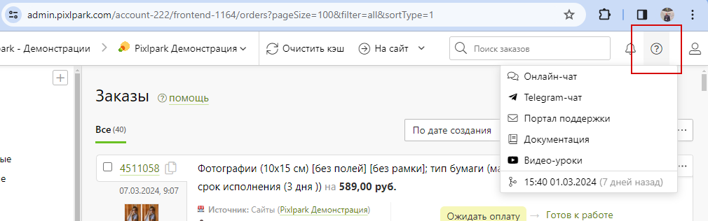

## Создание HAR-файла
* Для решения сложных технических проблем команде тех. поддержки Pixlpark часто требуется информация о взаимодействии сайта с браузером.
* Чтобы исследовать проблему, техподдержка может попросить HAR-файл (это HTTP архив) или лог сетевых запросов. С помощью таких файлов специалисты поддержки проверяют сетевые запросы вашего браузера в момент возникновения проблемы. Ниже вы найдете инструкции по созданию HAR-файла в разных браузерах.
> Если ниже отсутствует инструкция для вашего браузера, необходимо найти информацию в Интернете по запросу "__Как создать HAR-файл для [название браузера]__".

### Google Chrome
Для подотовки HAR-файла необходимо выполнить следующие действия:
1. Открыть страницу сайта, на которой возникает проблема.
2. В меню в правом верхнем углу выбрать пункты "__Дополнительные инструменты / Инструменты разработчика__".
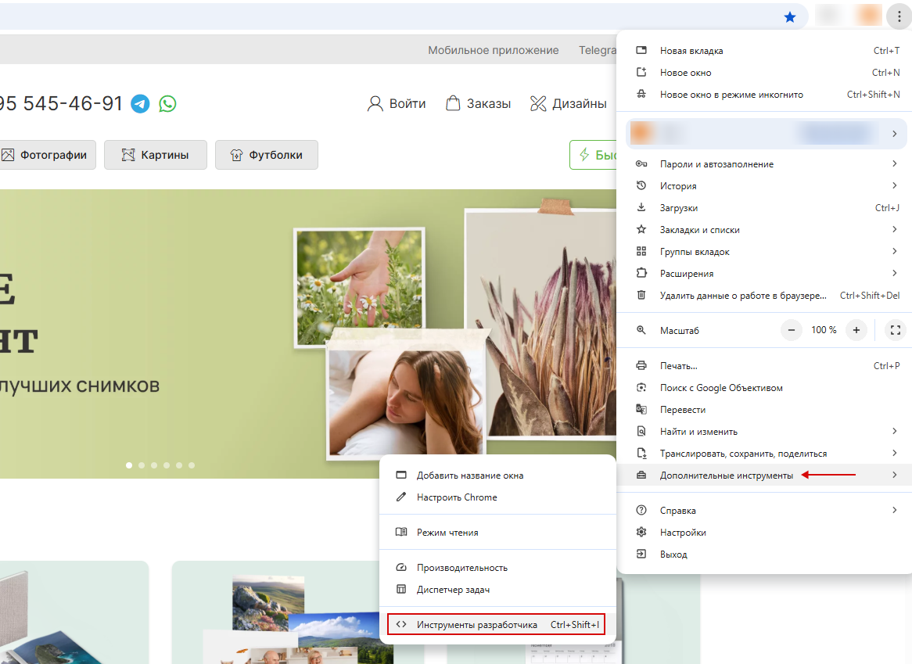
3. В открывшемся окне перейти на вкладку "__Сеть (Network)__".
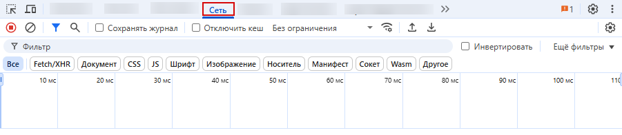
4. Кнопка записи в левом верхнем углу должна быть красной. В случае, если кнопка серого цвета, необходимо нажать на нее для начала записи.
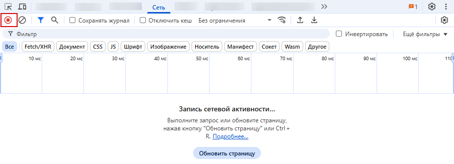
5. Включить опцию сохранения логов "__Preserve log__".
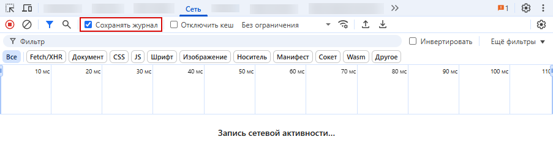
6. Нажать кнопку удаления данных для удаления предыдущих лог-записей с вкладки "__Network__".
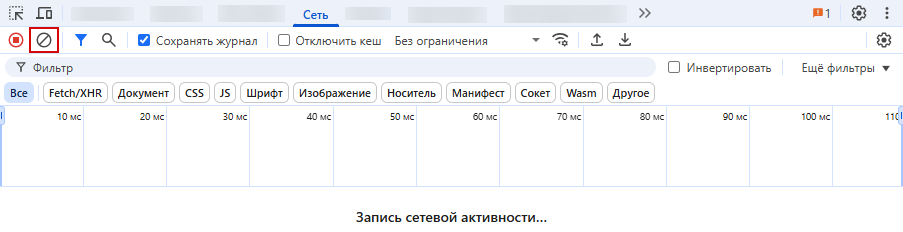
7. Пока идет запись сетевых запросов необходимо воспроизвести проблему.
8. После воспроизведения проблемы нажать правой кнопкой мыши в любом месте таблицы сетевых запросов, выбрать "__Save as HAR with Content__" и сохранить файл на компьютере.

9. Написать в [техподдержку Pixlpark](http://support.pixlpark.ru/) и прикрепить HAR-файл к письму с подробным объяснением ошибки. В теме письма необходимо написать "__Сетевая проблема, HAR-файл во вложении__". Дополнительные скриншоты также могут помочь.

### Safari
Для подотовки HAR-файла необходимо выполнить следующие действия:
1. Открыть страницу сайта, на которой возникает проблема.
2. Найти в строке меню Safari раздел "__Разработка__".
    + Если его не видно, включите его: "__Safari → Настройки → Дополнения__".
    + Проверьте флажок внизу рядом с "__Показывать меню «Разработка» в строке меню__".
3. В разделе "__Разработка__" откройте вкладку "__Подключить веб-инспектор__".

4. В открывшемся окне перейти на вкладку "__Сеть (Network)__".
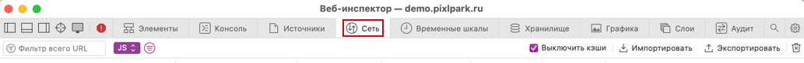
5. Установить флажок "__Сохранить журнал__" в левой части вкладок Сеть в меню "__Другие параметры фильтра...__".

6. Очистить элементы Сети, кликнув иконку "__Очистить сетевые объекты (Корзина)__" в правом углу от вкладки Сеть.

7. Установить флажок "__Выключить кеши__".

8. Воспроизвести действия, создающие проблему.
9. Сохранить сессию в виде файла .har, щёлкнув значок "__Экспортировать__" рядом со значком "__Очистить сетевые объекты (Корзина)__".

10. Написать в [техподдержку Pixlpark](http://support.pixlpark.ru/) и прикрепить HAR-файл к письму с подробным объяснением ошибки. В теме письма необходимо написать "__Сетевая проблема, HAR-файл во вложении__". Дополнительные скриншоты также могут помочь.

### Mozilla Firefox
Для подотовки HAR-файла необходимо выполнить следующие действия:
1. Открыть страницу сайта, на которой возникает проблема.
2. В меню Firefox в правом верхнем углу окна браузера выбрать "__Другие инструменты / Инструменты веб-разработчика__".
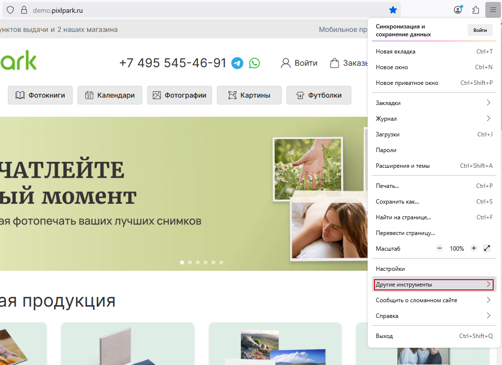
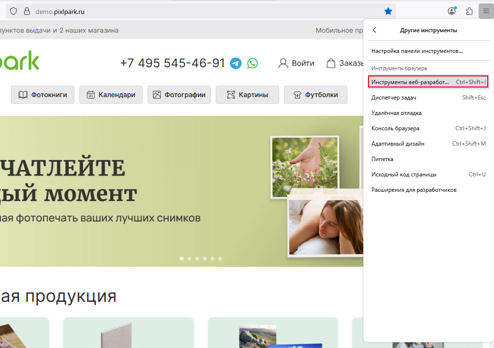
3. В нижней или боковой части страницы откроется панель инструментов на вкладке "__Сеть__" и начнется запись сетевых запросов.
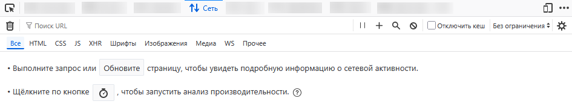
4. Воспроизвести проблему, через несколько секунд она будет записана. Далее, нажать правой кнопкой мыши в любом месте списка сетевых запросов и в меню выбрать "__Сохранить все как HAR__".
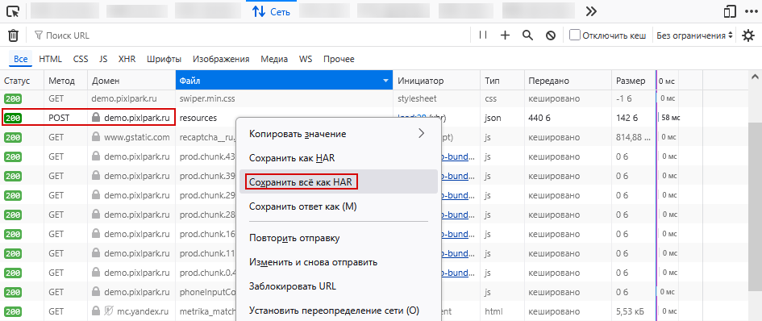
5. Сохранить созданный HAR-файл на компьютере.
6. Написать в [техподдержку Pixlpark](http://support.pixlpark.ru/) и прикрепить HAR-файл к письму с подробным объяснением ошибки. В теме письма необходимо написать "__Сетевая проблема, HAR-файл во вложении__". Дополнительные скриншоты также могут помочь.

### Microsoft Edge и IE 11
Для подотовки HAR-файла необходимо выполнить следующие действия:
1. Открыть страницу сайта, на которой возникает проблема.
2. На клавиатуре нажать "__F12__" для открытия панели инструментов разработчика.

3. Перейти на вкладку "__Сеть__".

4. Обновить страницу и воспроизвести проблему. Сетевые запросы будут записаны.
5. После завершения записи нажать кнопку "__Экспортировать как HAR-файл__" или нажать "__Ctrl + S__" на клавиатуре.

6. Сохранить созданный HAR-файл на компьютере.
7. Написать в [техподдержку Pixlpark](http://support.pixlpark.ru/) и прикрепить HAR-файл к письму с подробным объяснением ошибки. В теме письма необходимо написать "__Сетевая проблема, HAR-файл во вложении__". Дополнительные скриншоты также могут помочь.