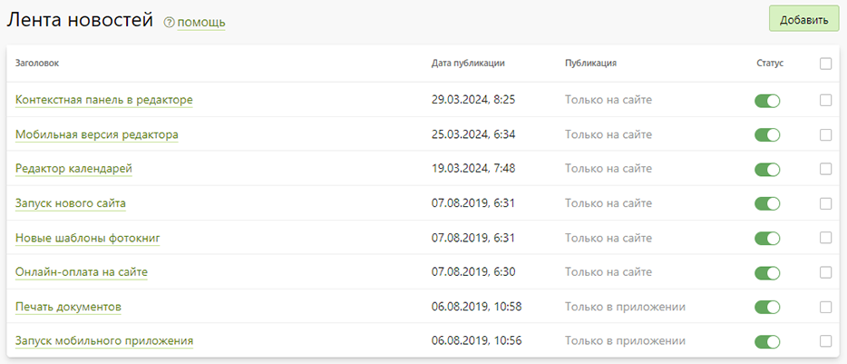
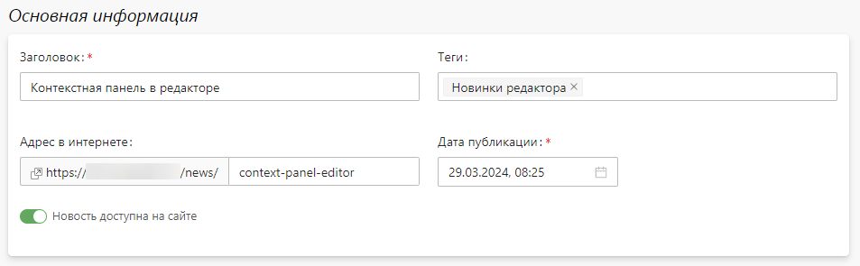
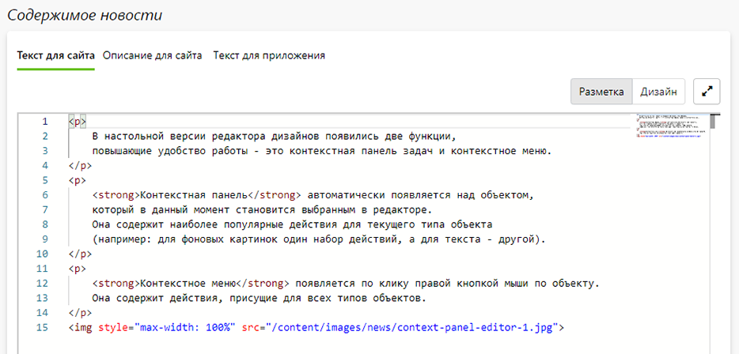
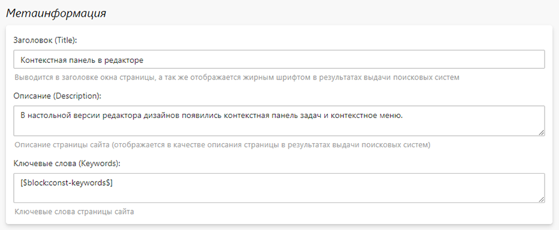

# Лента новостей
## Описание
* В данном разделе представлен список новостей. 
* 
* Каждая новость на сайте выводится отдельной страницей и имеет определенную специфику:
    + Относительный адрес начинается с `/news/`;
    + Разметка состоит из одной секции содержимого c предзаданной структурой:
        + хлебные крошки;
        + заголовок;
        + текст.
* Для гармоничного размещения новостей на странице списка рекомендуется описание задавать примерно одного объема, а иллюстрации делать шириной не более 840px.
* 

## Характеристики новости
* __Заголовок__ - заголовок новости, размещаемый в теге H1 и в хлебных крошках, выводимых над заголовок.
* __Теги__ - тематики новости, по которым их можно фильтровать на странице списка.
* __Адрес в интернете__ - адрес, по которому новость будет доступна на сайте.
* __Дата публикации__ - дата и время, когда новость будет опубликована на сайте или в приложении.
* 
* __Текст для сайта__ - содержимое новости для сайта в формате HTML-разметки; если оно не задано, то новость считается подготовленной только для приложения.
* __Описание для сайта__ - описание новости для сайта в формате HTML-разметки, которое выводится на странице списка новостей.
* __Текст для приложения__ - содержимое новости для приложения в формате Markdown-разметки; если оно не задано, то новость считается подготовленной только для сайта.
* 
* __Метаинформация__ - задание метатегов: заголовка (Title), описания (Description) и ключевых слов (Keywords), которые используются поисковыми системами для ранжирования страниц сайта и отображения их в выдаче.
* 
