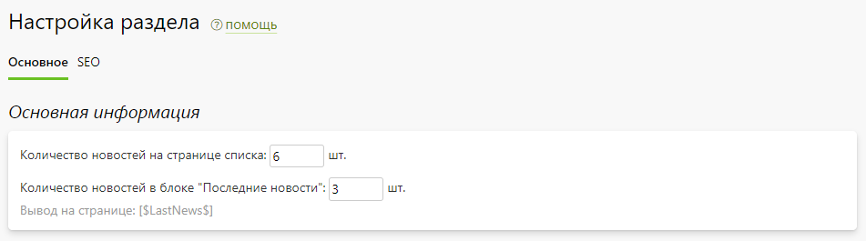
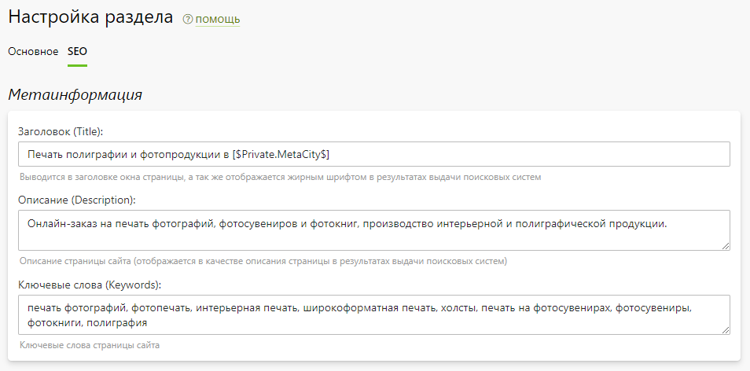

# Настройка
* В данном разделе представлены:
    + Общие настройки модуля;
* 
    + Метаинформация, используемая для страницы списка и любых новостей, у которых она не задана.
* 
* Для вывода списка последних новостей на пользовательских страницах сайта существует специальная константа `[$lastNews$]`. 