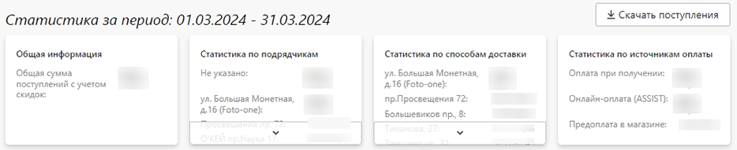
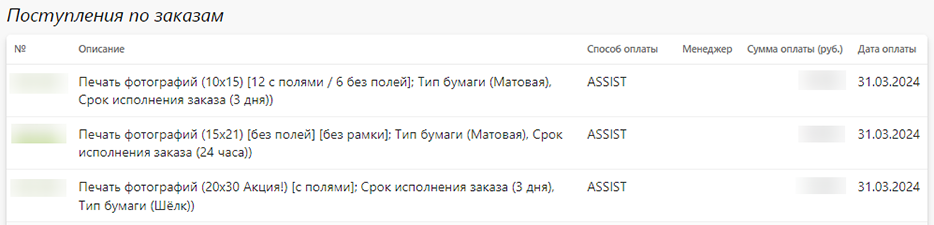
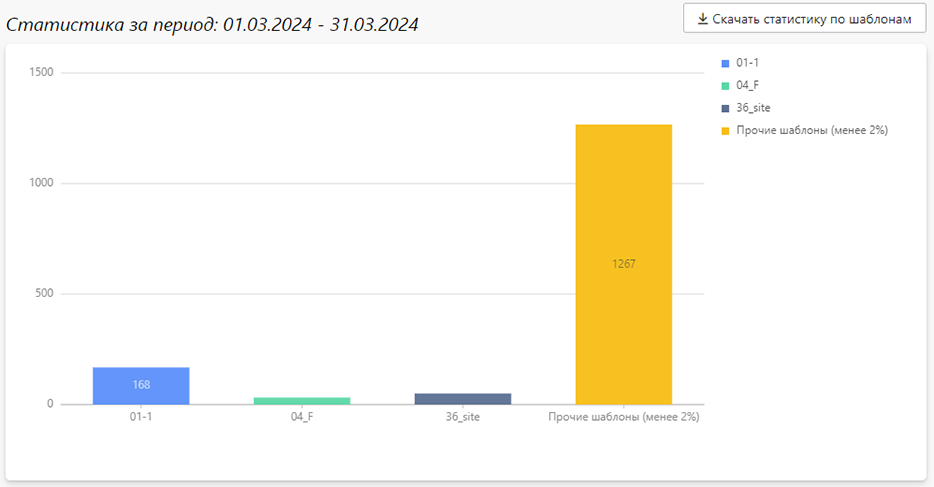

# Статистика продаж

## Статусы заказов
* В данном разделе представлена общая статистика по заказам, отражающая объем продаж в заданном временном интервале.
* Он содержит три основных блока:
    + __Фильтр__ - критерии для рассчета статистики, применяемые по условию "__И__". Т.е. в выборку попадают только те заказы, которые были переведены в указанный статус в течении заданного временного интервала и имеющие указанные значения всех перечисленных характеристик.
* 
    + __Статистика__ - агрегированные данные по заказам, соответствующим фильтру.
* 
    + __Продукция__ - реализованные продукты в разрезе количества и стоимости.
* 

## Поступление денег
* В данном разделе представлена информация о поступлении денежных средств по заказам в заданном временном интервале. Она, например, позволяет проводить сверки по остаткам в кассе, на расчетном счету или на балансе платежной системы.
* Раздел содержит три основных блока:
    + __Фильтр__ - критерии для расчета статиситки, применяемые по условию "__И__".
* 
    + __Статистика__ - агрегированные данные по поступлениям средств по источникам оплаты и способам доставки.
* 
    + __Поступления по заказам__ - список поступлений денежных средств по заказам с указанием номера заказа, его состава, способа оплаты, суммы, даты и менеджера.
* 

## Популярность шаблонов
* В данном разделе представлена информация о популярности шаблонов в оформленных заказах. Данная информация может быть полезна для выбора тематик или дизайнеров при пополнении банка шаблонов.
* Раздел содержит три основных блока:
    + __Фильтр__ - критерии для расчета статиситки, применяемые по условию "__И__".
* 
    + __Статистика__ - диаграмма популярности шаблонов, соответствующих фильтру.
* 
    + __Список шаблонов__ - список шаблонов с процентной долей использования и количеством заказов.
* 
