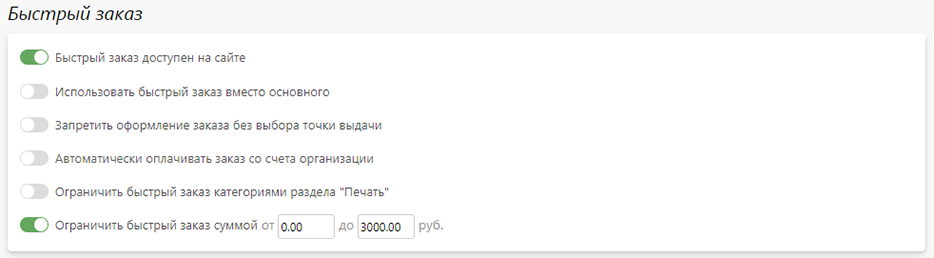
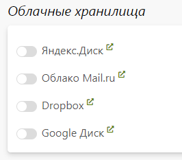
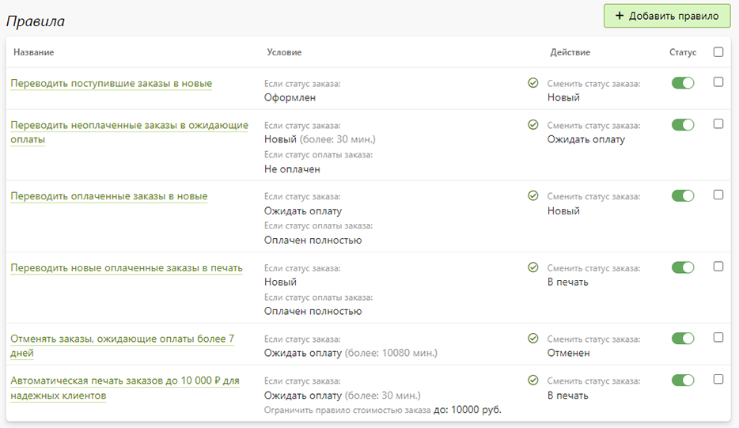
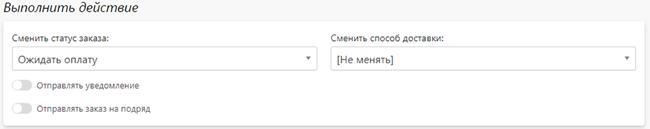
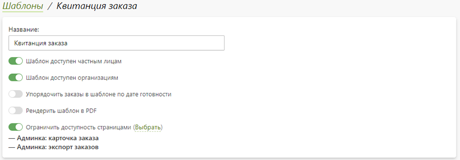
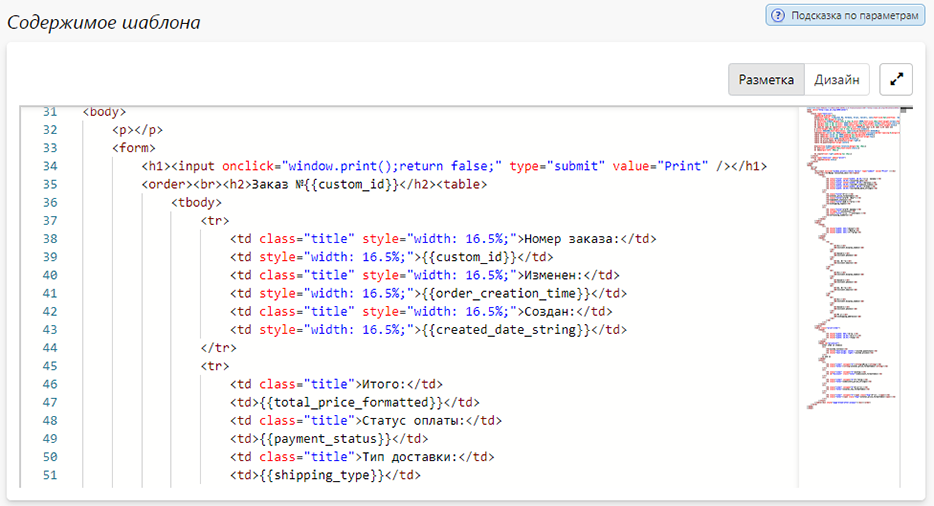
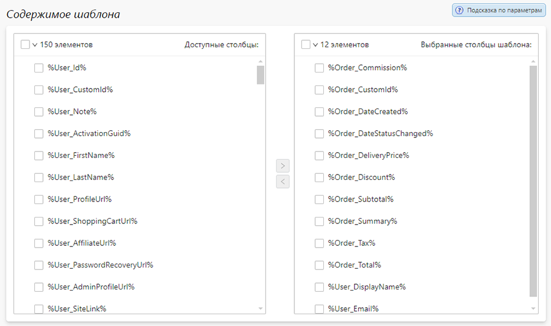
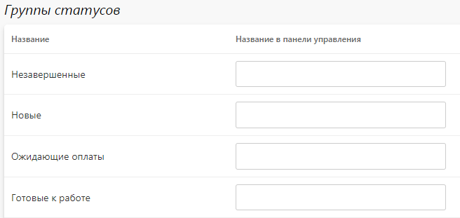

# Настройка
## Оформление заказов
### Основная информация
* В данном разделе представлены настройки, влияющие на процесс оформления заказа на сайте.
* 

### Быстрый заказ
* В данном разделе представлены настройки, влияющие на логику механизма быстрого заказа на странице корзины.
* 

## Управление заказами
### Основная информация
* В данном разделе представлены настройки, влияющие на управление заказами в панели управления.
* 

### Время исполнения заказов
* В данном разделе представлены настройки, влияющие на автоматически расчёт времени исполнения заказов. Конфигурация настроек позволяет учесть в расчете доставку, выходные и праздничные дни.
* 
* При включении данного функционала во всех точках выдачи необходимо заполнить блок "Время работы". Далее, к каждому товару, требующему автоматический расчет времени исполнения, необходимо привязать опцию срочности, а у каждой её позиции задать время исполнения и стоимость.
> Если необходимое на изготовление заказа время меньше продолжительности рабочего дня - указать реальное время изготовления заказа в часах. Иначе - указать время в часах согласно расчету:
``` formula
    Количество дней (округлить до целого в меньшую сторону) = Время изготовления в часах / Продолжительность рабочей смены;
    Время изготовления = Количество дней * 24 + (Время изготовления в часах - Продолжительность рабочего дня);
```
* При оформлении заказа на сайте на те продукты, для которых создана опция срочности будет автоматически рассчитано время готовности.  Оно будет отображаться как клиенту на сайте, так и сотрудникам в панели управления. При необходимости его можно будет изменить вручную в карточке заказа.

## Отображение заказов
### Основная информация
* В данном разделе представлены настройки, влияющие на отображение заказов в панели управления.
* 

### Скрипты и стили
* В данном разделе можно разместить собственный JS-код или CSS-стили, которые будут применяться для страниц панели управления. Например, можно написать скрипты и стили, чтобы "подсвечивать" заказы в списке c определенными товарами или срочностью.
* 

## Выгрузка заказов
### Облачные хранилища
* В данном разделе можно настроить автоматическую выгрузку заказов в следующие облачные хранилища:
    + [Яндекс.Диск](https://disk.yandex.ru/)
    + [Облако Mail.ru](https://cloud.mail.ru/)
    + [Dropbox](https://www.dropbox.com/ru/)
    + [Google Диск](https://drive.google.com/)
* 
* Подробнее о настройке интеграции написано в [статье документации](/integration/drives).

### ERP и CRM системы
* В данном разделе можно настроить автоматический экспорт заказов и обмен данными (включая калькуляцию) со следующими ERP и CRM-системами:
    + [Битрикс24](https://www.bitrix24.ru/)
    + [ASystem](https://monorhythm.ru/)
    + [AXIOM](https://axiompress.pro/)
    + [Hello Print](https://helloprint.ru/)
    + [HP Site Flow](https://hpsiteflow.com/)
    + [1С: Полиграфия](https://1cpoly.ru/)
    + [Принт-Эксперт](https://print-expert.net/)
* 
* Подробнее о настройке интеграции написано в [статье документации](/integration/crm).

## Правила автоматизации
### Описание
* В данном разделе представлен список автоматических действий над заказами. Например, можно настроить изменение статуса заказа и отправку уведомления при получении оплаты или длительном нахождении в каком-то статусе.
* 

### Характеристики правила
* __Название__ - название правила, отображаемое только в панели управления.
* 
* __Если выполняется условие__ - набор условий по характеристикам заказа:
    + Статус заказа;
    + Время нахождения в статусе;
    + Тип заказа;
    + Источник заказа;
    + Заказчиком выступает клиент и/или сотрудник;
    + Наличие комментария;
    + Статус оплаты;
    + Способ оплаты;
    + Ограничение продуктами раздела "Печать";
    + Ограничение опциями раздела "Печать";
    + Ограничение стоимостью заказа;
    + Ограничение группами клиентов.
* 
* __Выполнить действие__ - набор исполяемых действий при выполнении всех условий:
    + Сменить статус заказа;
    + Сменить способ доставки;
    + Отправить собственное уведомление;
    + Отправить заказ на подряд.
* 

## Шаблоны документов
### Описание
* __Шаблон документа__ - это форма документа, в которую может быть экспортирована информация о содержимом корзины или выбранных заказах для последующей печати. Например, шаблоном может быть квитанция заказа, транспортная накладная, счет или акт выполненных работ.
* Помимо создания __собственных__ шаблонов в сервисе Pixlpark предусмотрено около десятка __системных__, которые при необходимости можно отключить.
* 
* Основной характеристикой шаблона является __тип__, который задается только в момент его создания (без возможности изменения в будущем):
    + __HTML шаблон__ - содержимое шаблона задается в виде HTML-разметки с использованием [языка Scriban](/dev/scriban.md), а на выходе формируется либо HTML, либо PDF-документ.
    + __PDF шаблон__ - содержимое шаблона задается в виде размеченного специальным образом PDF-файла с использованием системных параметров, а на выходе формируется PDF-документ.
    + __Excel шаблон__ - содержимое шаблона задается в виде набора столбцов таблицы, соответствующих системным параметрам, а на выходе формируется Excel-документ.
* Отдельно стоит отметить два шаблона, которые представлены в списке системных:
    + __Квитанция заказа__ (`HTML`);
    + __Статистика по заказам__ (`Excel`);
* Первый используется для формирования сопроводительных документов в архиве заказа, а второй - для формирования статистики продаж в разделе "Заказы / Статистика". Переопределить эти шаблоны можно путем создания собственных с такими же именами.

### Характеристики шаблона
* __Название__ - название шаблона, отображаемое как на сайте, так и в панели управления.
* __Шаблон доступен частным лицам__ - шаблон доступен на сайте согласно заданным ограничениям страниц для клиентов, не являющихся сотрудниками организаций
* __Шаблон доступен организациям__ - шаблон доступен на сайте согласно заданным ограничениям страниц для сотрудников организаций.
* __Упорядочить заказы в шаблоне по дате готовности__ - при экспорте нескольких заказов они будут упорядочены в документе по дате готовности от новых к старым (по умолчанию заказы упорядочиваются по дате создания).
* __Рендерить шаблон в PDF__ - на выходе сохранять `HTML` шаблон в PDF-документ.
* __Ограничить доступность страницами__ - ограничить доступность шаблона следующими страницами сервиса:
    + __Админка: карточка заказа__ - шаблон будет доступен в панели управления на странице заказа;
    + __Админка: экспорт заказов__ - шаблон будет доступен в панели управления на странице экспорта;
    + __Сайт: карточка заказа__ - шаблон будет доступен на сайте в личном кабинете на странице заказа;
    + __Сайт: коммерческоре предложение__ - шаблон будет доступен на сайте на странице ком. предложения (для бизнес-сувениров);
    + __Сайт: корзина__ - шаблон будет доступен на сайте на странице корзины.
* 
* __Содержимое шаблона__ - содержмое шаблона, зависящее от его типа:
    + Для `HTML` - HTML-разметка с использованием [языка Scriban](/dev/scriban.md);
* 
    + Для `PDF` - специальным образом размеченный PDF-файл;
* 
    + Для `EXCEL` - набор столбцов таблицы из возможных параметров.
* 

## Локализация статусов
### Статусы оплаты
* В данном разделе можно переименовать статусы оплаты как для сайта, так и для панели управления.
* 

### Статусы заказа
* В данном разделе можно переименовать статусы заказа как для сайта, так и для панели управления.
* 

### Группы статусов
* В данном разделе можно переименовать группы статусов для панели управления.
* 