# Дизайны
## Шаблоны
### Описание
* __Шаблон__ - это типовой дизайн, на основании которого клиент создает персонализированный продукт в редакторе. Например, изменяет в шаблоне текст, загружает свои фотографии или добавляет новые графические элементы. В сервисе Pixlpark шаблоны активно используются для создания дизайнов фотокниг, календарей, плакатов и другой листовой продукции.
* Каждый шаблон состоит из:
    + __Настроек__ - характеристик, определяющих поведение шаблона в редакторе;
    + __Макетов__ - графических файлов в формате .PSD, состоящих из растровых и текстовых слоев. 
* Фактически в редакторе клиент работает именно макетами, которые имеют определенную специфику по разметке слоев (описано в [документации](/design/psd)).
* В разделе "__Печать / Дизайны / Шаблоны / Список__" представлен список доступных шаблонов. Их можно отфильтровать:
    + __По категории__ продуктов, для которых они применимы;
    + __По продукту__ выбранной ранее категории;
    + __По тегу__, заданному в шаблонах;
    + __По доступности__ на сайте;
    + __По автору__ шаблона.
* 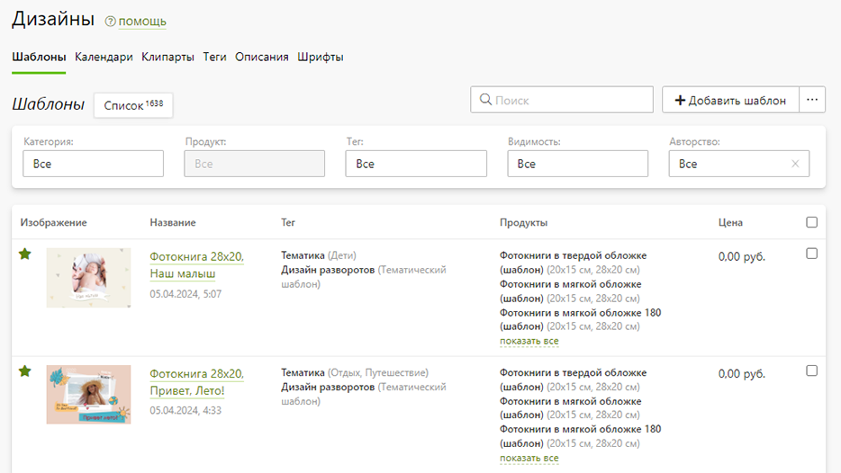
* Создать шаблон можно разными способами:
    + __Добавить пустой шаблон__, а затем настроить его (кнопка "Добавить шаблон → Добавить один");
    + __Добавить несколько шаблонов__, загружая архив с PSD-файлами (кнопка "Добавить шаблон → Добавить несколько"). В этом случае для каждого макета будет создан отдельный шаблон, куда он и будет загружен. Данный способ подходит для массового создания шаблонов одностраничной продукции (например, визиток);
    + __Дублировать выбранный шаблон__, а затем внести в него изменения;
    + __Импортировать шаблоны с демо-сайта__, указав продукцию, с которой они связаны (кнопка "три точки" пядом с "Добавить шаблон");
* Каждый импортированный шаблон автоматически связывается с исходным демонстрационным. Любые изменения шаблона на демо-сайте (к примеру, исправление ошибок) будут применяться и к вашему. Если же вы хотите в последствии самостоятельно изменять шаблон (без внесения в него правок извне), то вам сперва надо отвязать его от исходного. Это можно сделать на странице шаблона.
* На сайте все шаблоны отображаются в следующем порядке:
    + Если выбран один или несколько тегов, то отображаются только тематические шаблоны;
    + В случае отсутствия выбранной тематики в начале идет группа шаблонов с тегом по умолчанию, который задается настройках отображения (кнопка "три точки" рядом с "Добавить шаблон"), а затем - остальные шаблоны.
* 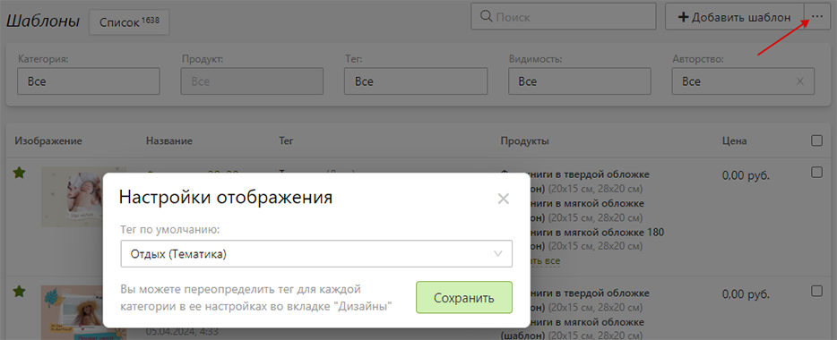
    + Внутри каждой из групп вначале идут шаблоны, помеченные избранными, а затем - все остальные.
    + В каждой подгруппе шаблоны упорядочиваются по дате их изменения (новые располагаются выше).

### Характеристики шаблона
* __Тип шаблона__ - тип, влияющий на логику настройки шаблона и обработку его редактором:
    + __Фотокнига__ - шаблон фотокниги (тип товара в настройках редактора категории - `Фотокнига`);
    + __Выпускной альбом__ - шаблон выпускного альбома (тип товара в настройках редактора категории - `Фотокнига`);
    + __Календарь перекидной__ - шаблон перекидного календаря с размещением на каждой странице по одному месяцу (тип товара - `Календарь`);
    + __Календарь комбмнированный__ - шаблон перекидного календаря с размещением на каждой странице по несколько месяцев (тип товара - `Календарь`)
        + [__пример 1__](https://demo.pixlpark.ru/printing/calendars-combined/12pages/template-6729278/editor): календарь на 12 страниц, где каждая страница содержит предыдущий, текущий и следующий месяц;
        + [__пример 2__](https://demo.pixlpark.ru/printing/calendars-combined/4pages/template-6729279/editor): календарь на 4 страницы, где каждая страница содержит по 3 месяца (январь-март, апрель-июнь, июль-сентябрь, октябрь-декабрь);
    + __Календарь палакат__ - шаблон календаря плаката с 12 месяцами на листе (тип товара - `Календарь`);
    + __Стандартный__ - шаблон иного продукта.
* __Название на сайте__ - название шаблона, которое выводится на сайте на странице списка шаблонов и в редакторе во вкладке "__Шаблоны__".
* __Название в панели управления__ - название шаблона в панели управления. Для удобства работы данное поле может содержать сокращенное название и технические характеристики (например, размер). Если его не задать, то в качестве названия для панели управления будет использоваться название на сайте.
* __Инициализация шаблона__ (только для шаблонов с типом `Фотокнига` и `Выпускной альбом`) - алгоритм размещения макетов на разворотах фотокниги:
    + __Согласно настройкам товара__ - использовать соответстующую настройку категории или товара;
    + __Целиком вписывается в зону печати без вылетов__ - вписывать макет в разворот фотокниги (аналог печати с полями);
    + __Целиком заполняет зону печати без вылетов__ - заполять макетом разворот фотокниги (аналог печати без полей);
    + __Постранично вписывается в страницы зоны печати без вылетов__:
        + слои макета `[background]` и `[foreground]` заполняют разворот фотокниги;
        + глуппа слоев, расположенные в папках с ключами `[align:Left]` и `[align:Right]`, вписываются в левую и правую страницу разворота соответственно;
    + __Постранично заполняет страницы зоны печати без вылетов__:
        + слои макета `[background]` и `[foreground]` заполняют разворот фотокниги;
        + глуппа слоев, расположенные в папках с ключами `[align:Left]` и `[align:Right]`, заполняют левую и правую страницу разворота соответственно;
* __Сетка по умолчанию__ (только для шаблонов с типом `Календарь`) - дизайн календарной сетки, который применяется при загрузке шаблона в редактор.
* __Алгоритм подстановки макетов на поверхности печати__ (только для шаблонов с типом `Стандартный`) - алгоритм размещения макетов на поверхностях печати:
    + __Наиболее подходящий по пропорциям__ - на поверхности печати макеты размещаются по максимальному совпадению их пропорций;
    + __По порядку__ - на поверхности печати макеты размещаются последовательно.
* __Автор шаблона__ - сотрудник компании с ролью "__Дизайнер__", который будет являться автором шаблона. Данный механизм может использоваться для начисления автору вознаграждения. Для этого в разделе "Заказы / Статистика / Популярность шаблонов" в скачиваемой статистике по шаблонам будет указан автор каждого из них. А вознаграждение может быть рассчитано вручную либо от стоимости заказов, либо от цены самого шаблона.
* __Номера связанных шаблонов__ - номера связанных шаблонов, перечисленные через запятую. Номер шаблона можно узнать в адресной строке при открытии страницы шаблона в панели управления. Например, если адрес страницы оканчивается на `/templates/2622444/edit`, то "__2622444__" и будет номером шаблона. При открытии редактора на сайте в адресной строке может передаваться номер шаблона, который будет загружаться в редактор для текущего продукта. Однако если этот шаблон не связан с продуктом, то вместо него по очереди будут пытаться загрузиться связанные шаблоны. Данный механизм связывания используется для шаблонов одного дизайна, но разных форматов. К примеру, для фотокниг через это поле связываются шаблоны под разные ориентации. Соответственно, при смене формата фотокниги в редакторе вместо текущего шаблона будет загружен тот, который предназначен для данной ориентации.
* __Шаблон доступен на сайте__ - выводить шаблон на сайте. В случае выключения данной настройки он все равно будет доступен по прямой ссылке в редакторе.
* __Скрывать в случайных__ - не выводить шаблон в блоке случайных.
* __Отображать в избранном__ - отображать шаблон в группе избранных на странице списка, т.е. выше тех, которые не имеют данной отметки.
* __Использовать первый макет шаблона для обложки__ - использовать в качестве обложки шаблона превью первого макета или его слой с названием `[template-preview]`.
* __Цена__ - стоимость шаблона, которая выводится на странице списка и учитывается при создании заказа.
* __Обложка шаблона__ - иллюстрация, которая отображается на сайте в качестве шаблона.
* 
* __Продукты__ - продукты, для которых на сайте будет доступен данный дизайн.
* 
* __Теги__ - тематики шаблона, по фильтру которых он будет отображаться на сайте.
* 
* __Макеты__ - файлы в формате .PSD, имеющие определенный порядок при размещении на поверхностях печати продукта. Каждый макет обладает единственной характеристикой -  доступностью его для поверхости печати, которая будет разная в зависимости от типа шаблона.
    + Для макетов с типом шаблона `Фотокнига` возможны значения:
        + Обложка - применяется только для поверхности с типом "Обложка";
        + Разворот - применяется для любой поверхности с типом "Разворот с неполным раскрытием", "Разворот с раскрытием на 180", "Разворот с форзацем слева" и "Разворот с форзацем справа";
        + Разворот с виньетками - ;
        + Разворот с коллажами - ;
* 
    + Для макетов с типом шаблона `Выпускной альбом` возможны значения:
        + Обложка - применяется только для поверхности с типом "Обложка";
        + Разворот - применяется для любой поверхности с любомым типом "Разворот с неполным раскрытием";
* 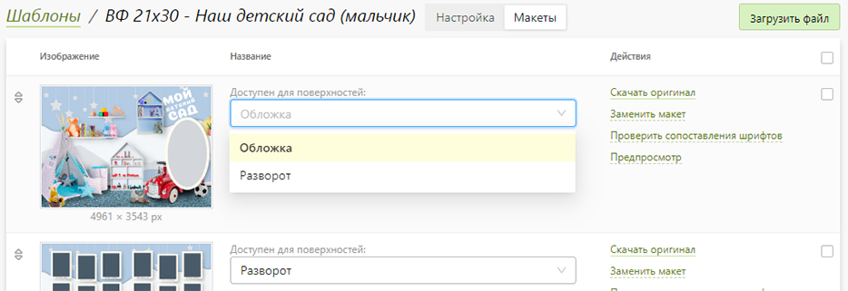
    + Для макетов с типом шаблона `Календарь перекидной` или `Календарь комбинированный` возомжны значения:
        + Обложка - применяется только для поверхности с типом "Обложка";
        + Любой месяц - применяется для любой поверхности, у которой тип не "Обложка";
        + Определенный месяц - применяется только для поверхности, месяц которой в редакторе совпадает с выбранным;
* 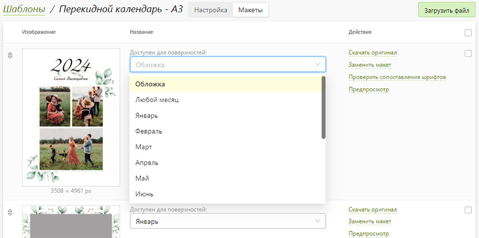
    + Для макетов с типом шаблона `Стандартный` можно задать формулу доступности по порядковому номеру поверхности печати (начиная с 1), используя следующие переменные:
        + `[index]` - порядковый номер поверхности;
        + `[last]` - номер последней поверхности.
* 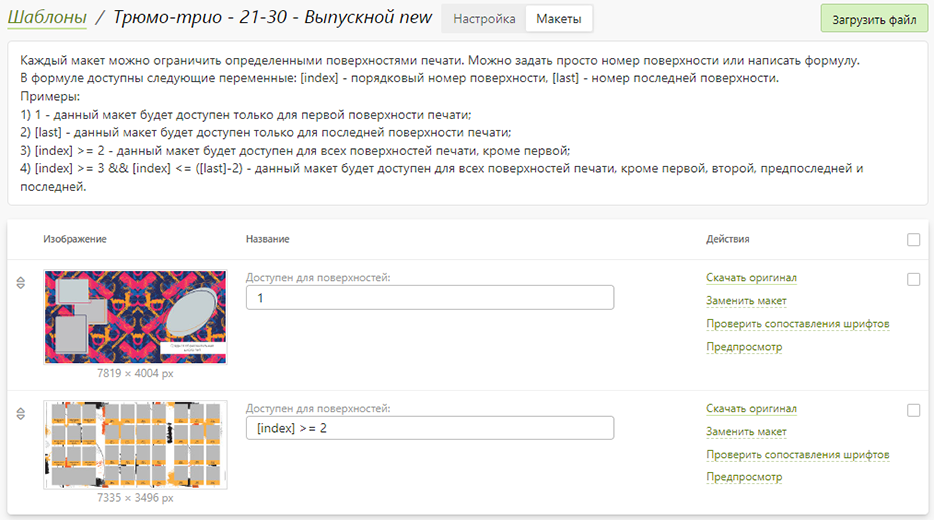

__Пример формул доступности для шаблонов с типом "Стандартный"__
```	formula
1 - макет доступен только для первой поверхности печати;
[last] - макет будедоступен только для последней поверхности печати;
[index] >= 2 -  макет доступен для всех поверхностей печати, кроме первой;
[index] >= 3 && [index] <= ([last]-2) - макет доступен для всех поверхностей печати, кроме первой, второй, предпоследней и последней.
```

### Маппинг
* Помимо возможности добавления собственных шаблонов в сервисе Pixlpark существует коллекция готовых дизайнов, которая регулярно пополняется новыми. Вы можете импортировать шаблоны с демо-сайта как со страницы списка шаблонов (через кнопку три точки рядом с "Добавить шаблон"), так и со страницы маппинга.
* Для последнего случая необходимо задать набор записей соответствия продуктов демонстрационного и собственного сайта. При этом каждая запись имеет настройки для автоматического импорта новых шаблонов и удаления устаревших. Т.е. при появлении нового шаблона на демо-сайте для указанного продукта он может быть автоматически импортирован. И аналогично - в случае удаления шаблона. Если же функция удаления устаревших шаблонов не будет включена, то они не будут удаляться с вашего сайта. А это может привести к дублированию шаблонов, если на демо-сайте вместо удаленных будут созданы новые с более оптимальными настройками.
* Иногда компании, имеющие собственные шаблоны, отключают автоматический импорт для записей маппинга и вручную производят копирование. Для этого на странице маппинга достаточно выбрать интересующие продукты и нажать кнопку "__Импортировать__" в панели снизу. В этой панели также можно изменить настройки автоимпорта и автоудаления для выбранных записей. А для импорта дизайнов по всем записям необходимо нажать кнопку "три точки" рядом с "Добавить запись" и выбрать действие "__Импортировать шаблоны__".
* 
* По умолчанию все шаблоны импортируются с демо-сайта вместе со своими тегами, а отвязанные или удаленные шаблоны и вовсе больше не копируются. При этом информация о факте удаления записывается историю импорта. Если же вы случайно удалили отвязанный шаблон, то вам вначале надо сбросить истори импорта (кнопка "три точки" рядом с "Добавить запись" → "__Настройки импорта__"), а затем скопиорвать шаблон заново.

## Календари
* В данном разделе представлены дизайны календарных сеток, которые можно использовать в шаблонах с типом `Календарь`. Вы можете использовать как системные дизайны, так и создать свои собственные. А при необходимости и вовсе выключить системные сетки.
* 
* В самом редакторе в панели управления слева во вкладке "Календарь" дизайны выводятся по реленвантности пропорций к дизайну сетки, выбранной для текущего шаблона.

## Клипарты
### Описание 
* Клипартами называются категории изображений, объединенных общей логикой использования на сайте. Эту логику определяет "тип изображений", задаваемый в настройках категории.
* Например: тип `Картина` используется для изображений высокого разрешения в интерьерной печати; `Принт` - для готовых дизайнов в печати на фотосувенирах; `Фотоконтент` - для фотографий, размещаемых в шаблонах, в предпросмотре дзиайнов фотокниг. Остальные типы изображений используются в качестве вспомогательных элемеентов редактора.
* 

### Характеристики категории
* __Название на сайте__ - название категории изображений, которое используется на сайте в качестве фильтра.
* __Тип изображений__ - тип изображений:
    + __Декор__ - выводятся в редакторе во вкладке "Стикеры";    
    + __Картина__ - выводятся в редакторе во вкладке "Картины", а также на отдельной странице картин;
    + __Маска__ - выводятся в редакторе во вкладке "Рамки";
    + __Принт__ выводятся в редакторе во вкладке "Клипарты", а также на отдельной странице клипартов;
    + __Фон__ - выводятся в редакторе во вкладке "Фон".
    + __Фотоконтент__ - используются для предпросмотра фотокниги на странице шаблонов.
* __Ограничить изображения следующими категориями раздела "Печать"__ - ограничить доступность изображений только выбранными катеориями печати.
* __Теги__ - тематика изображений с типом `Фотоконтент`.
* 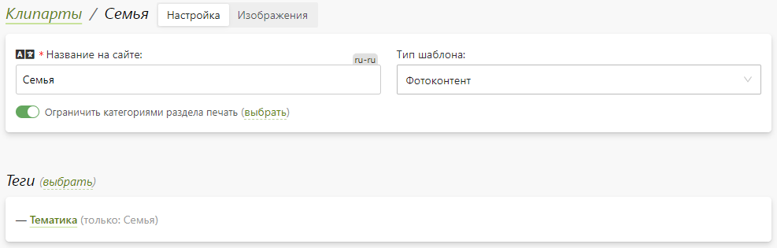
* __Изображения__ - набор:
    + растровых иллюстраций в формате `.PNG` или `.JPEG` для всех типов изображений кроме `Маска`;
    + векторных иллюстраций в формате `.SVG` для изображений с типом `Маска`.
* 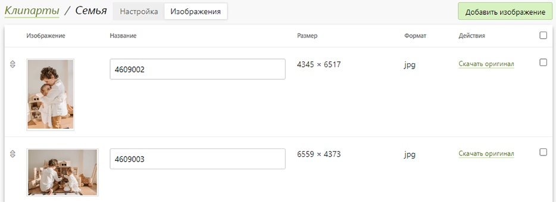

## Теги
* Для удобства выбора шаблонов на сайте предусмотрена их тегизация, которая может быть двух типов:
    + __Облаком тегов__: возможен выбор только одного тега с последующей фильтрацией шаблонов.
* 
    + __Группами тегов__: возможен выбор нескольких тегов с последующей фильтрацией шаблонов по условию "И". Т.е. останутся только те шаблоны, каждый из которых отмечен всеми выбранными тегами. В данном случае объединение тегов в семантические группы дает большую информативность и удобство работы с ними.
* 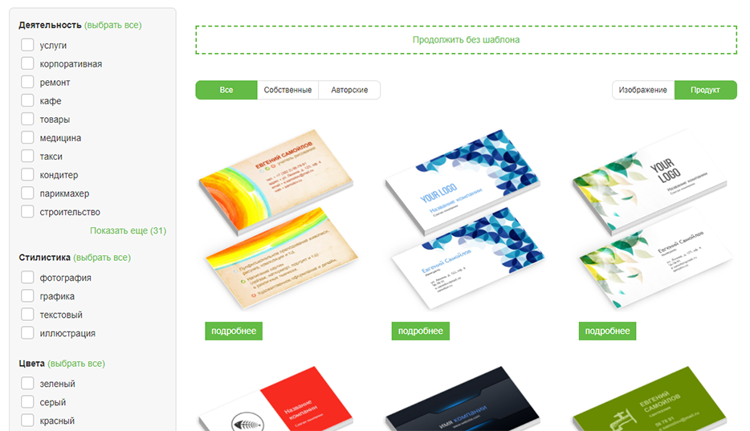
* На сайте на странице выбора шаблона выводятся только те теги, которые существуют у шаблонов, связанных с текущим продуктом. А применяемый тип тегизации зависит от наличия у тегов групп, в которые они объединяются.
* В данном разделе представлены теги, обладающие следующими характеристики:
    + __Группа__ - группа тега, которая отображаетя только на странице выбора шаблона;
    + __Название__ - название тега, которое отображается на странице выбора шаблона и в редакторе;
    + __URL__ - идентификатор, участвующий в формировании адреса страницы шаблонов с выбранным текущим тегом;
    + __CSS-класс__ - дополнительная информация для брендирования тега на странице шаблонов.
* 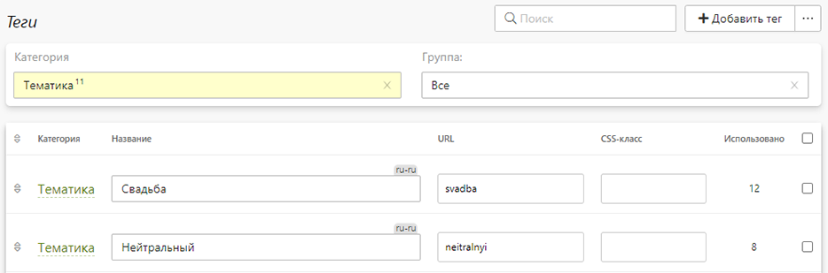

## Описания
* Страницы выбора шаблона хоть и содержит разные дизайны, но по умолчанию не воспринимаются поисковыми системами уникальными. И как результат, склеиваются в поисковой выдаче.
* Соответственно, для повышения уникальности страниц шаблонов в данном разделе можно задать для них разные заголовки H1, описания (идущее после заголовка) и метаинформацию. Причем наборы этих данных могут быть уникальными для каждой комбинации категории продуктов и тега.
* 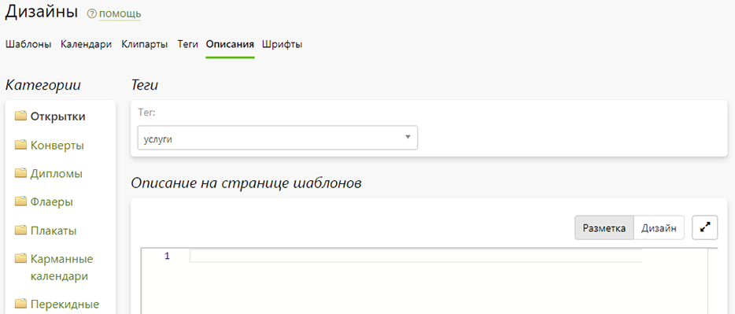

## Шрифты
### Описание
* Онлайн-редактор по умолчанию поддерживает определенный список шрифтов из набора Google Fonts, а также некоторые шрифты не из данной коллекции. Лицензии данных шрифтов допускают коммерческое использование. Если же в вашем PSD-макете используется иной шрифт, то в редакторе он будет автоматически заменяется на `PT Sans`.
* Для использования в редакторе собственных шрифтов их необходимо предварительно добавить в систему через раздел "__Печать / Дизайны / Шрифты__". Это могут быть как шрифты из коллекции Google Fonts, так и шрифты, загружаемые в виде отдельных файлов с вашего ПК.
* 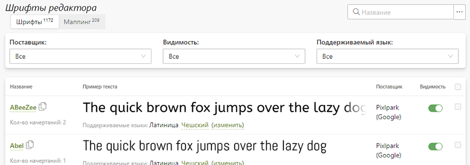

### Запрещенные шрифты
* На уровне платформы существует список запрещенных шрифтов, вместо которых в редакторе используются стандартные. И даже если для них заданы настройки маппинга, они будут проигнорированы. Это сделано для соблюдения лицензионной чистоты. 
* Ниже представлены правила замены запрещенных шрифтов. Например: шрифт `Arial-BoldMT` будет заменен на `Inter` с увеличенной толщиной линий (жирный) без наклона букв, а шрифт `Arial-ItalicMT` - на `Arimo` с обычной тощиной линий и с наклоном букв (курсивом).
```js
{"Arial-BoldMT", new FontSearchParams("Inter", FontVariantWeigth.Bold, FontVariantStyle.Normal)},
{"Arial-ItalicMT", new FontSearchParams("Arimo", FontVariantWeigth.Normal, FontVariantStyle.Italic)},
{"ArialMT", new FontSearchParams("Inter", FontVariantWeigth.Medium, FontVariantStyle.Normal)},
{"BookAntiqua", new FontSearchParams("Noto Serif KR", FontVariantWeigth.Medium, FontVariantStyle.Normal)},
{"Calibri", new FontSearchParams("Noto Sans JP", FontVariantWeigth.Normal, FontVariantStyle.Normal)},
{"Calibri-Bold", new FontSearchParams("Noto Sans JP", FontVariantWeigth.Bold, FontVariantStyle.Normal)},
{"Calibri-BoldItalic", new FontSearchParams("Noto Sans", FontVariantWeigth.Bold, FontVariantStyle.Italic)},
{"Calibri-Italic", new FontSearchParams("Noto Sans", FontVariantWeigth.Normal, FontVariantStyle.Italic)},
{"Cambria", new FontSearchParams("Lora", FontVariantWeigth.Normal, FontVariantStyle.Normal)},
{"Cambria-Bold", new FontSearchParams("Lora", FontVariantWeigth.Bold, FontVariantStyle.Normal)},
{"Cambria-BoldItalic", new FontSearchParams("Lora", FontVariantWeigth.Bold, FontVariantStyle.Italic)},
{"Cambria-Italic", new FontSearchParams("Lora", FontVariantWeigth.Medium, FontVariantStyle.Italic)},
{"Candara-Bold", new FontSearchParams("Fira Sans", FontVariantWeigth.SemiBold, FontVariantStyle.Normal)},
{"Candara-BoldItalic", new FontSearchParams("Fira Sans", FontVariantWeigth.SemiBold, FontVariantStyle.Italic)},
{"Candara-Italic", new FontSearchParams("Fira Sans", FontVariantWeigth.Normal, FontVariantStyle.Italic)},
{"CaviarDreams", new FontSearchParams("Comfortaa", FontVariantWeigth.Normal, FontVariantStyle.Normal)},
{"CaviarDreams-Bold", new FontSearchParams("Comfortaa", FontVariantWeigth.Bold, FontVariantStyle.Normal)},
{"CenturyGothic", new FontSearchParams("Montserrat", FontVariantWeigth.Normal, FontVariantStyle.Normal)},
{"CenturyGothic-Bold", new FontSearchParams("Montserrat", FontVariantWeigth.Bold, FontVariantStyle.Normal)},
{"ComicSansMS", new FontSearchParams("Balsamiq", FontVariantWeigth.Normal, FontVariantStyle.Normal)},
{"ComicSansMS-Bold", new FontSearchParams("Inter", FontVariantWeigth.Bold, FontVariantStyle.Normal)},
{"Consolas", new FontSearchParams("Source Sans Pro", FontVariantWeigth.Normal, FontVariantStyle.Normal)},
{"Consolas-Bold", new FontSearchParams("Source Sans Pro", FontVariantWeigth.Bold, FontVariantStyle.Normal)},
{"Constantia", new FontSearchParams("Noto Serif", FontVariantWeigth.Normal, FontVariantStyle.Normal)},
{"Constantia-Bold", new FontSearchParams("Noto Serif", FontVariantWeigth.Bold, FontVariantStyle.Normal)},
{"Constantia-BoldItalic", new FontSearchParams("Noto Serif", FontVariantWeigth.Bold, FontVariantStyle.Italic)},
{"Corbel", new FontSearchParams("Ubuntu", FontVariantWeigth.Normal, FontVariantStyle.Normal)},
{"Corbel-Bold", new FontSearchParams("Ubuntu", FontVariantWeigth.Bold, FontVariantStyle.Normal)},
{"Corbel-BoldItalic", new FontSearchParams("Ubuntu", FontVariantWeigth.Bold, FontVariantStyle.Italic)},
{"Corbel-Italic", new FontSearchParams("Ubuntu", FontVariantWeigth.Normal, FontVariantStyle.Italic)},
{"CourierNewPS-BoldMT", new FontSearchParams("Podkova", FontVariantWeigth.SemiBold, FontVariantStyle.Normal)},
{"FoundersGroteskMono", new FontSearchParams("Nanum Gothic", FontVariantWeigth.Bold, FontVariantStyle.Normal)},
{"FoundersGroteskMono-Light", new FontSearchParams("Nanum Gothic", FontVariantWeigth.Normal, FontVariantStyle.Normal)},
{"FoundersGroteskMono-Medium", new FontSearchParams("Nanum Gothic", FontVariantWeigth.ExtraBold, FontVariantStyle.Normal)},
{"Georgia", new FontSearchParams("Source Serif Pro", FontVariantWeigth.Normal, FontVariantStyle.Normal)},
{"Georgia-Bold", new FontSearchParams("Source Serif Pro", FontVariantWeigth.Bold, FontVariantStyle.Normal)},
{"Georgia-BoldItalic", new FontSearchParams("Source Serif Pro", FontVariantWeigth.Bold, FontVariantStyle.Italic)},
{"Georgia-Italic", new FontSearchParams("Source Serif Pro", FontVariantWeigth.Normal, FontVariantStyle.Italic)},
{"HeliosCond", new FontSearchParams("Oswald", FontVariantWeigth.Light, FontVariantStyle.Normal)},
{"HeliosCondBold", new FontSearchParams("Oswald", FontVariantWeigth.Bold, FontVariantStyle.Normal)},
{"Impact", new FontSearchParams("Fira Sans Condensed", FontVariantWeigth.ExtraBold, FontVariantStyle.Normal)},
{"Liana", new FontSearchParams("Marck Script", FontVariantWeigth.Normal, FontVariantStyle.Normal)},
{"Montserrat-Light", new FontSearchParams("Montserrat", FontVariantWeigth.Light, FontVariantStyle.Normal)},
{"MyriadPro-Bold", new FontSearchParams("Cousine", FontVariantWeigth.Bold, FontVariantStyle.Normal)},
{"MyriadPro-BoldIt", new FontSearchParams("Cousine", FontVariantWeigth.Bold, FontVariantStyle.Italic)},
{"MyriadPro-It", new FontSearchParams("Cousine", FontVariantWeigth.Normal, FontVariantStyle.Italic)},
{"MyriadPro-Regular", new FontSearchParams("Cousine", FontVariantWeigth.Normal, FontVariantStyle.Normal)},
{"MyriadPro-Semibold", new FontSearchParams("Cousine", FontVariantWeigth.Normal, FontVariantStyle.Normal)},
{"MyriadPro-SemiboldIt", new FontSearchParams("Cousine", FontVariantWeigth.Normal, FontVariantStyle.Italic)},
{"OpenSans-Bold", new FontSearchParams("Open Sans", FontVariantWeigth.Bold, FontVariantStyle.Normal)},
{"OpenSans-Regular", new FontSearchParams("Open Sans", FontVariantWeigth.Normal, FontVariantStyle.Normal)},
{"RosaMarena", new FontSearchParams("Bad Script", FontVariantWeigth.Normal, FontVariantStyle.Normal)},
{"SegoePrint", new FontSearchParams("Caveat", FontVariantWeigth.Normal, FontVariantStyle.Normal)},
{"SegoePrint-Bold", new FontSearchParams("Caveat", FontVariantWeigth.Bold, FontVariantStyle.Normal)},
{"SegoeUI", new FontSearchParams("Nunito", FontVariantWeigth.Normal, FontVariantStyle.Normal)},
{"SegoeUI-Bold", new FontSearchParams("Nunito", FontVariantWeigth.Bold, FontVariantStyle.Normal)},
{"SegoeUI-BoldItalic", new FontSearchParams("Nunito", FontVariantWeigth.Bold, FontVariantStyle.Italic)},
{"SegoeUI-Italic", new FontSearchParams("Nunito", FontVariantWeigth.Normal, FontVariantStyle.Italic)},
{"SegoeUI-Light", new FontSearchParams("Nunito", FontVariantWeigth.Light, FontVariantStyle.Normal)},
{"Tahoma", new FontSearchParams("Manrope", FontVariantWeigth.Normal, FontVariantStyle.Normal)},
{"Tahoma-Bold", new FontSearchParams("Manrope", FontVariantWeigth.Bold, FontVariantStyle.Normal)},
{"TimesNewRomanPS-BoldMT", new FontSearchParams("Playfair Display", FontVariantWeigth.Bold, FontVariantStyle.Normal)},
{"TimesNewRomanPS-ItalicMT", new FontSearchParams("Playfair Display", FontVariantWeigth.Normal, FontVariantStyle.Italic)},
{"TimesNewRomanPSMT", new FontSearchParams("Playfair Display", FontVariantWeigth.Normal, FontVariantStyle.Normal)},
{"Trebuchet-BoldItalic", new FontSearchParams("PT Sans", FontVariantWeigth.Bold, FontVariantStyle.Italic)},
{"TrebuchetMS-Bold", new FontSearchParams("PT Sans", FontVariantWeigth.Bold, FontVariantStyle.Normal)},
{"TrebuchetMS-Italic", new FontSearchParams("PT Sans", FontVariantWeigth.Normal, FontVariantStyle.Italic)},
{"Ubuntu-Bold", new FontSearchParams("Ubuntu", FontVariantWeigth.Bold, FontVariantStyle.Normal)},
{"Verdana", new FontSearchParams("Rubik", FontVariantWeigth.Normal, FontVariantStyle.Normal)},
{"Verdana-Bold", new FontSearchParams("Rubik", FontVariantWeigth.Bold, FontVariantStyle.Normal)},
{"AVerdana-BoldItalic", new FontSearchParams("Rubik", FontVariantWeigth.Bold, FontVariantStyle.Italic)},
{"Verdana-Italic", new FontSearchParams("Rubik", FontVariantWeigth.Normal, FontVariantStyle.Italic)}
```

### Маппинг
* В PSD-макете дизайна не хранится сам шрифт. Там используется имя шрифта, как он был назван на компьютере создателя файла (например: `ShantellSans-Regular` или `CormorantGaramond-Regular`). Также мы знаем его начертание: `bold` и/или `italic` Это вся информация, которую мы можем получить об используемом шрифте из PSD-файла.
* Таким образом, шрифт в макете определяется: `[название шрифта] [жирный или нет] [курсив или нет]`.
* При загрузке макета шаблона в редактор для каждого текстового слоя подбирается максимально подходящий шрифт среди собственных и системных. В начале идет поиск по полному, а затем по частичному совпадению названий. Если же совпадений не находится, то в используется шрифт `PT Sans`. 
* В разделе "__Печать / Дизайны / Шрифты / Маппинг__" отображаются названия шрифтов, используемые в макетах, и применяемые для них шрифты в редакторе. Если какое-либо соответствие работает не корректно, то его можно переопределить вручную - задать собственный или системный шрифт. Это и называется маппингом.
* С подробной инструкцией по маппингу шрифтов можно ознакомиться в разделе документации [__Печать / FAQ / Инструкция по мапингу шрифтов__](../print/faq#инструкция-по-маппингу-шрифтов)
* 