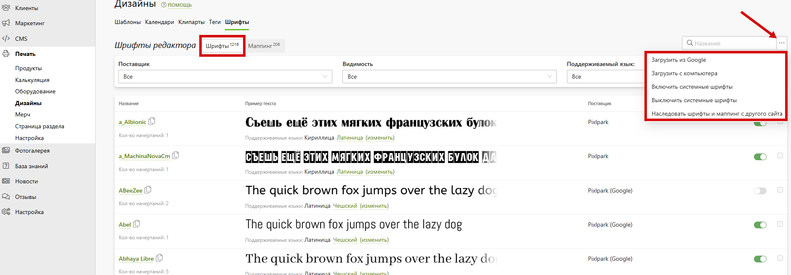
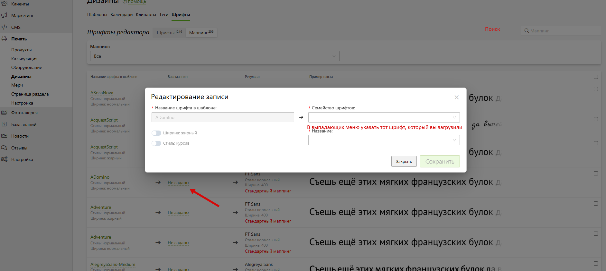

# Ответы на популярные вопросы

## Как скопировать продукт с демо-сайта
### Копирование продукта
Для того чтобы скопировать продукт с демо-сайта, необходимо выполнить следующие действия:
1. Открыть в панели управления раздел “__Печать / Продукты__”.
2. Нажать кнопку “__Добавить / Обновить__” в правом верхнем углу.
3. На открывшейся странице нажать “__Копировать категорию с демо-сайта__” и в списке выбрать интересующую вас категорию.
4. Если требуется, изменить настройки копирования. Например, вы можете не копировать шаблоны.
5. Нажать кнопку “Добавить”.
6. На странице списка категорий найти скопированную (располагается в самом низу) и перейти в нее.
7. Отредактировать адрес категории, набор продуктов, опций и их стоимость.

### Вывод продукта на сайт
После того, как у вас настроен продукт (а точнее категория продуктов), его необходимо вывести на сайте. Для этого необходимо:
1. Выбрать страницу любого существующего продукта на сайте, которая будет шаблоном для нового, и скопировать ее.
2. Отредактировать эту страницу: изменить адрес, разместить калькулятор новой категории, поправить ссылки кнопок, изменить шаблоны, иллюстрации, примеры работ.
3. Разместить ссылку на страницу с новым продуктом:
    + в навигационном меню;
    + на странице раздела;
    + где-либо еще (например, в популярных продуктах).

## Как скопировать шаблоны с демо-сайта
### Ручное копирование
Для того чтобы скопировать шаблоны с демо-сайта, необходимо выполнить следующие действия:
1. Открыть в панели управления раздел “__Печать / Дизайны / Шаблоны__”.
2. Рядом с кнопкой “__Добавить шаблон__” нажать “__три точки__” и выбрать действие “__Импортировать с демо-сайта__”.
3. В открывшемся модальном окне выбрать продукты демо-сайта, шаблоны которых требуется скопировать, и нажать кнопку “Выбрать”.
4. После закрытия модального окна в фильтре автоматически будут выбраны следующие значения: Категория - Без категории, Авторство - Демонстрационные. В списке останутся лишь импортированные шаблоны с демо-сайта.
5. Далее, их необходимо связать с товарами сайта. Чтобы эта процедура была проще, мы рекомендуем за один проход импорта добавлять шаблоны одного типа. Это позволит одним кликом выбрать все шаблоны, а затем в панели снизу нажать “три точки” и выбрать действие “Привязать к продуктам”. В появившемся модальном окне надо будет указать уже продукты вашего сайта и нажать “Выбрать”.
* Каждый новый шаблон при импорте автоматически связывается с исходным демонстрационным. Любые изменения шаблона на демо-сайте (к примеру, исправление ошибок) будут применяться и к вашему. Если же вы хотите в последствии самостоятельно изменять шаблон (без внесения в него правок извне), то вам сперва надо отвязать его от исходного. В этом случае исходный шаблон больше не будет импортирован. Отвязать шаблон можно на его странице. 
* По умолчанию при импорте вместе с шаблоном подгружаются и его теги. Однако, это можно отключить в настройках импорта (рядом с кнопкой “__Добавить шаблон__” нажать “__три точки__” и выбрать __"Настройки импорта"__).
* К примеру, это может быть нужно, когда помимо демонстрационных шаблонов у вас загружены собственные с заранее определенной структурой тематик. 
* В настройках импорта также можно включить копирование шаблонов, которые были отвязаны, и сбросить историю импорта. Последнее содержит информацию о том, какие шаблоны не надо копировать заново, если они были удалены после импорта. 

### Автоматическое копирование
Описанный выше метод копирования шаблонов удобен, если требуется один раз импортировать шаблоны. Однако, если вы хотите регулярно получать новые шаблоны, то данный процесс можно автоматизировать выполнив следующие действия:
1. Открыть в панели управления раздел “__Печать / Дизайны / Шаблоны__” и перейти во вкладку “__Маппинг__”.
2. Нажать кнопку “__Добавить запись__”.
3. В открывшемся модальном окне задать соответствие продукта своего и демо-сайта, а затем нажать кнопку “Сохранить”. 
4. Повторить предыдущий пункт для всех ваших товаров, которым требуются шаблоны с демо-сайта.
* В модальном окне задания соответствия продуктов присутствуют еще две настройки: 
Первая позволяет автоматически удалять шаблон, если был удален исходный на демо-сайта. Например, если был разработан новый.
Вторая отвечает за автоматический импорт шаблонов для указанного товара вашего сайта. Это действие выполняется ночью раз в сутки.
* На странице списка записей маппинга также выводится количество новых шаблонов демо-сайта, доступные для импорта. Например, вы можете отказаться от автоматического копирования, выполняя эту процедуру по необходимости. Заодно сможете проверять новые шаблоны - на сколько они по тематикам и стилистике подходят вашему сайту. Для ручного копирования необходимо выбрать нужные записи маппинга и нажать кнопку “__Импортировать__” в панели снизу.

## Инструкция по маппингу шрифтов
В данном разделе описывается процесс маппинга шрифтов в системе после загрузки макета. Инструкция включает шаги по проверке статуса маппинга, загрузке шрифтов в систему и назначению соответствия между шрифтами шаблона и загруженными шрифтами.

### 1. Проверка статуса маппинга для загруженного макета
1. Зайдите в раздел **Печать → Дизайны → Шаблоны** и выберите нужный шаблон.  
2. Перейдите на вкладку **Макеты**.
3. В списке макетов найдите нужный макет и в колонке **Действия** нажмите по ссылке **Проверить сопоставление шрифтов**.  
4. В появившемся модальном окне **«Проверка сопоставления шрифтов»** обратите внимание на колонку **«Выполнение мапинга»**:
   - **«Да»** — маппинг выполнен, дополнительных действий не требуется.
   - **«Нет»** — требуется ручной маппинг. 
* 
> **Важно:**  
> Перед началом маппинга убедитесь, что нужный шрифт загружен в систему (с помощью Google Fonts или с компьютера).

### 2. Загрузка шрифта в систему (при необходимости)
1. Перейдите в **Печать → Дизайны → Шрифты**.  
2. Нажмите на три точки справа от панели поиска.  
3. В выпадающем меню выберите:
   - **«Загрузить из Google»** 
   - **«Загрузить с компьютера»** 
4. После загрузки шрифта с компьютера или импорта из Google Fonts дождитесь появления шрифта в списке.
* 

### 3. Ручной маппинг шрифтов
1. Перейдите в **Печать → Дизайны → Шаблоны → Макеты**. 
2. Выберете шаблон и перейдите на вкладку **Макеты**. Откройте окно **«Проверка сопоставления шрифтов»**.
2. Если в поле **Выполнение мапинга** стоит **«Нет»**, нажмите **«Выполнить маппинг вручную»**.  
3. Откроется раздел **Печать → Дизайны → Шрифты → Маппинг**.  
4. Найдите строку с нужным названием шрифта.  
5. В колонке **Ваш маппинг** нажмите **«Не задано»**.  
6. В появившемся окне **Редактирование записи**:
   - Убедитесь, что поле **Название шрифта в шаблоне** заполнено.
   - В поле **Семейство шрифтов** выберите нужный загруженный Вами шрифт.
   - При необходимости установите чекбоксы **Жирный** и/или **Курсив**.  
7. Нажмите **Сохранить**, затем закройте окно.
* 

### 4. Проверка итогового результата
1. Вернитесь во вкладку **Макеты** нужного Вам шаблона.  
2. Откройте окно **«Проверка сопоставления шрифтов»**.  
3. Убедитесь, что в колонке **Выполнение мапинга** указано **«Да»**.  
4. Если по-прежнему **«Нет»**, вернитесь в **Шрифты → Маппинг** и проверьте правильность выбора семейства шрифта и сохранения изменений.

### FAQ
- **Шрифт не отображается в списке:**
  - Проверьте, что он успешно загружен (обновите страницу).
  - Убедитесь, что используется совместимый формат (.ttf, .otf).
- **Неверное начертание:**
  - Отметьте **Жирный** или **Курсив**, если шаблон этого требует.
  - При отсутствии нужного начертания загрузите дополнительный файл.
- **Проблемы с кодировкой:**
  - Убедитесь, что шрифт поддерживает нужный язык (кириллица/латиница).
  - Нажмите «(изменить)» в списке шрифтов для настройки языков.

## Видеоуроки
### Как скопировать продукт с демо-сайта
<iframe width="720" height="405" src="https://rutube.ru/play/embed/a41cdd43e9d7928f29f10ffd729adb94/" frameBorder="0" allow="clipboard-write; autoplay" webkitAllowFullScreen mozallowfullscreen allowFullScreen></iframe>

### Как скопировать шаблоны с демо-сайта
<iframe width="720" height="405" src="https://rutube.ru/play/embed/005777c72d1f07c35427426135dadeb1/" frameBorder="0" allow="clipboard-write; autoplay" webkitAllowFullScreen mozallowfullscreen allowFullScreen></iframe>