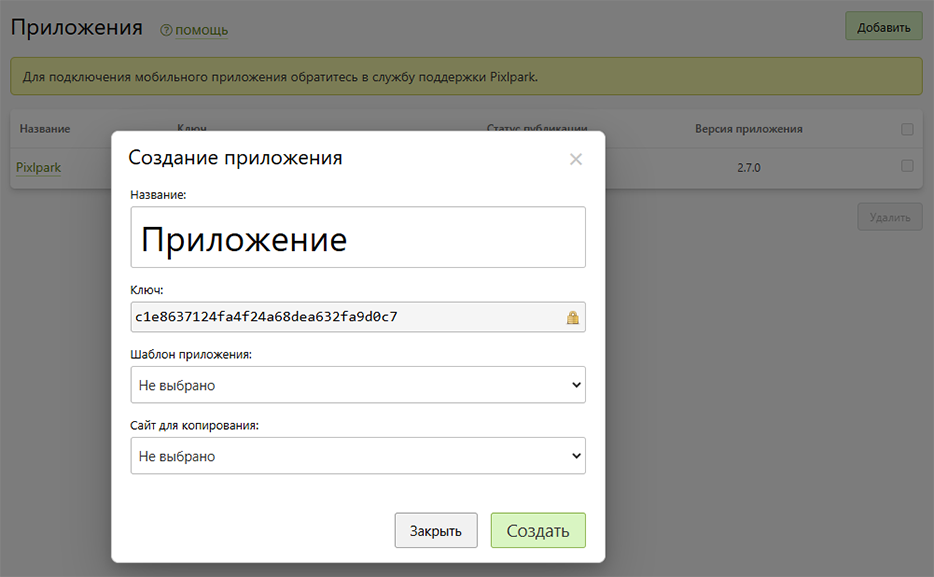

# Приложения
* В данном разделе представлены все приложения компании.
* Также на странице можно:
    + Добавить новое.
    + Перейти в карточку приложения.
    + Включить или выключить любое приложение.
    + Удалить выделенные приложения.
*

* При добавлении приложения в модальном окне указывается:
    + __Название__ - название приложения в панели управления.
    + __Ключ__ - автоматически созданный и не подлежащий изменению идентификатор приложения.
    + __Шаблон приложения__ - копируемое приложение со всеми его настройками.
    + __Сайт для копирования__ - сайт, который будет связан с новым приложением, в качестве магазина.

