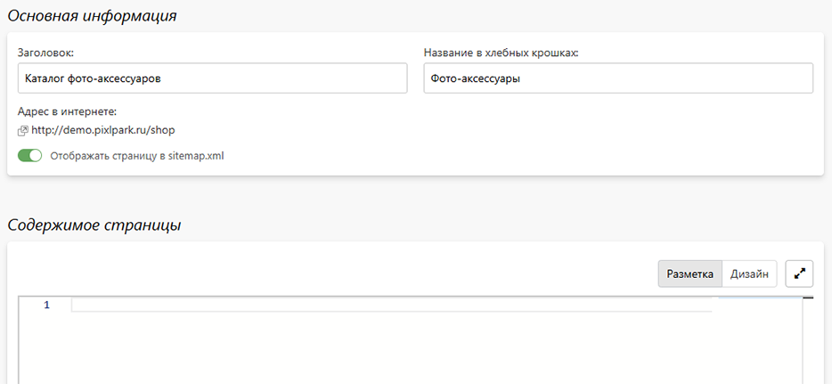

# Страница раздела
* Страница раздела имеет определенную специфику:
    + Фиксированный относительный адрес  `/shop`;
    + Разметка состоит из одной секции содержимого c предзаданной структурой:
        + хлебные крошки;
        + заголовок;
        + текст;
        + список категорий, где каждая состоит из заголовка и обложки.
* В данном разделе можно отредактировать следующие характеристики:
    + __Заголовок__ - заголовок страницы, размещаемый в теге H1;
    + __Название в хлебных крошках__ - название страницы в хлебных крошках, которые выводятся над заголовком; если название не задано, то в качестве него используется заголовок;
    + __Содержимое страницы__ - содержимое страницы в формате HTML-разметки, которое выводится после заголовка, но перед списком категорий.
* 