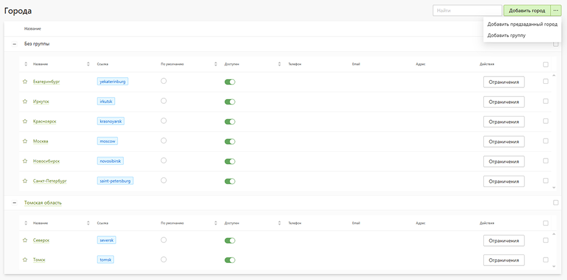

# Города

* В данном разделе задаются города сайта, которые позволяют показывать релевантный контент, цены, акции, новости, а также оптимизировать сайт под локальное SEO.

## Добавление городов
* На странице можно:
    - Добавить предзаданный город
    - Добавить группу 
    - Добавить собственный город
* 

## Константы для CMS
* `[$city:name$]` - название города на кирилице. 
    * `[$city:cityInCase(Nominative)$]` - название города на кирилице, в именительном падеже.
    * `[$city:cityInCase(Genitive)$] ` - название города на кирилице, в родительном падеже.
    * `[$city:cityInCase(Dative)$]` - название города на кирилице, в дательном падеже.
    * `[$city:cityInCase(Accusative)$]` - название города на кирилице, в винительном падеже.
    * `[$city:cityInCase(Instrumental)$]` - название города на кирилице, в творительном падеже.
    * `[$city:cityInCase(Prepositional)$] ` - название города на кирилице, в предложном падеже.
* `[$city:slug$]` - название города на латинице без пробелов (используется для ссылок).
* `[$city:id$]` - идентификатор города.
* `[$city:phone$]` - телефон города с учётом маски.
* `[$city:phoneNumber$]` - телефон города (только цифры).
* `[$city:email$]` - эл. почта города.
* `[$city:address$]` - адрес города.
* `[$city:pageAvailableFor$]` - список городов для которых доступна текущая страница.
* `[$city:isVisibleFor(spb,tomsk)$]` - отображает элемент CMS для городов с ссылкой spb и tomsk (Пример использования `style="[$city:isVisibleFor(spb,tomsk)$]"`).
* `[$city:isHiddenFor(spb,tomsk)$]` - скрывает элемент CMS для городов с ссылкой spb и tomsk (Пример использования `style="[$city:isHiddenFor(spb,tomsk)$]"`).

## FAQ
### Группы городов
* Для добавления городов в группу, для начала необходимо создать группу. После этого нужно выделить города и нажать на кнопку "добавить в группу".
### Ограничение категории, опции, новости, скидки, страницы CMS
* Для ограничения категорий, опций, новостей, скидок и CMS страниц городами необходимо включить настройку "Ограничить городами".
### Стоимость продуктов
* Для задания стоимости категорий для каждого города отдельно, необходимо в админ.панели перейти в раздел Печать -> Продукты, в верхней правой части экрана нажать на кнопку "Редактировать цены", на новой странице выбрать раздел "Стоимость товаров для городов" или "Стоимость опций для городов".
### Контакнтая информация
* Чтобы городу задать контактную информацию, необходимо перейти в список городов кликнуть по городу, откроется модальное окно с редактированием информации для города.
### Плагин выбора города
* В плагине выбора города, в быстром доступе отображаются города отмеченные как избранные ("звездочкой" в админ. панели), а в алфавитном указателе отображаются все города с включенным доступом.